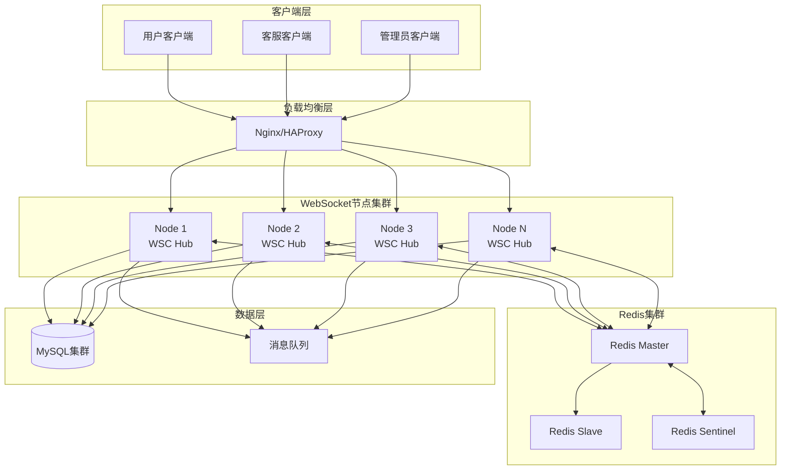

# 🚀 分布式WebSocket连接管理器 (Distributed WSC)

## 📋 概述

基于 `go-rpc-gateway` 框架的企业级分布式WebSocket连接管理系统，专为大规模IM聊天场景设计，支持水平扩展、故障恢复和跨节点消息路由。

## 🏗️ 架构设计

### 系统架构图



## 🎯 核心功能特性

### 1. 分布式节点管理

#### 节点信息结构
```go
type NodeInfo struct {
    ID          string    `json:"id"`           // 节点唯一标识
    IPAddress   string    `json:"ip_address"`   // IP地址
    Port        int       `json:"port"`         // 端口号
    Status      string    `json:"status"`       // 状态：active, inactive
    LoadScore   float64   `json:"load_score"`   // 负载分数 (0.0-1.0)
    LastSeen    time.Time `json:"last_seen"`    // 最后心跳时间
    Connections int       `json:"connections"`  // 当前连接数
}
```

#### 节点发现机制
- **自动注册**: 节点启动时自动注册到Redis
- **心跳检测**: 每10秒发送心跳，30秒超时移除
- **负载均衡**: 基于连接数和CPU使用率计算负载分数
- **故障转移**: 节点失效时自动重新分配连接

### 2. 客户端连接管理

#### 客户端信息结构
```go
type Client struct {
    ID         string                 // 客户端唯一标识
    UserID     string                 // 用户ID
    UserType   string                 // 用户类型：customer, agent, admin
    TicketID   string                 // 当前工单ID
    Role       string                 // 角色权限
    WSClient   *wsc.Wsc               // WebSocket连接
    LastSeen   time.Time              // 最后活跃时间
    Status     string                 // 在线状态
    Department string                 // 部门（客服）
    Skills     []string               // 技能标签（客服）
    MaxTickets int                    // 最大并发工单数
    NodeID     string                 // 所在节点ID
    Metadata   map[string]interface{} // 扩展元数据
}
```

#### 连接管理特性
- **多重映射**: clientID → userID → ticketID 多维度索引
- **会话保持**: 基于用户ID的会话亲和性
- **优雅断开**: 连接断开时自动清理相关状态
- **重连支持**: 客户端断线重连自动恢复状态

### 3. 消息路由系统

#### 分布式消息结构
```go
type DistributedMessage struct {
    Type      string    `json:"type"`       // 消息类型
    NodeID    string    `json:"node_id"`    // 源节点ID
    Timestamp time.Time `json:"timestamp"`  // 时间戳
    Payload   *Message  `json:"payload"`    // 消息体
    Metadata  map[string]interface{} `json:"metadata,omitempty"`
}
```

#### 消息路由策略
```go
// 点对点消息路由
func (h *Hub) routeMessage(message *Message) {
    switch {
    case message.To != "": // 单播消息
        if h.IsUserOnCurrentNode(message.To) {
            h.sendToLocalUser(message)
        } else {
            h.SendToOtherNodes(message)
        }
    case message.TicketID != "": // 工单群发
        h.sendToTicketUsers(message)
    default: // 广播消息
        h.broadcastToAll(message)
    }
}
```

## 🔧 核心API接口

### 节点管理接口

```go
// 创建分布式Hub
hub := NewHub(redisClient, "192.168.1.100", 8080)

// 获取节点信息
nodeInfo := hub.GetNodeInfo()

// 获取所有节点
allNodes := hub.GetAllNodes()

// 获取节点统计
stats := hub.GetNodeStats()
```

### 客户端管理接口

```go
// 注册客户端
client := &Client{
    UserID:   "user123",
    UserType: "customer",
    TicketID: "ticket456",
    Role:     "customer",
}
hub.register <- client

// 发送消息给用户
hub.SendToUser("user123", message)

// 发送消息给工单
hub.SendToTicket("ticket456", message)

// 广播消息
hub.Broadcast(message)
```

### 分布式通信接口

```go
// 检查用户是否在当前节点
if hub.IsUserOnCurrentNode("user123") {
    // 本地处理
} else {
    // 转发到其他节点
    hub.SendToOtherNodes(message)
}

// 跨节点消息发送
hub.SendToOtherNodes(&Message{
    Type:     "text",
    From:     "agent001",
    To:       "user123",
    Content:  "Hello from other node",
    TicketID: "ticket456",
})
```

## 📊 性能指标与监控

### 关键性能指标

| 指标名称 | 目标值 | 监控方式 | 告警阈值 |
|---------|--------|----------|----------|
| **连接数** | 100万+ | 实时统计 | > 80万 |
| **消息延迟** | < 50ms | P95监控 | > 100ms |
| **节点负载** | < 80% | 负载分数 | > 90% |
| **心跳丢失** | < 1% | 心跳统计 | > 5% |
| **跨节点延迟** | < 100ms | 消息追踪 | > 200ms |
| **内存使用** | < 8GB | 系统监控 | > 12GB |

### 监控数据结构

```go
type HubStats struct {
    NodeID              string    `json:"node_id"`
    TotalConnections    int64     `json:"total_connections"`
    ActiveConnections   int       `json:"active_connections"`
    ActiveTickets       int       `json:"active_tickets"`
    OnlineAgents        int       `json:"online_agents"`
    MessagesSent        int64     `json:"messages_sent"`
    MessagesReceived    int64     `json:"messages_received"`
    LoadScore           float64   `json:"load_score"`
    NodeStatus          string    `json:"node_status"`
    ConnectedNodes      int       `json:"connected_nodes"`
    LastStatsUpdate     time.Time `json:"last_stats_update"`
}
```

## 🚦 部署配置

### Docker部署示例

```dockerfile
FROM golang:1.20-alpine AS builder
WORKDIR /app
COPY . .
RUN CGO_ENABLED=0 GOOS=linux go build -o wsc-server ./cmd/server

FROM alpine:latest
RUN apk --no-cache add ca-certificates
WORKDIR /root/
COPY --from=builder /app/wsc-server .
EXPOSE 8080 9090
ENV NODE_IP=0.0.0.0
ENV NODE_PORT=8080
ENV REDIS_URL=redis://redis:6379
CMD ["./wsc-server"]
```

### Kubernetes配置

```yaml
apiVersion: apps/v1
kind: Deployment
metadata:
  name: wsc-hub
spec:
  replicas: 3
  selector:
    matchLabels:
      app: wsc-hub
  template:
    metadata:
      labels:
        app: wsc-hub
    spec:
      containers:
      - name: wsc-hub
        image: wsc-hub:latest
        ports:
        - containerPort: 8080
        - containerPort: 9090
        env:
        - name: NODE_IP
          valueFrom:
            fieldRef:
              fieldPath: status.podIP
        - name: REDIS_URL
          value: "redis://redis-service:6379"
        resources:
          requests:
            memory: "2Gi"
            cpu: "1"
          limits:
            memory: "4Gi"
            cpu: "2"
        livenessProbe:
          httpGet:
            path: /health
            port: 8080
          initialDelaySeconds: 30
          periodSeconds: 10
        readinessProbe:
          httpGet:
            path: /ready
            port: 8080
          initialDelaySeconds: 5
          periodSeconds: 5
---
apiVersion: v1
kind: Service
metadata:
  name: wsc-hub-service
spec:
  selector:
    app: wsc-hub
  ports:
  - name: websocket
    port: 8080
    targetPort: 8080
  - name: grpc
    port: 9090
    targetPort: 9090
  type: LoadBalancer
```

### Nginx负载均衡配置

```nginx
upstream wsc_backend {
    least_conn;
    server 10.0.1.10:8080 weight=1 max_fails=3 fail_timeout=30s;
    server 10.0.1.11:8080 weight=1 max_fails=3 fail_timeout=30s;
    server 10.0.1.12:8080 weight=1 max_fails=3 fail_timeout=30s;
}

server {
    listen 80;
    server_name ws.company.com;

    # WebSocket升级支持
    location /ws {
        proxy_pass http://wsc_backend;
        proxy_http_version 1.1;
        proxy_set_header Upgrade $http_upgrade;
        proxy_set_header Connection "upgrade";
        proxy_set_header Host $host;
        proxy_set_header X-Real-IP $remote_addr;
        proxy_set_header X-Forwarded-For $proxy_add_x_forwarded_for;
        
        # WebSocket超时设置
        proxy_connect_timeout 60s;
        proxy_send_timeout 60s;
        proxy_read_timeout 300s;
        
        # 会话保持（基于IP）
        ip_hash;
    }

    # 健康检查
    location /health {
        proxy_pass http://wsc_backend;
        proxy_set_header Host $host;
    }

    # 统计信息
    location /stats {
        proxy_pass http://wsc_backend;
        proxy_set_header Host $host;
        # 只允许内网访问
        allow 10.0.0.0/8;
        deny all;
    }
}
```

## 🔧 配置参数

### Hub配置选项

```go
type HubConfig struct {
    // 节点配置
    NodeIP          string        `yaml:"node_ip"`           // 节点IP
    NodePort        int           `yaml:"node_port"`         // 节点端口
    
    // Redis配置
    RedisURL        string        `yaml:"redis_url"`         // Redis连接URL
    RedisPoolSize   int           `yaml:"redis_pool_size"`   // 连接池大小
    
    // 通道配置
    RegisterBuffer  int           `yaml:"register_buffer"`   // 注册通道缓冲区
    BroadcastBuffer int           `yaml:"broadcast_buffer"`  // 广播通道缓冲区
    NodeMsgBuffer   int           `yaml:"node_msg_buffer"`   // 节点消息缓冲区
    
    // 超时配置
    HeartbeatInterval time.Duration `yaml:"heartbeat_interval"` // 心跳间隔
    NodeTimeout       time.Duration `yaml:"node_timeout"`       // 节点超时
    ClientTimeout     time.Duration `yaml:"client_timeout"`     // 客户端超时
    
    // 负载配置
    MaxConnections    int     `yaml:"max_connections"`    // 最大连接数
    LoadThreshold     float64 `yaml:"load_threshold"`     // 负载阈值
}
```

### 默认配置

```yaml
hub:
  node_ip: "0.0.0.0"
  node_port: 8080
  redis_url: "redis://localhost:6379"
  redis_pool_size: 100
  register_buffer: 256
  broadcast_buffer: 1024
  node_msg_buffer: 1024
  heartbeat_interval: 10s
  node_timeout: 30s
  client_timeout: 90s
  max_connections: 100000
  load_threshold: 0.8
```

## 🔍 故障排查指南

### 常见问题及解决方案

#### 1. 节点无法发现其他节点
**现象**: 节点启动后无法看到其他节点
**原因**: Redis连接问题或网络分区
**解决**:
```bash
# 检查Redis连接
redis-cli -h redis-host ping

# 检查节点注册
redis-cli keys "ws:nodes:*"

# 检查网络连通性
telnet other-node-ip 8080
```

#### 2. 跨节点消息无法送达
**现象**: 不同节点的用户无法通信
**原因**: Redis发布订阅配置错误
**解决**:
```bash
# 检查Redis发布订阅
redis-cli monitor

# 手动测试发布订阅
redis-cli publish ws:heartbeat "test"
```

#### 3. 节点负载不均衡
**现象**: 某些节点连接数过多
**原因**: 负载均衡算法或配置问题
**解决**:
```go
// 调整负载计算算法
func (h *Hub) calculateLoadScore() float64 {
    connections := len(h.clients)
    cpuUsage := getCurrentCPUUsage()
    memoryUsage := getCurrentMemoryUsage()
    
    // 综合负载计算
    return (float64(connections)/1000.0)*0.4 + 
           cpuUsage*0.3 + 
           memoryUsage*0.3
}
```

#### 4. 内存泄漏问题
**现象**: 节点内存持续增长
**原因**: 连接或消息未正确清理
**解决**:
```go
// 定期清理过期连接
func (h *Hub) cleanupExpiredConnections() {
    h.mutex.Lock()
    defer h.mutex.Unlock()
    
    now := time.Now()
    for clientID, client := range h.clients {
        if now.Sub(client.LastSeen) > h.config.ClientTimeout {
            delete(h.clients, clientID)
            delete(h.userToClient, client.UserID)
            // 清理其他映射
        }
    }
}
```

## 📈 性能优化建议

### 1. 连接优化
- **连接池**: 使用连接池复用WebSocket连接
- **心跳优化**: 调整心跳间隔，减少网络开销
- **缓冲区调优**: 根据业务量调整通道缓冲区大小

### 2. 内存优化
- **对象池**: 使用sync.Pool复用Message对象
- **定期清理**: 实现定期清理过期数据的机制
- **内存监控**: 添加内存使用量监控和告警

### 3. 网络优化
- **消息压缩**: 对大消息进行压缩传输
- **批量处理**: 批量处理非实时消息
- **协议优化**: 使用二进制协议替代JSON

### 4. 数据库优化
- **读写分离**: Redis主从分离，读写分离
- **分片策略**: 按用户ID或工单ID分片
- **缓存预热**: 预加载热点数据到缓存

## 🚀 扩展计划

### 短期目标
- [ ] 实现基于地理位置的节点选择
- [ ] 添加消息持久化和离线推送
- [ ] 实现更精细的权限控制
- [ ] 支持消息加密传输

### 中期目标
- [ ] 支持多房间/多频道功能
- [ ] 实现智能客服分配算法
- [ ] 添加消息审核和过滤
- [ ] 支持富媒体消息（图片、文件、视频）

### 长期目标
- [ ] 集成AI智能客服
- [ ] 支持语音和视频通话
- [ ] 实现全文搜索和消息归档
- [ ] 构建完整的开发者平台

---

## 📚 相关文档

- [go-rpc-gateway 使用指南](../README.md)
- [WebSocket 最佳实践](../docs/websocket-best-practices.md)
- [Redis 集群配置](../docs/redis-cluster-setup.md)
- [性能调优指南](../docs/performance-tuning.md)
- [监控告警配置](../docs/monitoring-setup.md)

---

**版本**: v1.0.0  
**更新时间**: 2025-11-12  
**维护者**: IM推送服务团队