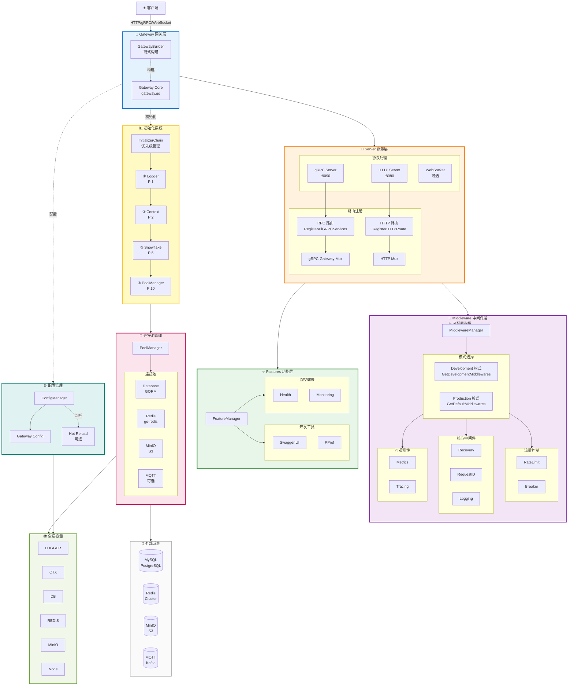
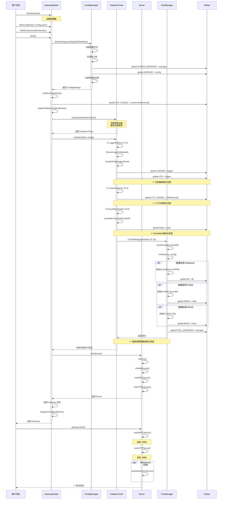
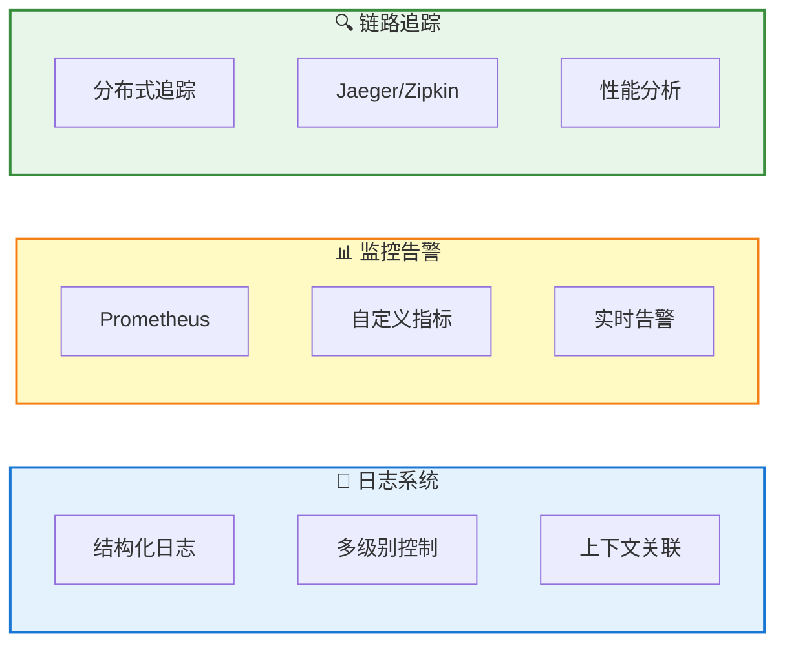

<div align="center">

# 🚀 Go RPC Gateway

### 新一代企业级微服务网关框架 · 高性能 · 高可用 · 开箱即用

[](https://go.dev/)
[](LICENSE)
[]()
[]()
[
</div>

---

## ✨ 为什么选择 Go RPC Gateway？

| 🎯 特性 | 💡 能力 | 📊 指标 | ✅ 优势 |
|---------|---------|---------|---------|
| **⚡ 极致性能** | 高并发处理<br/>快速启动<br/>低延迟响应<br/>内存高效 | **10,000+ QPS**<br/>启动 < 3s<br/>P99 < 50ms<br/>内存 < 100MB | 单机承载海量请求<br/>秒级快速部署<br/>用户体验流畅<br/>成本显著降低 |
| **🛡️ 生产可靠** | 高可用保障<br/>自动容错<br/>优雅关闭<br/>热更新 | **99.9%+ 可用性**<br/>熔断/限流<br/>< 30s 关闭<br/>零停机 | 业务持续稳定<br/>异常自动恢复<br/>平滑版本升级<br/>用户无感知 |
| **🎯 开箱即用** | 零配置启动<br/>链式 API<br/>自动管理<br/>丰富组件 | **3 行代码启动**<br/>流畅调用<br/>依赖自动化<br/>15+ 中间件 | 快速上手开发<br/>代码简洁优雅<br/>降低维护成本<br/>功能开箱可用 |
| **🏗️ 架构先进** | 分层设计<br/>优先级初始化<br/>功能插件化<br/>配置驱动 | **6 层架构**<br/>4 级优先级<br/>动态启用<br/>统一管理 | 职责清晰易懂<br/>启动顺序可靠<br/>灵活按需加载<br/>配置集中控制 |
| **🔌 完整集成** | 连接池管理<br/>全局变量<br/>多协议支持<br/>可观测性 | **DB/Redis/MinIO**<br/>6 个全局变量<br/>HTTP/gRPC/WS<br/>日志/监控/追踪 | 资源自动管理<br/>访问简单直接<br/>一套代码多用<br/>问题快速定位 |
| **📦 企业特性** | 中间件体系<br/>安全防护<br/>限流熔断<br/>国际化 | **15+ 中间件**<br/>认证/授权<br/>自动保护<br/>多语言支持 | 功能开箱即用<br/>安全合规保障<br/>系统稳定运行<br/>全球化部署 |

---

## 📖 系统架构

### 完整架构视图



### 初始化流程



---

### 📊 完整的可观测性



## 🤝 贡献与支持

### 参与贡献

我们欢迎所有形式的贡献！

```bash
# Fork 项目并创建功能分支
git checkout -b feature/amazing-feature

# 提交更改
git commit -m 'feat: add amazing feature'

# 推送并创建 Pull Request
git push origin feature/amazing-feature
```

- 🐛 [报告 Bug](https://github.com/kamalyes/go-rpc-gateway/issues)
- ✨ [功能建议](https://github.com/kamalyes/go-rpc-gateway/issues)
- 📖 [改进文档](https://github.com/kamalyes/go-rpc-gateway/pulls)
- 💻 [提交代码](https://github.com/kamalyes/go-rpc-gateway/pulls)

### 相关项目

- [go-config](https://github.com/kamalyes/go-config) - 统一配置管理
- [go-logger](https://github.com/kamalyes/go-logger) - 高性能日志
- [go-toolbox](https://github.com/kamalyes/go-toolbox) - 工具集
- [go-cachex](https://github.com/kamalyes/go-cachex) - 多级缓存
- [go-wsc](https://github.com/kamalyes/go-wsc) - WebSocket 客户端

### 联系我们

- 📧 Email: <501893067@qq.com>
- 💬 讨论: [GitHub Discussions](https://github.com/kamalyes/go-rpc-gateway/discussions)
- 🐛 问题: [GitHub Issues](https://github.com/kamalyes/go-rpc-gateway/issues)

---

## 📄 开源协议

本项目采用 [MIT License](LICENSE) 开源协议。

---

<div align="center">

**⭐ 如果这个项目对你有帮助，请给一个 Star 支持！**

Built with ❤️ by [Kamalyes](https://github.com/kamalyes)

[⬆ 回到顶部](#-go-rpc-gateway)

</div>
