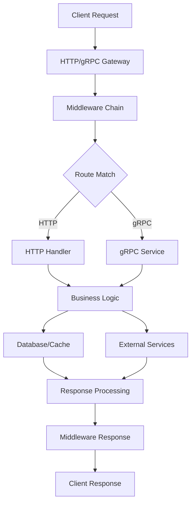

# 🚀 Go RPC Gateway

<div align="center">

[](https://go.dev/)
[](LICENSE)
[]()
[]()
[]()
[]()

**🎯 企业级 gRPC-Gateway 微服务网关框架，基于链式构建器模式**

深度集成 [go-config](https://github.com/kamalyes/go-config) 统一配置管理、[go-logger](https://github.com/kamalyes/go-logger) 结构化日志、[go-toolbox](https://github.com/kamalyes/go-toolbox) 工具集、[go-cachex](https://github.com/kamalyes/go-cachex) 多级缓存、[go-wsc](https://github.com/kamalyes/go-wsc) WebSocket客户端等核心库，提供数据库、缓存、对象存储、消息队列等完整的企业级微服务解决方案。

[🚀 快速开始](#-快速开始) • [⚙️ 配置文档](#️-配置文档) • [🏗️ 架构设计](#️-架构设计) • [📦 部署指南](#-部署指南) • [📚 示例代码](#-示例代码)

</div>

---

## 🎯 项目特色

### 🆕 最新特性 (v2.1.0)

✨ **链式构建器模式** - 全新的优雅API设计

```go
gateway, err := gateway.NewGateway().
    WithConfigPath("./config.yaml").
    WithEnvironment(config.EnvProduction).
    WithHotReload(nil).
    BuildAndStart()
```

✨ **功能特性管理器** - 动态启用/禁用功能模块

```go
gw.EnableFeature(server.FeaturePProf)
gw.EnableFeature(server.FeatureMonitoring)
gw.EnableFeature(server.FeatureTracing)
```

✨ **增强的连接池管理** - 自动化数据库、Redis、MinIO 连接池管理
✨ **模块化中间件系统** - 15+ 内置中间件，支持自定义扩展
✨ **智能配置发现** - 自动配置文件发现和环境适配

### 🏗️ 核心架构优势

| 特性 | 描述 | 优势 |
|------|------|------|
| **🔧 链式构建器** | 流畅的API设计 | 代码更优雅，配置更灵活 |
| **⚙️ 模块化设计** | 可插拔组件架构 | 高内聚低耦合，易扩展 |
| **🔄 配置热重载** | 运行时配置更新 | 无需重启即可应用配置变更 |
| **🔌 中间件生态** | 15+ 内置中间件 | 开箱即用的企业级功能 |
| **📊 可观测性** | 完整监控体系 | Metrics + Tracing + Logging |
| **🛡️ 类型安全** | 编译时检查 | Protocol Buffers + 强类型配置 |

### 🚀 企业级特性

**核心库集成**

- 🔧 **go-config** - 统一配置管理，支持热重载
- 📝 **go-logger** - 高性能结构化日志系统
- 🛠️ **go-toolbox** - 安全访问工具和常用函数
- 💾 **go-cachex** - 多级缓存框架
- 🌐 **go-wsc** - 高性能WebSocket客户端

**内置基础设施**

- 💾 **数据库** - MySQL/PostgreSQL/SQLite (GORM)
- 🔴 **Redis** - 单机/集群/哨兵模式支持
- 📦 **MinIO** - 对象存储服务
- 🐰 **RabbitMQ** - 消息队列支持
- ⚡ **连接池** - 自动化连接池管理

**监控与运维**

- 📊 **Prometheus** - 指标监控和告警
- 🔍 **OpenTelemetry** - 分布式链路追踪
- 💡 **PProf** - 内置性能分析工具
- 🏥 **健康检查** - 多组件健康状态监控
- 🔄 **优雅关闭** - 信号捕获和资源清理

---

## 🚀 快速开始

### 📦 安装

```bash
go get github.com/kamalyes/go-rpc-gateway
```

### 🎯 三种使用方式

#### 1️⃣ 极简启动 (30秒上手)

```go
package main

import gateway "github.com/kamalyes/go-rpc-gateway"

func main() {
    // 链式构建并启动
    gw, _ := gateway.NewGateway().
        WithSearchPath("./config").
        BuildAndStart()
    
    // 等待关闭信号
    gw.WaitForShutdown()
}
```

#### 2️⃣ 配置文件启动 (推荐)

**配置文件 `config.yaml`:**

```yaml
name: my-gateway
version: v2.1.0
environment: development

http_server:
  host: 0.0.0.0
  port: 8080

grpc:
  server:
    host: 0.0.0.0
    port: 9090

# 数据库配置
mysql:
  enabled: true
  host: localhost
  port: 3306
  username: root
  password: password
  dbname: gateway

# Redis 配置
redis:
  enabled: true
  host: localhost
  port: 6379
```

**应用代码:**

```go
package main

import gateway "github.com/kamalyes/go-rpc-gateway"

func main() {
    gw, err := gateway.NewGateway().
        WithConfigPath("config.yaml").
        WithHotReload(nil). // 启用配置热重载
        BuildAndStart()
    
    if err != nil {
        panic(err)
    }
    
    gw.WaitForShutdown()
}
```

#### 3️⃣ 完整功能开发

```go
package main

import (
    "net/http"
    gateway "github.com/kamalyes/go-rpc-gateway"
    "github.com/kamalyes/go-rpc-gateway/global"
    "google.golang.org/grpc"
)

func main() {
    // 创建网关
    gw, err := gateway.NewGateway().
        WithConfigPath("config.yaml").
        WithEnvironment(gateway.EnvProduction).
        Build() // 构建但不启动
    
    if err != nil {
        panic(err)
    }
    
    // 注册 gRPC 服务
    gw.RegisterService(func(s *grpc.Server) {
        // pb.RegisterUserServiceServer(s, &userService{})
    })
    
    // 注册 HTTP 路由
    gw.RegisterHTTPRoutes(map[string]http.HandlerFunc{
        "/api/users": handleUsers,
        "/api/health": handleHealth,
    })
    
    // 启用功能特性
    gw.EnableFeature(server.FeaturePProf)      // 性能分析
    gw.EnableFeature(server.FeatureMonitoring) // 监控指标
    gw.EnableFeature(server.FeatureTracing)    // 链路追踪
    gw.EnableFeature(server.FeatureSwagger)    // API 文档
    
    // 启动服务
    if err := gw.Start(); err != nil {
        panic(err)
    }
    
    gw.WaitForShutdown()
}

func handleUsers(w http.ResponseWriter, r *http.Request) {
    // 使用全局数据库连接
    if global.DB != nil {
        var users []User
        global.DB.Find(&users)
        // 返回用户列表...
    }
}

func handleHealth(w http.ResponseWriter, r *http.Request) {
    // 健康检查逻辑
    status := map[string]interface{}{
        "status": "healthy",
        "services": gw.HealthCheck(),
    }
    // 返回健康状态...
}
```

### 🎨 访问服务

启动后可访问以下端点：

| 服务 | 地址 | 描述 |
|------|------|------|
| HTTP API | <http://localhost:8080> | RESTful API 服务 |
| gRPC | localhost:9090 | gRPC 服务 |
| 健康检查 | <http://localhost:8080/health> | 服务健康状态 |
| 指标监控 | <http://localhost:8080/metrics> | Prometheus 指标 |
| API 文档 | <http://localhost:8080/swagger/> | Swagger UI |
| 性能分析 | <http://localhost:8080/debug/pprof/> | PProf 性能分析 |

---

## ⚙️ 配置文档

### 🔧 配置文件结构

完整的 `config.yaml` 配置示例：

```yaml
# 基础服务配置
name: go-rpc-gateway
version: v2.1.0
environment: production  # development, testing, production
debug: false

# HTTP 服务器配置
http_server:
  host: 0.0.0.0
  port: 8080
  read_timeout: 30s
  write_timeout: 30s
  idle_timeout: 120s

# gRPC 服务器配置
grpc:
  server:
    host: 0.0.0.0
    port: 9090

# 数据库配置
mysql:
  enabled: true
  host: localhost
  port: 3306
  username: root
  password: password
  dbname: gateway
  charset: utf8mb4
  max_idle_conns: 10
  max_open_conns: 100
  conn_max_lifetime: 3600s

# Redis 配置
redis:
  enabled: true
  host: localhost
  port: 6379
  password: ""
  db: 0
  pool_size: 10
  min_idle_conns: 5

# MinIO 对象存储配置
minio:
  enabled: true
  endpoint: localhost:9000
  access_key: minioadmin
  secret_key: minioadmin
  use_ssl: false
  bucket_name: gateway-bucket

# 中间件配置
middleware:
  # CORS 跨域配置
  cors:
    enabled: true
    allowed_origins: ["*"]
    allowed_methods: ["GET", "POST", "PUT", "DELETE"]
    allowed_headers: ["*"]
  
  # 限流配置
  rate_limit:
    enabled: true
    rate: 100        # 每秒允许的请求数
    burst: 200       # 突发请求数
  
  # 日志配置
  logging:
    enabled: true
    level: info      # debug, info, warn, error
    format: json     # json, text

# Swagger 文档配置
swagger:
  enabled: true
  ui_path: /swagger/
  json_path: /swagger/doc.json
  title: Go RPC Gateway API
  description: 企业级微服务网关 API 文档
  version: v2.1.0

# 监控配置
monitoring:
  enabled: true
  prometheus:
    enabled: true
    path: /metrics
  
  # 链路追踪配置
  tracing:
    enabled: true
    jaeger:
      endpoint: http://localhost:14268/api/traces
    zipkin:
      endpoint: http://localhost:9411/api/v2/spans

# 健康检查配置
health:
  enabled: true
  path: /health
  detailed: true  # 是否显示详细的组件状态

# 安全配置
security:
  # TLS 配置
  tls:
    enabled: false
    cert_file: cert.pem
    key_file: key.pem
  
  # JWT 配置
  jwt:
    enabled: false
    secret: your-jwt-secret
    expire: 24h
```

### 🔄 配置热重载

框架支持配置文件的热重载功能：

```go
// 启用热重载 (默认配置)
gw, err := gateway.NewGateway().
    WithConfigPath("config.yaml").
    WithHotReload(nil).  // 使用默认热重载配置
    Build()

// 自定义热重载配置
hotReloadConfig := &config.HotReloadConfig{
    Enabled:  true,
    Interval: 5 * time.Second,  // 检查间隔
    Debounce: 1 * time.Second,  // 防抖时间
}

gw, err := gateway.NewGateway().
    WithConfigPath("config.yaml").
    WithHotReload(hotReloadConfig).
    Build()
```

---

## 🏗️ 架构设计

### 📋 系统架构图

```
┌─────────────────────────────────────────────────────────────────┐
│                     🚀 Go RPC Gateway                           │
│                        (v2.1.0)                                │
├─────────────────────────────────────────────────────────────────┤
│                    🔌 API Gateway Layer                        │
│ ┌─────────────┐  ┌─────────────┐  ┌─────────────┐             │
│ │   HTTP/1.1  │  │   HTTP/2    │  │    gRPC     │             │
│ │    :8080    │  │    :8080    │  │    :9090    │             │
│ └─────────────┘  └─────────────┘  └─────────────┘             │
├─────────────────────────────────────────────────────────────────┤
│                  🔧 Middleware Layer                           │
│ ┌───────┬───────┬───────┬───────┬───────┬───────┬───────┐     │
│ │ CORS  │ Auth  │ Rate  │ Log   │Metric │Trace  │Recovery│     │
│ │       │       │ Limit │       │       │       │       │     │
│ └───────┴───────┴───────┴───────┴───────┴───────┴───────┘     │
├─────────────────────────────────────────────────────────────────┤
│                  🏗️ Business Layer                            │
│ ┌─────────────┐  ┌─────────────┐  ┌─────────────┐             │
│ │   Service   │  │  Handler    │  │ Controller  │             │
│ │   Logic     │  │   Router    │  │   Layer     │             │
│ └─────────────┘  └─────────────┘  └─────────────┘             │
├─────────────────────────────────────────────────────────────────┤
│                 📦 Infrastructure Layer                        │
│ ┌──────────┬──────────┬──────────┬──────────┬──────────┐      │
│ │ Database │  Redis   │  MinIO   │ RabbitMQ │  Consul  │      │
│ │ (GORM)   │ (Cache)  │(Storage) │(Message) │(Discovery│      │
│ └──────────┴──────────┴──────────┴──────────┴──────────┘      │
└─────────────────────────────────────────────────────────────────┘
```

### 🔧 核心模块

| 模块 | 功能 | 文件位置 |
|------|------|----------|
| **Gateway** | 主入口和构建器 | `gateway.go` |
| **Server** | 服务器核心逻辑 | `server/` |
| **Middleware** | 中间件管理 | `middleware/` |
| **Config** | 配置管理 | `config/` |
| **Pool** | 连接池管理 | `cpool/` |
| **Global** | 全局状态管理 | `global/` |
| **Breaker** | 熔断器 | `breaker/` |
| **Response** | 响应处理 | `response/` |
| **PBMO** | PB↔Model 高性能转换 | `pbmo/` |

> 🔄 **PBMO**: Protocol Buffer Model Object Converter，提供 PB ↔ GORM Model 的高性能双向转换，单次转换仅需 3μs，比标准反射快 17-22倍。[详细文档 →](./pbmo/README.md)

### 🔄 请求处理流程



---

## 📦 功能特性

### 🎛️ 功能特性管理器

框架提供统一的功能特性管理，支持动态启用/禁用功能模块：

```go
// 可用的功能特性
type FeatureType string

const (
    FeatureSwagger    FeatureType = "swagger"    // API 文档
    FeatureMonitoring FeatureType = "monitoring" // 监控指标
    FeatureHealth     FeatureType = "health"     // 健康检查
    FeaturePProf      FeatureType = "pprof"      // 性能分析
    FeatureTracing    FeatureType = "tracing"    // 链路追踪
)

// 启用功能特性
gw.EnableFeature(server.FeaturePProf)
gw.EnableFeature(server.FeatureMonitoring)

// 检查功能状态
if gw.IsFeatureEnabled(server.FeatureSwagger) {
    fmt.Println("Swagger is enabled")
}
```

### 🔌 中间件系统

内置15+企业级中间件：

| 中间件 | 功能 | 配置键 |
|--------|------|--------|
| **CORS** | 跨域资源分享 | `middleware.cors` |
| **Rate Limit** | 流量控制 | `middleware.rate_limit` |
| **Auth** | 身份认证 | `middleware.auth` |
| **Logging** | 访问日志 | `middleware.logging` |
| **Metrics** | 指标收集 | `middleware.metrics` |
| **Tracing** | 链路追踪 | `middleware.tracing` |
| **Recovery** | 异常恢复 | `middleware.recovery` |
| **RequestID** | 请求ID追踪 | `middleware.request_id` |
| **Security** | 安全防护 | `middleware.security` |
| **I18N** | 国际化支持 | `middleware.i18n` |

### 💾 连接池管理

自动化的资源连接池管理：

```go
// 获取全局资源
if global.DB != nil {
    // 数据库操作
    var users []User
    global.DB.Find(&users)
}

if global.REDIS != nil {
    // Redis 操作
    global.REDIS.Set(ctx, "key", "value", 0)
}

if global.MinIO != nil {
    // 对象存储操作
    global.MinIO.PutObject(ctx, bucket, object, reader, size, opts)
}

// 健康检查所有连接
healthStatus := gw.HealthCheck()
fmt.Printf("Database: %v\n", healthStatus["database"])
fmt.Printf("Redis: %v\n", healthStatus["redis"])
```

### 📊 监控与可观测性

**Prometheus 指标监控**

```bash
# 查看指标
curl http://localhost:8080/metrics

# 常见指标
http_requests_total          # HTTP请求总数
http_request_duration_seconds # 请求处理时间
grpc_server_handled_total    # gRPC处理总数
database_connections_active  # 数据库活跃连接数
```

**链路追踪 (OpenTelemetry)**

- 支持 Jaeger、Zipkin 等追踪系统
- 自动生成请求追踪ID
- 记录跨服务调用链路

**性能分析 (PProf)**

```bash
# CPU 分析
go tool pprof http://localhost:8080/debug/pprof/profile

# 内存分析
go tool pprof http://localhost:8080/debug/pprof/heap

# Goroutine 分析
go tool pprof http://localhost:8080/debug/pprof/goroutine
```

---

## 📚 使用示例

### 🎯 基础API服务

```go
package main

import (
    "encoding/json"
    "net/http"
    gateway "github.com/kamalyes/go-rpc-gateway"
)

type User struct {
    ID   int    `json:"id"`
    Name string `json:"name"`
}

func main() {
    gw, _ := gateway.NewGateway().
        WithSearchPath("./config").
        Build()
    
    // 注册路由
    gw.RegisterHTTPRoutes(map[string]http.HandlerFunc{
        "/api/users": handleUsers,
        "/api/hello": handleHello,
    })
    
    gw.Start()
    gw.WaitForShutdown()
}

func handleUsers(w http.ResponseWriter, r *http.Request) {
    users := []User{
        {ID: 1, Name: "Alice"},
        {ID: 2, Name: "Bob"},
    }
    
    w.Header().Set("Content-Type", "application/json")
    json.NewEncoder(w).Encode(users)
}

func handleHello(w http.ResponseWriter, r *http.Request) {
    response := map[string]string{
        "message": "Hello from Go RPC Gateway!",
        "version": "v2.1.0",
    }
    
    w.Header().Set("Content-Type", "application/json")
    json.NewEncoder(w).Encode(response)
}
```

### 🔗 gRPC + HTTP 混合服务

```go
package main

import (
    "context"
    "net/http"
    
    gateway "github.com/kamalyes/go-rpc-gateway"
    "github.com/kamalyes/go-rpc-gateway/global"
    pb "your-project/proto"  // 你的 protobuf 文件
    "google.golang.org/grpc"
)

type UserService struct {
    pb.UnimplementedUserServiceServer
}

func (s *UserService) GetUser(ctx context.Context, req *pb.GetUserRequest) (*pb.GetUserResponse, error) {
    // 使用全局数据库连接
    var user User
    if err := global.DB.First(&user, req.Id).Error; err != nil {
        return nil, err
    }
    
    return &pb.GetUserResponse{
        User: &pb.User{
            Id:    user.ID,
            Name:  user.Name,
            Email: user.Email,
        },
    }, nil
}

func main() {
    gw, _ := gateway.NewGateway().
        WithConfigPath("config.yaml").
        Build()
    
    // 注册 gRPC 服务
    userSvc := &UserService{}
    gw.RegisterService(func(s *grpc.Server) {
        pb.RegisterUserServiceServer(s, userSvc)
    })
    
    // 注册 HTTP 网关处理器
    gw.RegisterHTTPHandler(context.Background(), 
        pb.RegisterUserServiceHandlerFromEndpoint)
    
    // 额外的 HTTP 路由
    gw.RegisterHTTPRoute("/health", func(w http.ResponseWriter, r *http.Request) {
        w.WriteHeader(http.StatusOK)
        w.Write([]byte("OK"))
    })
    
    // 启用功能
    gw.EnableFeature(server.FeatureSwagger)
    gw.EnableFeature(server.FeatureMonitoring)
    
    gw.Start()
    gw.WaitForShutdown()
}
```

### 🏭 生产环境部署

**Docker 部署**

```dockerfile
FROM golang:1.23-alpine AS builder

WORKDIR /app
COPY go.mod go.sum ./
RUN go mod download

COPY . .
RUN go build -o gateway main.go

FROM alpine:latest
RUN apk --no-cache add ca-certificates
WORKDIR /root/

COPY --from=builder /app/gateway .
COPY --from=builder /app/config.yaml .

EXPOSE 8080 9090
CMD ["./gateway"]
```

**Kubernetes 部署**

```yaml
apiVersion: apps/v1
kind: Deployment
metadata:
  name: go-rpc-gateway
spec:
  replicas: 3
  selector:
    matchLabels:
      app: go-rpc-gateway
  template:
    metadata:
      labels:
        app: go-rpc-gateway
    spec:
      containers:
      - name: gateway
        image: your-registry/go-rpc-gateway:v2.1.0
        ports:
        - containerPort: 8080
        - containerPort: 9090
        env:
        - name: ENVIRONMENT
          value: production
        livenessProbe:
          httpGet:
            path: /health
            port: 8080
          initialDelaySeconds: 30
          periodSeconds: 10
---
apiVersion: v1
kind: Service
metadata:
  name: go-rpc-gateway-service
spec:
  selector:
    app: go-rpc-gateway
  ports:
  - name: http
    port: 80
    targetPort: 8080
  - name: grpc
    port: 9090
    targetPort: 9090
  type: LoadBalancer
```

---

## 🔧 开发指南

### 🛠️ 本地开发

```bash
# 克隆项目
git clone https://github.com/kamalyes/go-rpc-gateway
cd go-rpc-gateway

# 安装依赖
go mod tidy

# 运行示例
go run examples/main.go

# 构建项目
go build -o bin/gateway main.go

# 运行测试
go test ./...
```

### 📋 项目结构

```
go-rpc-gateway/
├── gateway.go              # 主网关入口和构建器
├── server/                 # 服务器核心模块
│   ├── server.go          # 服务器结构定义
│   ├── http.go            # HTTP服务器
│   ├── grpc.go            # gRPC服务器
│   ├── lifecycle.go       # 生命周期管理
│   ├── features.go        # 功能特性管理
│   └── banner.go          # 启动横幅
├── middleware/             # 中间件系统
│   ├── manager.go         # 中间件管理器
│   ├── cors.go            # CORS中间件
│   ├── auth.go            # 认证中间件
│   ├── ratelimit.go       # 限流中间件
│   └── ...                # 其他中间件
├── cpool/                 # 连接池管理
│   ├── manager.go         # 池管理器
│   ├── database/          # 数据库连接池
│   ├── redis/             # Redis连接池
│   └── ...                # 其他连接池
├── global/                # 全局状态管理
│   ├── global.go          # 全局变量
│   └── model.go           # 全局模型
├── config/                # 配置文件
├── docs/                  # 文档目录
├── examples/              # 示例代码
└── scripts/               # 构建脚本
```

### 🧪 测试覆盖

```bash
# 运行测试
go test -v ./...

# 生成覆盖率报告
go test -coverprofile=coverage.out ./...
go tool cover -html=coverage.out

# 基准测试
go test -bench=. ./...
```

---

## 🔗 相关资源

### 📖 文档

- [📘 详细使用手册](./HOW_TO_USE.md) - 完整的API使用指南
- [🏗️ 架构文档](./docs/ARCHITECTURE.md) - 系统架构设计
- [⚙️ 配置指南](./docs/CONFIG_ANALYSIS.md) - 详细配置说明
- [🔌 中间件指南](./docs/MIDDLEWARE_GUIDE.md) - 中间件开发和使用
- [📦 部署指南](./docs/DEPLOYMENT.md) - 生产环境部署
- [🔧 重构计划](./REFACTORING_PLAN.md) - 项目重构历程

### 🔗 核心依赖库

- [kamalyes/go-config](https://github.com/kamalyes/go-config) - 统一配置管理
- [kamalyes/go-logger](https://github.com/kamalyes/go-logger) - 结构化日志
- [kamalyes/go-toolbox](https://github.com/kamalyes/go-toolbox) - 工具函数集
- [kamalyes/go-cachex](https://github.com/kamalyes/go-cachex) - 多级缓存
- [kamalyes/go-wsc](https://github.com/kamalyes/go-wsc) - WebSocket客户端

### 🎯 示例项目

- [基础API服务](./examples/basic-api/) - 简单的RESTful API服务
- [gRPC + HTTP混合](./examples/grpc-http/) - gRPC和HTTP的混合服务
- [微服务网关](./examples/microservice-gateway/) - 完整的微服务网关示例
- [企业级应用](./examples/enterprise-app/) - 包含完整基础设施的企业应用

---

## ❓ 常见问题

### Q: 如何自定义中间件？

A: 实现 `middleware.MiddlewareFunc` 接口：

```go
func CustomMiddleware() middleware.MiddlewareFunc {
    return func(next http.Handler) http.Handler {
        return http.HandlerFunc(func(w http.ResponseWriter, r *http.Request) {
            // 中间件逻辑
            next.ServeHTTP(w, r)
        })
    }
}
```

### Q: 如何配置多环境？

A: 使用环境特定的配置文件：

```bash
config/
├── gateway-dev.yaml     # 开发环境
├── gateway-test.yaml    # 测试环境
└── gateway-prod.yaml    # 生产环境
```

```go
gw, err := gateway.NewGateway().
    WithSearchPath("./config").
    WithEnvironment(config.EnvProduction).
    Build()
```

### Q: 如何启用HTTPS？

A: 在配置文件中配置TLS：

```yaml
security:
  tls:
    enabled: true
    cert_file: "cert.pem"
    key_file: "key.pem"
```

### Q: 如何集成外部服务发现？

A: 实现服务发现接口或使用现有的Consul集成：

```yaml
consul:
  enabled: true
  address: "localhost:8500"
  service:
    name: "go-rpc-gateway"
    port: 8080
```

---

## 🤝 贡献指南

我们欢迎任何形式的贡献！

### 💡 贡献方式

- **报告Bug** - 提交详细的issue
- **功能建议** - 提出新功能需求
- **代码贡献** - 提交Pull Request
- **文档改进** - 完善文档和示例
- **测试用例** - 增加测试覆盖率

### 📝 提交规范

```bash
# 功能开发
git commit -m "feat: 添加新的中间件支持"

# Bug修复
git commit -m "fix: 修复连接池泄漏问题"

# 文档更新
git commit -m "docs: 更新API使用示例"

# 测试相关
git commit -m "test: 增加中间件测试用例"
```

### 🔄 开发流程

1. Fork 项目
2. 创建功能分支 (`git checkout -b feature/amazing-feature`)
3. 提交变更 (`git commit -m 'feat: add amazing feature'`)
4. 推送分支 (`git push origin feature/amazing-feature`)
5. 创建 Pull Request

---

## 📄 许可证

本项目采用 [MIT License](LICENSE) 开源许可证。

---

## 🆘 获取帮助

- 📫 **邮件支持**: <501893067@qq.com>
- 🐛 **问题反馈**: [GitHub Issues](https://github.com/kamalyes/go-rpc-gateway/issues)
- 💬 **讨论交流**: [GitHub Discussions](https://github.com/kamalyes/go-rpc-gateway/discussions)
- 📖 **详细文档**: [项目Wiki](https://github.com/kamalyes/go-rpc-gateway/wiki)

---

<div align="center">

**🌟 如果这个项目对你有帮助，请给一个Star支持！**

**Built with ❤️ by [Kamalyes](https://github.com/kamalyes)**

</div>
