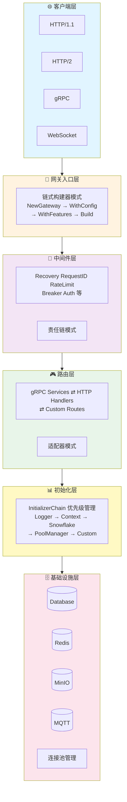
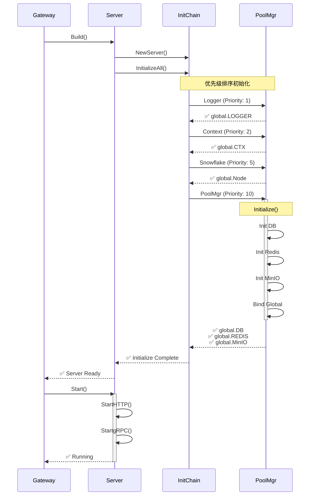
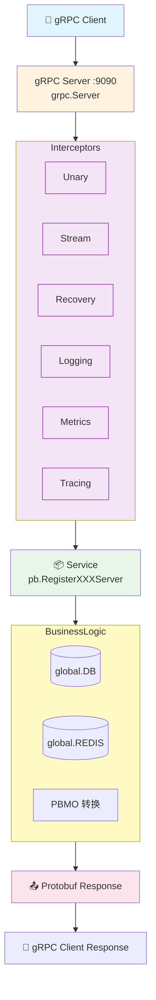

# 🏗️ 系统架构文档

> Go RPC Gateway 深度架构解析

---

## 📋 目录

- [架构概览](#架构概览)
- [核心组件](#核心组件)
- [初始化流程](#初始化流程)
- [请求处理流程](#请求处理流程)

---

## 🏛️ 架构概览

Go RPC Gateway 采用分层架构设计，将系统分为 6 个核心层次：



---

## 🧩 核心组件

### 1. Gateway (网关核心)

**文件**: `gateway.go`

**职责**:
- 提供链式构建器 API
- 管理网关生命周期
- 协调各组件初始化
- 处理优雅关闭

**核心结构**:

```go
type GatewayBuilder struct {
    configPath     string
    searchPath     string
    prefix         string
    environment    string
    hotReload      *config.HotReloadConfig
    silent         bool
    autoStart      bool
}

func (b *GatewayBuilder) Build() (*server.Server, error)
func (b *GatewayBuilder) BuildAndStart() (*server.Server, error)
```

**设计亮点**:
- ✅ 流畅的 API 设计 (Method Chaining)
- ✅ 参数可选 (Optional Parameters)
- ✅ 默认值智能推断
- ✅ 错误提前发现

---

### 2. Server (服务器核心)

**文件**: `server/server.go`, `server/http.go`, `server/grpc.go`

**职责**:
- 管理 HTTP/gRPC 双协议服务
- 功能特性动态控制
- 路由注册和分发
- 健康检查管理

**核心结构**:

```go
type Server struct {
    config          *gwconfig.Gateway
    httpServer      *http.Server
    grpcServer      *grpc.Server
    middlewareChain *middleware.Manager
    enabledFeatures map[FeatureType]bool
}

func (s *Server) Start() error
func (s *Server) EnableFeature(feature FeatureType)
func (s *Server) RegisterService(registrar func(*grpc.Server))
func (s *Server) RegisterHTTPRoutes(routes map[string]http.HandlerFunc)
```

**特性管理**:

```go
type FeatureType string

const (
    FeatureSwagger    FeatureType = "swagger"
    FeatureMonitoring FeatureType = "monitoring"
    FeatureHealth     FeatureType = "health"
    FeaturePProf      FeatureType = "pprof"
    FeatureTracing    FeatureType = "tracing"
    FeatureWSC        FeatureType = "wsc"
)
```

---

### 3. InitializerChain (初始化链)

**文件**: `global/initializer.go`

**职责**:
- 基于优先级的组件初始化
- 依赖关系自动管理
- 健康检查统一接口
- 资源清理逆序执行

**核心接口**:

```go
type Initializer interface {
    Name() string
    Priority() int
    Initialize(ctx context.Context, cfg *gwconfig.Gateway) error
    Cleanup() error
    HealthCheck() error
}

type InitializerChain struct {
    initializers []Initializer
}

func (c *InitializerChain) Register(i Initializer)
func (c *InitializerChain) InitializeAll(ctx context.Context, cfg *gwconfig.Gateway) error
func (c *InitializerChain) HealthCheckAll() map[string]error
func (c *InitializerChain) CleanupAll() error
```

**内置初始化器**:

| 初始化器 | 优先级 | 职责 | 依赖 |
|---------|--------|------|------|
| LoggerInitializer | 1 | 初始化日志器 | - |
| ContextInitializer | 2 | 创建全局上下文 | Logger |
| SnowflakeInitializer | 5 | 初始化ID生成器 | Logger |
| PoolManagerInitializer | 10 | 初始化连接池 | Logger, Context |

**执行流程**:

```
[注册阶段]
  Register(&LoggerInitializer{})      -> Priority: 1
  Register(&ContextInitializer{})     -> Priority: 2
  Register(&SnowflakeInitializer{})   -> Priority: 5
  Register(&PoolManagerInitializer{}) -> Priority: 10
  Register(&CustomInitializer{})      -> Priority: 20
  
[排序阶段]
  sort.Slice(initializers, func(i, j int) bool {
      return initializers[i].Priority() < initializers[j].Priority()
  })
  
[执行阶段]
  for _, init := range initializers {
      if err := init.Initialize(ctx, cfg); err != nil {
          return err  // 快速失败
      }
  }
  
[清理阶段 (逆序)]
  for i := len(initializers) - 1; i >= 0; i-- {
      init.Cleanup()
  }
```

---

### 4. Middleware Manager (中间件管理器)

**文件**: `middleware/manager.go`

**职责**:
- 中间件注册和链接
- 执行顺序控制
- HTTP/gRPC 双协议适配

**核心结构**:

```go
type Manager struct {
    middlewares []func(http.Handler) http.Handler
    config      *gwconfig.Gateway
}

func (m *Manager) Use(middleware func(http.Handler) http.Handler)
func (m *Manager) Chain(handler http.Handler) http.Handler
```

**内置中间件**:

```
执行顺序 (从外到内):
  1. Recovery        -> Panic 捕获
  2. RequestID       -> 请求ID生成
  3. Logging         -> 访问日志
  4. Metrics         -> 指标收集
  5. Tracing         -> 链路追踪
  6. Security        -> 安全防护
  7. CORS            -> 跨域处理
  8. RateLimit       -> 流量控制
  9. Breaker         -> 熔断保护
 10. Auth            -> 身份认证
 11. I18N            -> 国际化
 ... (自定义中间件)
 
请求流向:
  Client -> Recovery -> RequestID -> ... -> Handler -> ... -> Client
```

---

### 5. Connection Pool Manager (连接池管理器)

**文件**: `cpool/manager.go`

**职责**:
- 统一管理数据库/Redis/MinIO/MQTT连接
- 自动初始化和健康检查
- 连接池生命周期管理

**核心结构**:

```go
type Manager struct {
    db    *gorm.DB
    redis *redis.Client
    minio *minio.Client
    mqtt  mqtt.Client
    logger logger.Logger
}

func (m *Manager) Initialize(ctx context.Context, cfg *gwconfig.Gateway) error
func (m *Manager) GetDB() *gorm.DB
func (m *Manager) GetRedis() *redis.Client
func (m *Manager) HealthCheck() map[string]bool
func (m *Manager) Close() error
```

**初始化逻辑**:

```go
if cfg.Mysql.Enabled {
    m.db = initDatabase(cfg.Mysql)
    global.DB = m.db  // 绑定到全局
}

if cfg.Redis.Enabled {
    m.redis = initRedis(cfg.Redis)
    global.REDIS = m.redis
}

if cfg.Minio.Enabled {
    m.minio = initMinIO(cfg.Minio)
    global.MinIO = m.minio
}
```

---

## 🔄 初始化流程

### 完整初始化时序图



### 初始化步骤详解

**Step 1: 网关构建**

```go
gw, err := gateway.NewGateway().
    WithConfigPath("config.yaml").
    WithHotReload(nil).
    Build()
```

- 解析配置文件
- 创建 Server 实例
- 触发初始化链

**Step 2: 初始化链执行**

```go
chain := global.GetDefaultInitializerChain()
ctx, cancel := context.WithTimeout(global.CTX, 30*time.Second)
defer cancel()

err := chain.InitializeAll(ctx, global.GATEWAY)
```

- 按优先级顺序初始化
- 超时控制 (30秒)
- 错误快速失败

**Step 3: 组件绑定**

```go
// 由 PoolManagerInitializer 自动执行
global.DB = manager.GetDB()
global.REDIS = manager.GetRedis()
global.MinIO = manager.GetMinIO()
global.Node = snowflakeNode
```

**Step 4: 服务启动**

```go
gw.Start()
```

- 启动 HTTP 服务器 (端口 8080)
- 启动 gRPC 服务器 (端口 9090)
- 启用功能特性
- 注册信号处理

---

## 🚦 请求处理流程

### HTTP 请求流程

```mermaid
flowchart TD
    Client["🌐 Client Request"] --> HTTPServer["HTTP Server :8080<br/>http.Server.Handler"]
    
    HTTPServer --> MW["🔧 Middleware Chain"]
    
    subgraph Middlewares["中间件执行顺序"]
        MW1["Recovery"] --> MW2["RequestID"]
        MW2 --> MW3["Logging"]
        MW3 --> MW4["Metrics"]
        MW4 --> MW5["Tracing"]
        MW5 --> MW6["Security"]
        MW6 --> MW7["CORS"]
        MW7 --> MW8["RateLimit"]
        MW8 --> MW9["Breaker"]
        MW9 --> MW10["Auth"]
    end
    
    MW --> MW1
    MW10 --> Router
    
    Router["🎮 Router<br/>http.ServeMux"] --> Handlers
    
    subgraph Handlers["处理器类型"]
        H1["gRPC Gateway"]
        H2["Custom HTTP"]
        H3["Features<br/>swagger/pprof/health"]
    end
    
    Handlers --> Business["💼 Business Handler"]
    
    subgraph Business
        DB[("global.DB")]
        Redis[("global.REDIS")]
        MinIO[("global.MinIO")]
        Logic["业务逻辑"]
    end
    
    Business --> Response["📤 Response<br/>JSON/Protobuf"]
    Response --> ClientResp["🌐 Client Response"]
    
    style Client fill:#e1f5ff
    style HTTPServer fill:#fff3e0
    style Middlewares fill:#f3e5f5
    style Router fill:#e8f5e9
    style Business fill:#fff9c4
    style Response fill:#fce4ec
```



### gRPC 请求流程



---

**📚 相关文档**:
- [快速开始](QUICK_START.md)
- [初始化器指南](INITIALIZER_GUIDE.md)
- [中间件指南](MIDDLEWARE_GUIDE.md)
- [配置指南](CONFIG_GUIDE.md)
