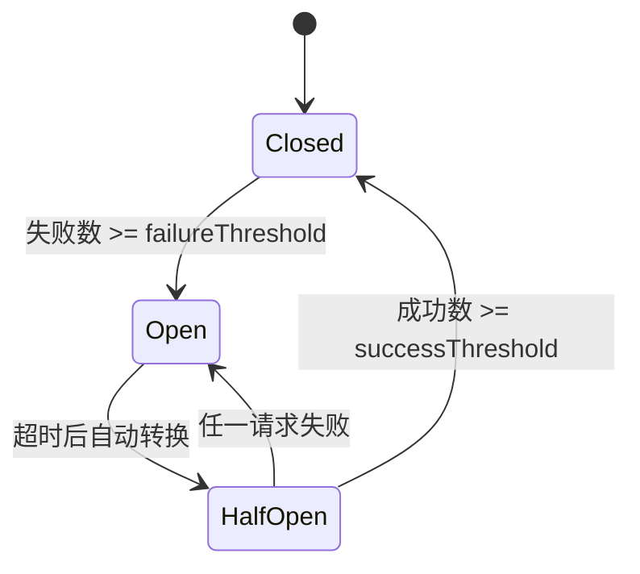
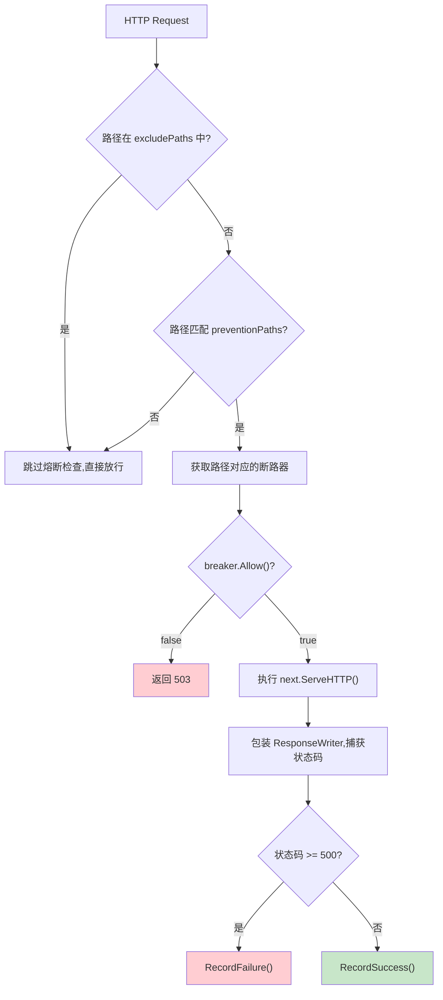

# 熔断器

## 概述

`breaker` 包提供独立的熔断器实现，包含核心断路器逻辑、多实例管理器和 HTTP 中间件。配置管理下沉到 `go-config`，核心业务逻辑由此模块维护。

> 源码目录：[breaker/](../breaker/)

## 状态机

断路器有三种状态：



| 状态 | 行为 |
|------|------|
| `Closed` | 正常工作，允许所有请求，累计失败数 |
| `Open` | 拒绝所有请求，等待超时后转为 HalfOpen |
| `HalfOpen` | 允许部分请求，成功数达到阈值则转 Closed，任一失败则转 Open |

## Breaker — 核心断路器

> 源码：[breaker/breaker.go:Breaker](../breaker/breaker.go#L34)

```go
type Breaker struct {
    mu                sync.RWMutex
    state             State
    failureThreshold  int           // 失败阈值
    successThreshold  int           // 半开→关闭的成功阈值
    timeout           time.Duration // Open→HalfOpen 超时
    volumeThreshold   int           // 最小请求量（低于此值不触发熔断）
    failureCount      int32
    successCount      int32
    totalRequests     int64
    failedRequests    int64
    lastFailureTime   time.Time
    lastSuccessTime   time.Time
    lastStateChangeAt time.Time
}
```

### 创建

> 源码：[breaker.go:New()](../breaker/breaker.go#L49)

```go
breaker := breaker.New(
    5,                // failureThreshold: 连续 5 次失败触发熔断
    3,                // successThreshold: 半开状态连续 3 次成功恢复
    10,               // volumeThreshold: 至少 10 次请求才开始计算
    30*time.Second,   // timeout: 熔断 30 秒后尝试恢复
)
```

### 核心方法

| 方法 | 说明 | 源码 |
|------|------|------|
| `Allow() bool` | 检查是否允许请求通过 | [breaker.go:L61](../breaker/breaker.go#L61) |
| `RecordSuccess()` | 记录成功 | [breaker.go:L80](../breaker/breaker.go#L80) |
| `RecordFailure()` | 记录失败 | [breaker.go:L97](../breaker/breaker.go#L97) |
| `GetState() State` | 获取当前状态 | [breaker.go:L131](../breaker/breaker.go#L131) |
| `GetStats() map[string]any` | 获取统计信息 | [breaker.go:L137](../breaker/breaker.go#L137) |
| `Reset()` | 重置断路器 | [breaker.go:L168](../breaker/breaker.go#L168) |

### 使用示例

```go
breaker := breaker.New(5, 3, 10, 30*time.Second)

if !breaker.Allow() {
    return errors.NewError(errors.ErrCodeCircuitBreakerOpen, "service unavailable")
}

result, err := callExternalService()
if err != nil {
    breaker.RecordFailure()
    return err
}
breaker.RecordSuccess()
return result, nil
```

### 统计信息

```go
stats := breaker.GetStats()
// stats = {
//     "state":             "closed",
//     "total_requests":    150,
//     "failed_requests":   3,
//     "failure_rate":      2.0,
//     "failure_count":     0,
//     "success_count":     0,
//     "last_failure_time": "2025-01-01T12:00:00Z",
//     "last_success_time": "2025-01-01T12:01:00Z",
//     "last_state_change": "2025-01-01T11:00:00Z",
//     "uptime":            "1h0m0s",
// }
```

## Manager — 断路器管理器

> 源码：[breaker/manager.go:Manager](../breaker/manager.go#L22)

管理多个断路器实例，每个路径一个独立断路器。

```go
type Manager struct {
    mu               sync.RWMutex
    breakers         map[string]*Breaker
    failureThreshold int
    successThreshold int
    timeout          int64          // 纳秒
    volumeThreshold  int
    preventionPaths  []string       // 需要保护的路径前缀
    excludePaths     []string       // 排除的路径
}
```

### 创建

> 源码：[manager.go:NewManager()](../breaker/manager.go#L33)

```go
manager := breaker.NewManager(
    5,                // failureThreshold
    3,                // successThreshold
    10,               // volumeThreshold
    30e9,             // timeout (纳秒，30秒)
    []string{"/api/v1/external/"},  // preventionPaths
    []string{"/api/v1/health"},     // excludePaths
)
```

### 核心方法

| 方法 | 说明 | 源码 |
|------|------|------|
| `GetBreaker(path) *Breaker` | 获取或创建路径断路器（double-check lock） | [manager.go:L47](../breaker/manager.go#L47) |
| `IsPathProtected(path) bool` | 检查路径是否需要保护 | [manager.go:L107](../breaker/manager.go#L107) |
| `GetAllBreakers() map[string]*Breaker` | 获取所有断路器 | [manager.go:L73](../breaker/manager.go#L73) |
| `ResetBreaker(path) bool` | 重置指定路径断路器 | [manager.go:L85](../breaker/manager.go#L85) |
| `ResetAllBreakers()` | 重置所有断路器 | [manager.go:L96](../breaker/manager.go#L96) |
| `GetStats() map[string]map[string]any` | 获取所有断路器统计 | [manager.go:L108](../breaker/manager.go#L108) |
| `GetHealthStatus() map[string]any` | 获取健康状态 | [manager.go:L172](../breaker/manager.go#L172) |

### 健康状态

```go
status := manager.GetHealthStatus()
// status = {
//     "is_healthy":         true,
//     "total_breakers":     5,
//     "open_breakers":      0,
//     "half_open_breakers": 1,
//     "closed_breakers":    4,
// }
```

### 计数方法

| 方法 | 说明 | 源码 |
|------|------|------|
| `CountOpenBreakers() int` | Open 状态数量 | [manager.go:L126](../breaker/manager.go#L126) |
| `CountHalfOpenBreakers() int` | HalfOpen 状态数量 | [manager.go:L137](../breaker/manager.go#L137) |
| `CountClosedBreakers() int` | Closed 状态数量 | [manager.go:L148](../breaker/manager.go#L148) |

## HTTPMiddleware — HTTP 中间件

> 源码：[breaker/middleware.go:HTTPMiddleware()](../breaker/middleware.go#L17)

```go
func HTTPMiddleware(manager *Manager) func(http.Handler) http.Handler
```

为 HTTP 处理器提供断路器保护：

```go
manager := breaker.NewManager(5, 3, 10, 30e9,
    []string{"/api/v1/external/"},
    []string{"/api/v1/health"},
)

// 应用中间件
handler := breaker.HTTPMiddleware(manager)(nextHandler)
```

执行流程：



熔断时的响应：

```json
{
    "code": 503,
    "message": "Service temporarily unavailable (circuit breaker open)",
    "success": false
}
```

## 配置

```yaml
middleware:
  breaker:
    enabled: true
    failure-threshold: 5
    success-threshold: 3
    volume-threshold: 10
    timeout: 30s
    prevention-paths:
      - "/api/v1/external/"
    exclude-paths:
      - "/api/v1/health"
```

## 下一步

- [中间件系统](./MIDDLEWARE.md) — 了解所有中间件
- [错误体系](./ERRORS.md) — 了解熔断器使用的错误码
