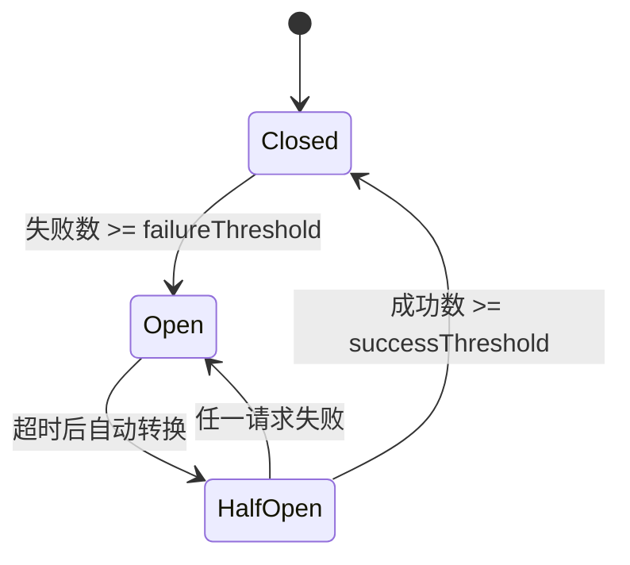
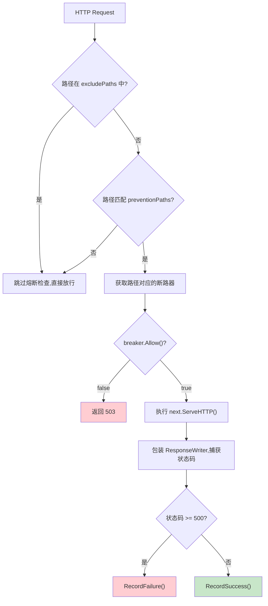

# 熔断器

## 概述

`middleware` 包提供独立的熔断器实现，包含核心断路器逻辑、多实例管理器和 HTTP 中间件。配置管理下沉到 `go-config`（`breakerconfig.CircuitBreaker`），核心业务逻辑由此模块维护。

> 源码：[middleware/breaker.go](../middleware/breaker.go)

## 状态机

断路器有三种状态：


```mermaid
stateDiagram-v2
    [*] --> Closed

    Closed --> Open : 失败数 >= failureThreshold
    Open --> HalfOpen : 超时后自动转换
    HalfOpen --> Closed : 成功数 >= successThreshold
    HalfOpen --> Open : 任一请求失败
```

| 状态 | 常量 | 行为 |
|------|------|------|
| `BreakerClosed` | `"closed"` | 正常工作，允许所有请求，累计失败数 |
| `BreakerOpen` | `"open"` | 拒绝所有请求，等待超时后转为 HalfOpen |
| `BreakerHalfOpen` | `"half_open"` | 允许部分请求，成功数达到阈值则转 Closed，任一失败则转 Open |

`BreakerState` 类型定义为 `type BreakerState string`，上述三个常量为其可选值。

## Breaker — 核心断路器

> 源码：[middleware/breaker.go:Breaker](../middleware/breaker.go#L37)

```go
type Breaker struct {
    mu                sync.RWMutex
    state             BreakerState
    failureThreshold  int           // 失败阈值
    successThreshold  int           // 半开→关闭的成功阈值
    timeout           time.Duration // Open→HalfOpen 超时
    volumeThreshold   int           // 最小请求量（低于此值不触发熔断）
    failureCount      int32
    successCount      int32
    totalRequests     int64
    failedRequests    int64
    lastFailureTime   time.Time
    lastSuccessTime   time.Time
    lastStateChangeAt time.Time
}
```

### 创建

> 源码：[breaker.go:NewBreaker()](../middleware/breaker.go#L54)

```go
breaker := middleware.NewBreaker(
    5,                // failureThreshold: 连续 5 次失败触发熔断
    3,                // successThreshold: 半开状态连续 3 次成功恢复
    10,               // volumeThreshold: 至少 10 次请求才开始计算
    30*time.Second,   // timeout: 熔断 30 秒后尝试恢复
)
```

### 核心方法

| 方法 | 说明 | 源码 |
|------|------|------|
| `Allow() bool` | 检查是否允许请求通过 | [breaker.go:L67](../middleware/breaker.go#L67) |
| `RecordSuccess()` | 记录成功 | [breaker.go:L96](../middleware/breaker.go#L96) |
| `RecordFailure()` | 记录失败 | [breaker.go:L113](../middleware/breaker.go#L113) |
| `GetState() BreakerState` | 获取当前状态 | [breaker.go:L162](../middleware/breaker.go#L162) |
| `GetStats() BreakerSnapshot` | 获取统计信息（等价于 `Snapshot()`） | [breaker.go:L169](../middleware/breaker.go#L169) |
| `Snapshot() BreakerSnapshot` | 获取强类型快照（用于指标采集） | [breaker.go:L183](../middleware/breaker.go#L183) |
| `Reset()` | 重置断路器 | [breaker.go:L196](../middleware/breaker.go#L196) |

### BreakerSnapshot — 强类型快照

> 源码：[middleware/breaker.go:BreakerSnapshot](../middleware/breaker.go#L174)

`GetStats()` 返回强类型 `BreakerSnapshot`，避免 `map[string]any` 的反射开销，便于指标采集：

```go
type BreakerSnapshot struct {
    State          BreakerState
    TotalRequests  int64
    FailedRequests int64
    FailureCount   int32
    SuccessCount   int32
}
```

### 使用示例

```go
breaker := middleware.NewBreaker(5, 3, 10, 30*time.Second)

if !breaker.Allow() {
    return errors.NewError(errors.ErrCodeCircuitBreakerOpen, "service unavailable")
}

result, err := callExternalService()
if err != nil {
    breaker.RecordFailure()
    return err
}
breaker.RecordSuccess()
return result, nil
```

### 统计信息

```go
stats := breaker.GetStats()
// stats 类型为 BreakerSnapshot：
// stats.State          = BreakerClosed
// stats.TotalRequests  = 150
// stats.FailedRequests = 3
// stats.FailureCount   = 0
// stats.SuccessCount   = 0
```

## BreakerManager — 断路器管理器

> 源码：[middleware/breaker.go:BreakerManager](../middleware/breaker.go#L217)

管理多个断路器实例，每个路径一个独立断路器。直接持有 `go-config` 的 `breakerconfig.CircuitBreaker` 配置对象。

```go
type BreakerManager struct {
    mu             sync.RWMutex
    breakers       map[string]*Breaker
    config         *breakerconfig.CircuitBreaker // go-config 断路器配置
    excludePathSet map[string]struct{}           // 排除路径集合，O(1) 查找替代线性扫描
}
```

### 创建

> 源码：[breaker.go:NewBreakerManager()](../middleware/breaker.go#L225)

直接接收 `go-config` 配置对象；传 `nil` 时自动使用 `breakerconfig.Default()`：

```go
import (
    "github.com/kamalyes/go-rpc-gateway/middleware"
    breakerconfig "github.com/kamalyes/go-config/pkg/breaker"
)

cfg := &breakerconfig.CircuitBreaker{
    Enabled:          true,
    FailureThreshold: 5,
    SuccessThreshold: 3,
    VolumeThreshold:  10,
    Timeout:          int64(30 * time.Second), // 纳秒
    PreventionPaths:  []string{"/api/v1/external/"}, // 需要保护的路径前缀
    ExcludePaths:     []string{"/api/v1/health"},    // 排除的路径
}
manager := middleware.NewBreakerManager(cfg)
```

### 核心方法

| 方法 | 说明 | 源码 |
|------|------|------|
| `GetBreaker(path) *Breaker` | 获取或创建路径断路器（double-check lock） | [breaker.go:L240](../middleware/breaker.go#L240) |
| `GetAllBreakers() map[string]*Breaker` | 获取所有断路器 | [breaker.go:L268](../middleware/breaker.go#L268) |
| `GetAllBreakerSnapshots() map[string]BreakerSnapshot` | 获取所有断路器的强类型快照（用于指标采集） | [breaker.go:L280](../middleware/breaker.go#L280) |
| `GetStats() map[string]BreakerSnapshot` | 获取所有断路器统计（等价于 `GetAllBreakerSnapshots`，兼容旧 API） | [breaker.go:L321](../middleware/breaker.go#L321) |
| `ResetBreaker(path) bool` | 重置指定路径断路器 | [breaker.go:L292](../middleware/breaker.go#L292) |
| `ResetAllBreakers()` | 重置所有断路器 | [breaker.go:L306](../middleware/breaker.go#L306) |
| `IsPathProtected(path) bool` | 检查路径是否需要保护（排除路径 O(1) map 查找，保护路径前缀匹配） | [breaker.go:L326](../middleware/breaker.go#L326) |
| `CountByState() BreakerHealthStatus` | 单次遍历统计各状态断路器数量 | [breaker.go:L352](../middleware/breaker.go#L352) |
| `GetHealthStatus() BreakerHealthStatus` | 获取健康状态（返回强类型结构体，单次遍历） | [breaker.go:L387](../middleware/breaker.go#L387) |

### BreakerHealthStatus — 健康状态

> 源码：[middleware/breaker.go:BreakerHealthStatus](../middleware/breaker.go#L343)

`GetHealthStatus()` 返回强类型 `BreakerHealthStatus`，替代旧的 `map[string]any`：

```go
type BreakerHealthStatus struct {
    Total    int  // 断路器总数
    Open     int  // 打开数量
    HalfOpen int  // 半开数量
    Closed   int  // 关闭数量
    Healthy  bool // 是否健康（无打开的断路器）
}
```

```go
status := manager.GetHealthStatus()
// status.Total    = 5
// status.Open     = 0
// status.HalfOpen = 1
// status.Closed   = 4
// status.Healthy  = true
```

### 计数方法

以下方法均委托 `CountByState()` 单次遍历得到结果（替代三次独立遍历）：

| 方法 | 说明 | 源码 |
|------|------|------|
| `CountOpenBreakers() int` | Open 状态数量 | [breaker.go:L372](../middleware/breaker.go#L372) |
| `CountHalfOpenBreakers() int` | HalfOpen 状态数量 | [breaker.go:L377](../middleware/breaker.go#L377) |
| `CountClosedBreakers() int` | Closed 状态数量 | [breaker.go:L382](../middleware/breaker.go#L382) |

## BreakerHTTPMiddleware — HTTP 中间件

> 源码：[middleware/breaker.go:BreakerHTTPMiddleware()](../middleware/breaker.go#L397)

```go
func BreakerHTTPMiddleware(manager *BreakerManager) func(http.Handler) http.Handler
```

为 HTTP 处理器提供断路器保护：

```go
manager := middleware.NewBreakerManager(cfg)

// 应用中间件
handler := middleware.BreakerHTTPMiddleware(manager)(nextHandler)
```

执行流程：


```mermaid
flowchart TD
    REQ["HTTP Request"] --> CHECK_EXCLUDE{"路径在 excludePaths 中?"}
    CHECK_EXCLUDE -->|是| SKIP["跳过熔断检查,直接放行"]
    CHECK_EXCLUDE -->|否| CHECK_PREVENT{"路径匹配 preventionPaths?"}
    CHECK_PREVENT -->|否| SKIP
    CHECK_PREVENT -->|是| GET_BREAKER["获取路径对应的断路器"]
    GET_BREAKER --> ALLOW{"breaker.Allow()?"}
    ALLOW -->|false| REJECT["返回 503"]
    ALLOW -->|true| EXEC["执行 next.ServeHTTP()"]
    EXEC --> WRAP["包装 ResponseWriter,捕获状态码"]
    WRAP --> CHECK_STATUS{"状态码 >= 500?"}
    CHECK_STATUS -->|是| RECORD_FAIL["RecordFailure()"]
    CHECK_STATUS -->|否| RECORD_SUCCESS["RecordSuccess()"]

    style REJECT fill:#ffcdd2
    style RECORD_FAIL fill:#ffcdd2
    style RECORD_SUCCESS fill:#c8e6c9
```

熔断时的响应（使用预分配的响应体，零分配）：

```json
{
    "code": 503,
    "message": "Service temporarily unavailable (circuit breaker open)",
    "success": false
}
```

## 配置

熔断器配置通过 `go-config` 的 `breakerconfig.CircuitBreaker` 提供，YAML 中位于 `middleware.circuit-breaker`：

```yaml
middleware:
  circuit-breaker:
    enabled: true
    failure-threshold: 5
    success-threshold: 3
    volume-threshold: 10
    timeout: 30000000000  # 纳秒（30 秒）
    prevention-paths:
      - "/api/v1/external/"
    exclude-paths:
      - "/api/v1/health"
```

> `timeout` 字段为 `int64` 纳秒值，运行时通过 `time.Duration(m.config.Timeout)` 转换。

## 下一步

- [中间件系统](./MIDDLEWARE.md) — 了解所有中间件
- [错误体系](./ERRORS.md) — 了解熔断器使用的错误码
