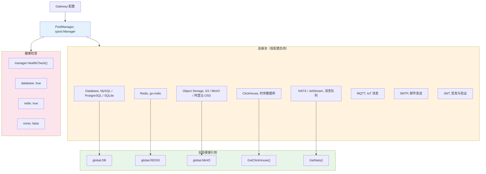

# 连接池管理

## 概述

`cpool.Manager` 是所有连接的唯一管理者，统一管理数据库、Redis、MinIO、ClickHouse、NATS、MQTT、SMTP 等客户端连接的生命周期。

> 源码：[cpool/manager.go](../cpool/manager.go)

## 连接管理架构



## PoolManager 接口

> 源码：[cpool/manager.go:PoolManager](../cpool/manager.go#L30)

```go
type PoolManager interface {
    Initialize(ctx context.Context, cfg *gwconfig.Gateway) error
    GetDB() *gorm.DB
    GetRedis() *redis.Client
    GetCache() cachex.CtxCache
    GetMinIO() *minio.Client
    GetStorage() oss.StorageHandler
    GetMQTT() mqtt.Client
    GetSnowflake() *snowflake.Node
    GetCasbin() casbin.IEnforcer
    GetSMTP() smtp.MailHandler
    GetClickHouse() clickhouse.Conn
    GetNats() *natsclient.NatsConn
    GetNatsX() *natsx.Client
    SetDB(db *gorm.DB)
    Close() error
    HealthCheck() map[string]bool
}
```

## 创建 Manager

```go
manager := cpool.NewManager(logger)
if err := manager.Initialize(ctx, cfg); err != nil {
    return err
}
defer manager.Close()
```

Manager 初始化时自动根据配置启用对应连接：

```yaml
database:
  enabled: true
cache:
  enabled: true
oss:
  enabled: true
tsdb:
  enabled: true
queue:
  enabled: true
mqtt:
  enabled: true
smtp:
  enabled: true
```

## 数据库 — MySQL / PostgreSQL / SQLite

> 源码：[cpool/database/client.go](../cpool/database/client.go)

支持三种数据库驱动：

```yaml
database:
  enabled: true
  db-name: mydb
  driver: "mysql"          # mysql | postgres | sqlite
  host: "127.0.0.1"
  port: 3306
  username: root
  password: "secret"
  max-open-conns: 100
  max-idle-conns: 10
  conn-max-lifetime: 3600  # 秒
```

获取连接：

```go
db := gwglobal.GetDB()
db.Create(&user)
db.Find(&users)
```

## Redis

> 源码：[cpool/redis/redis.go](../cpool/redis/redis.go)

```yaml
cache:
  enabled: true
  host: "127.0.0.1"
  port: 6379
  password: ""
  db: 0
```

获取连接：

```go
rdb := gwglobal.GetRedis()
rdb.Set(ctx, "key", "value", 10*time.Minute)
val, err := rdb.Get(ctx, "key").Result()
```

## 对象存储 — S3 / MinIO / 阿里云 OSS

> 源码：[cpool/oss/storage.go](../cpool/oss/storage.go)

```yaml
oss:
  enabled: true
  endpoint: "minio:9000"
  access-key: "minioadmin"
  secret-key: "minioadmin"
  bucket: "my-bucket"
  use-ssl: false
```

获取连接：

```go
minioClient := gwglobal.GetMinIO()

// 或使用 StorageHandler 统一接口
storage := gwglobal.GetPoolManager().GetStorage()
info, err := storage.Upload(ctx, bucket, key, reader, size)
```

StorageHandler 统一接口支持 S3/MinIO/阿里云 OSS，屏蔽底层差异。

## ClickHouse

> 源码：[cpool/clickhouse/client.go](../cpool/clickhouse/client.go)

```yaml
tsdb:
  enabled: true
  host: "clickhouse:9000"
  database: "analytics"
  username: "default"
  password: ""
```

获取连接：

```go
chConn := gwglobal.GetClickHouse()
rows, err := chConn.Query(ctx, "SELECT * FROM events LIMIT 10")
```

支持原生 ClickHouse 连接和标准 database/sql 接口两种模式。

## NATS / JetStream

> 源码：[cpool/nats/client.go](../cpool/nats/client.go)

```yaml
queue:
  enabled: true
  endpoint: "nats://nats:4222"
  jetstream-enabled: true
```

获取连接：

```go
natsConn := gwglobal.GetNats()
natsConn.Conn.Publish("subject", data)

// 使用 JetStream
js := natsConn.JetStream
js.Publish(ctx, "subject", data)

// 使用 go-natsx 易用性封装
natsxClient := gwglobal.GetNatsX()
natsxClient.Publish("subject", msg)
```

NatsConn 封装结构：

```go
type NatsConn struct {
    Conn      *nats.Conn            // NATS 底层连接
    JetStream nats.JetStreamContext // JetStream 上下文
}
```

## MQTT

> 源码：[cpool/mqtt/mqtt.go](../cpool/mqtt/mqtt.go)

```yaml
mqtt:
  enabled: true
  endpoint: "tcp://mqtt:1883"
  client-id: "my-service"
  protocol-version: 4
  clean-session: true
```

获取连接：

```go
mqttClient := gwglobal.GetPoolManager().GetMQTT()
token := mqttClient.Publish("topic", 0, false, payload)
```

## SMTP 邮件

> 源码：[cpool/smtp/smtp.go](../cpool/smtp/smtp.go)

```yaml
smtp:
  enabled: true
  host: "smtp.example.com"
  port: 587
  username: "noreply@example.com"
  password: "secret"
```

获取连接：

```go
smtpClient := gwglobal.GetPoolManager().GetSMTP()
err := smtpClient.SendEmail(ctx, []string{"user@example.com"}, "Subject", "Body")
err := smtpClient.SendEmailWithHTML(ctx, []string{"user@example.com"}, "Subject", "<h1>HTML</h1>")
```

MailHandler 接口：

```go
type MailHandler interface {
    SendEmail(ctx context.Context, to []string, subject, body string) error
    SendEmailWithHTML(ctx context.Context, to []string, subject, htmlBody string) error
    Close() error
}
```

## JWT 签发与验证

> 源码：[cpool/jwt/jwt.go](../cpool/jwt/jwt.go)、[cpool/jwt/model.go](../cpool/jwt/model.go)

```go
// 创建 JWT 实例
j := jwt.NewJWT()

// 设置签名密钥
jwt.SetJWTSignKey("your-secret-key")

// 生成 Token
claims := jwt.CustomClaims{
    UserId:      "user-123",
    UserName:    "john",
    AuthorityId: "admin",
    RegisteredClaims: jwt.RegisteredClaims{
        ExpiresAt: jwt.NewNumericDate(time.Now().Add(24 * time.Hour)),
    },
}
token, err := j.GenerateToken(claims)

// 解析 Token
parsedClaims, err := j.ParseToken(tokenString)
```

CustomClaims 模型：

> 源码：[cpool/jwt/model.go:CustomClaims](../cpool/jwt/model.go#L33)

```go
type CustomClaims struct {
    TokenId      string `json:"tokenId"`
    UserId       string `json:"userId"`
    UserName     string `json:"userName"`
    UserType     string `json:"userType"`
    NickName     string `json:"nickName"`
    PhoneNumber  string `json:"phoneNumber"`
    AuthorityId  string `json:"authorityId"`
    MerchantNo   string `json:"merchantNo"`
    PlatformType int32  `json:"platformType"`
    AppProductId int32  `json:"appProductId"`
    Extend       string `json:"extend"`
    BufferTime   int64  `json:"bufferTime"`
    jwt.RegisteredClaims
}
```

## 健康检查

```go
status := manager.HealthCheck()
// status = map[string]bool{
//     "database":    true,
//     "redis":       true,
//     "minio":       false,
//     "clickhouse":  true,
//     "nats":        true,
// }
```

## 关闭所有连接

```go
if err := manager.Close(); err != nil {
    logger.Error("Failed to close pool manager: %v", err)
}
```

## 下一步

- [全局变量与初始化器](./GLOBAL.md) — 了解 PoolManager 如何被自动初始化
- [gRPC 客户端](./GRPC-CLIENT.md) — 了解 gRPC 客户端连接管理
