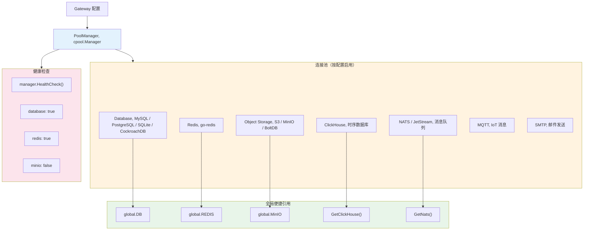

# 连接池管理

## 概述

`cpool.Manager` 是所有连接的唯一管理者，统一管理数据库、Redis、MinIO、ClickHouse、NATS、MQTT、SMTP 等客户端连接的生命周期。

> 源码：[cpool/manager.go](../cpool/manager.go)

## 连接管理架构


```mermaid
flowchart TD
    CFG["Gateway 配置"] --> MGR["PoolManager, cpool.Manager"]

    subgraph POOLS["连接池（按配置启用）"]
        DB["Database, MySQL / PostgreSQL / SQLite / CockroachDB"]
        REDIS["Redis, go-redis"]
        OSS["Object Storage, S3 / MinIO / BoltDB"]
        CH["ClickHouse, 时序数据库"]
        NATS["NATS / JetStream, 消息队列"]
        MQTT["MQTT, IoT 消息"]
        SMTP["SMTP, 邮件发送"]
    end

    MGR --> POOLS

    subgraph GLOBAL_REF["全局便捷引用"]
        G_DB["global.DB"]
        G_REDIS["global.REDIS"]
        G_MINIO["global.MinIO"]
        G_CH["GetClickHouse()"]
        G_NATS["GetNats()"]
    end

    DB --> G_DB
    REDIS --> G_REDIS
    OSS --> G_MINIO
    CH --> G_CH
    NATS --> G_NATS

    subgraph HEALTH["健康检查"]
        HC["manager.HealthCheck()"]
        HC_DB["database: true"]
        HC_REDIS["redis: true"]
        HC_MINIO["minio: false"]
    end

    MGR --> HEALTH

    style MGR fill:#e3f2fd
    style POOLS fill:#fff3e0
    style GLOBAL_REF fill:#e8f5e9
    style HEALTH fill:#fce4ec
```

## PoolManager 接口

> 源码：[cpool/manager.go:PoolManager](../cpool/manager.go#L30)

```go
type PoolManager interface {
    Initialize(ctx context.Context, cfg *gwconfig.Gateway) error

    GetDB() *gorm.DB
    GetRedis() *redis.Client
    GetCache() cachex.CtxCache
    GetMinIO() *minio.Client
    GetStorage() oss.StorageHandler
    GetMQTT() mqtt.Client
    GetSnowflake() *snowflake.Node
    GetSMTP() smtp.MailHandler
    GetClickHouse() *gorm.DB
    GetNats() *natsclient.NatsConn
    GetNatsX() *natsx.Client
    GetI18n() interface{}

    SetDB(db *gorm.DB)
    SetRedis(rdb *redis.Client)
    SetCache(cache cachex.CtxCache)
    SetMinIO(minio *minio.Client)
    SetMQTT(mqtt mqtt.Client)
    SetSnowflake(node *snowflake.Node)
    SetSMTP(smtp smtp.MailHandler)
    SetClickHouse(conn *gorm.DB)
    SetNats(conn *natsclient.NatsConn)
    SetI18n(i18n interface{})

    Close() error
    HealthCheck() map[string]bool
}
```

## 创建 Manager

```go
manager := cpool.NewManager(logger)
if err := manager.Initialize(ctx, cfg); err != nil {
    return err
}
defer manager.Close()
```

Manager 初始化时自动根据配置启用对应连接：

```yaml
database:
  enabled: true
cache:
  enabled: true
oss:
  enabled: true
tsdb:
  enabled: true
queue:
  enabled: true
mqtt:
  enabled: true
smtp:
  enabled: true
```

## 数据库 — MySQL / PostgreSQL / SQLite / CockroachDB

> 源码：[cpool/database/client.go](../cpool/database/client.go)

支持四种数据库驱动，由 `database.Gorm` 根据配置 `type` 字段分发，对应工厂函数 `GormMySQL`、`GormPostgreSQL`、`GormSQLite`、`GormCockroachDB`（CockroachDB 兼容 PostgreSQL 协议）：

```yaml
database:
  enabled: true
  db-name: mydb
  type: "mysql"            # mysql | postgres | sqlite | cockroachdb
  host: "127.0.0.1"
  port: 3306
  username: root
  password: "secret"
  max-open-conns: 100
  max-idle-conns: 10
  conn-max-lifetime: 3600  # 秒
```

获取连接：

```go
db := gwglobal.GetDB()
db.Create(&user)
db.Find(&users)
```

## Redis

> 源码：[cpool/redis/redis.go](../cpool/redis/redis.go)

```yaml
cache:
  enabled: true
  host: "127.0.0.1"
  port: 6379
  password: ""
  db: 0
```

获取连接：

```go
rdb := gwglobal.GetRedis()
rdb.Set(ctx, "key", "value", 10*time.Minute)
val, err := rdb.Get(ctx, "key").Result()
```

## 对象存储 — S3 / MinIO / BoltDB

> 源码：[cpool/oss/storage.go](../cpool/oss/storage.go)、[cpool/oss/minio.go](../cpool/oss/minio.go)、[cpool/oss/boltdb.go](../cpool/oss/boltdb.go)

```yaml
oss:
  enabled: true
  type: "minio"            # minio | s3 | boltdb
  endpoint: "minio:9000"
  access-key: "minioadmin"
  secret-key: "minioadmin"
  bucket: "my-bucket"
  use-ssl: false
```

获取连接：

```go
minioClient := gwglobal.GetMinIO()

// 或使用 StorageHandler 统一接口
storage := gwglobal.GetPoolManager().GetStorage()
info, err := storage.PutObject(ctx, bucket, key, reader, size, "application/octet-stream")
```

`StorageHandler` 统一接口屏蔽 S3 / MinIO / BoltDB 底层差异，由 `oss.NewStorage` 根据配置 `type` 创建对应实现（`MinIOStorage`、`S3Storage`、`BoltDBStorage`）。主要方法包括 Bucket 操作（`ListBuckets`、`BucketExists`、`CreateBucket`、`DeleteBucket`）、Object 操作（`ListObjects`、`GetObject`、`GetObjectBlob`、`PutObject`、`DeleteObject`）、预签名 URL（`GetPresignedDownloadURL`、`GetPresignedUploadURL`）和 `Close`。

## ClickHouse

> 源码：[cpool/clickhouse/client.go](../cpool/clickhouse/client.go)

```yaml
tsdb:
  enabled: true
  host: "clickhouse:9000"
  database: "analytics"
  username: "default"
  password: ""
```

获取连接（返回 `*gorm.DB`，由 `NewClickHouseDB` 创建，内部基于 gorm clickhouse 驱动，并复用 `cpool/database` 的 `GormLogger` 统一 SQL 日志）：

```go
chDB := gwglobal.GetClickHouse()
rows, err := chDB.Raw("SELECT * FROM events LIMIT 10").Rows()
defer rows.Close()
```

## NATS / JetStream

> 源码：[cpool/nats/client.go](../cpool/nats/client.go)

```yaml
queue:
  enabled: true
  endpoint: "nats://nats:4222"
  jetstream-enabled: true
```

获取连接：

```go
natsConn := gwglobal.GetNats()
natsConn.Conn.Publish("subject", data)

// 使用 JetStream（需配置 jetstream-enabled）
js := natsConn.JetStream
js.Publish("subject", data)

// 使用 go-natsx 易用性封装（推荐，提供泛型发布/订阅、批量流式消费、WorkerPool）
natsxClient := gwglobal.GetNatsX()
```

`NatsConn` 封装结构（由 `NewNats` 创建，将底层连接、JetStream 上下文与 go-natsx 客户端绑定在一起）：

```go
type NatsConn struct {
    Conn      *nats.Conn            // NATS 底层连接实例
    JetStream nats.JetStreamContext // JetStream 上下文（启用 JetStream 时非 nil）
    Client    *natsx.Client         // go-natsx 易用性封装客户端（启用时非 nil）
}
```

## MQTT

> 源码：[cpool/mqtt/mqtt.go](../cpool/mqtt/mqtt.go)

```yaml
mqtt:
  enabled: true
  endpoint: "tcp://mqtt:1883"
  client-id: "my-service"
  protocol-version: 4
  clean-session: true
```

获取连接：

```go
mqttClient := gwglobal.GetPoolManager().GetMQTT()
token := mqttClient.Publish("topic", 0, false, payload)
```

## SMTP 邮件

> 源码：[cpool/smtp/smtp.go](../cpool/smtp/smtp.go)

```yaml
smtp:
  enabled: true
  host: "smtp.example.com"
  port: 587
  username: "noreply@example.com"
  password: "secret"
```

获取连接：

```go
smtpClient := gwglobal.GetPoolManager().GetSMTP()
err := smtpClient.SendEmail(ctx, []string{"user@example.com"}, "Subject", "Body")
err := smtpClient.SendEmailWithHTML(ctx, []string{"user@example.com"}, "Subject", "<h1>HTML</h1>")
```

MailHandler 接口：

```go
type MailHandler interface {
    SendEmail(ctx context.Context, to []string, subject, body string) error
    SendEmailWithHTML(ctx context.Context, to []string, subject, htmlBody string) error
    Close() error
}
```

`SmtpClient` 是 `MailHandler` 的实现，由 `NewSmtpClient(cfg *smtpconfig.Smtp, log logger.ILogger) (*SmtpClient, error)` 创建。

## 健康检查

```go
status := manager.HealthCheck()
// status = map[string]bool{
//     "database":    true,
//     "redis":       true,
//     "minio":       false,
//     "mqtt":        true,
//     "clickhouse":  true,
//     "nats":        true,
// }
```

仅已初始化（非 nil）的连接才会出现在返回 map 中。

## 关闭所有连接

```go
if err := manager.Close(); err != nil {
    logger.Error("Failed to close pool manager: %v", err)
}
```

## 下一步

- [全局变量与初始化器](./GLOBAL.md) — 了解 PoolManager 如何被自动初始化
- [gRPC 客户端](./GRPC-CLIENT.md) — 了解 gRPC 客户端连接管理
