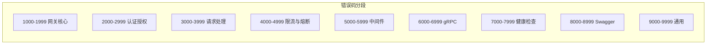
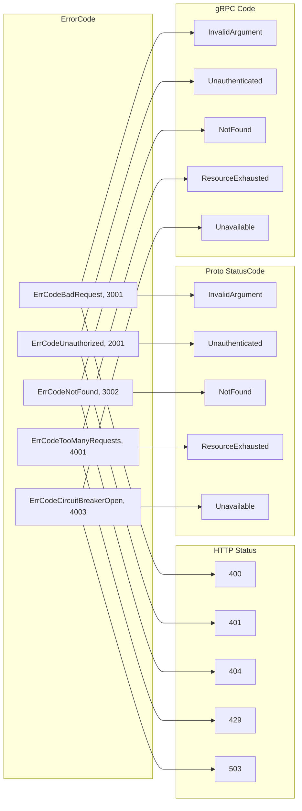

# 错误体系

## 概述

`errors` 包提供统一的错误定义和管理，包含错误码体系、`AppError` 结构体、三态映射（ErrorCode → HTTP Status / gRPC StatusCode / Proto StatusCode）和格式化工具。

> 源码目录：[errors/](../errors/)

## ErrorCode — 错误码

> 源码：[errors/code.go](../errors/code.go)

`ErrorCode` 基于 `int` 类型，按业务域分段：



| 范围 | 域 | 示例 |
|------|-----|------|
| 1000–1999 | 网关核心 | `ErrCodeGatewayNotInitialized(1001)`、`ErrCodeGatewayTimeout(1005)` |
| 1100–1199 | 配置与特性 | `ErrCodeFeatureNotRegistered(1102)`、`ErrCodeGRPCServerInitFailed(1106)` |
| 1200–1299 | 服务器与基础设施 | `ErrCodeServerCreationFailed(1201)` |
| 2000–2999 | 认证授权 | `ErrCodeUnauthorized(2001)`、`ErrCodeTokenExpired(2004)` |
| 2100–2199 | JWT 扩展 | `ErrCodeTokenMalformed(2101)`、`ErrCodeAccountLoginElsewhere(2103)` |
| 3000–3999 | 请求处理 | `ErrCodeBadRequest(3001)`、`ErrCodeNotFound(3002)` |
| 3100–3199 | 数据转换与验证 | `ErrCodePBMessageNil(3101)`、`ErrCodeMustBePointer(3108)` |
| 4000–4999 | 限流与熔断 | `ErrCodeTooManyRequests(4001)`、`ErrCodeCircuitBreakerOpen(4003)` |
| 5000–5999 | 中间件 | `ErrCodeMiddlewareError(5001)`、`ErrCodeSignatureInvalid(5007)` |
| 5100–5199 | 国际化 | `ErrCodeLanguageLoadFailed(5101)` |
| 6000–6999 | gRPC | `ErrCodeGRPCConnectionFailed(6001)`、`ErrCodeGRPCTimeout(6004)` |
| 7000–7999 | 健康检查 | `ErrCodeHealthCheckFailed(7001)` |
| 8000–8999 | Swagger | `ErrCodeSwaggerNotFound(8001)` |
| 9000–9999 | 通用 | `ErrCodeUnknown(9000)`、`ErrCodeConflict(9004)` |

## AppError — 应用错误

> 源码：[errors/error.go:AppError](../errors/error.go#L210)

```go
type AppError struct {
    Code    ErrorCode
    Message string
    Details string
}
```

### 创建

```go
// 基础创建
err := errors.NewError(errors.ErrCodeBadRequest, "invalid user ID")

// 格式化创建
err := errors.NewErrorf(errors.ErrCodeNotFound, "user %s not found", userID)

// 链式添加详情
err := errors.NewError(errors.ErrCodeUnauthorized, "").
    WithDetails("token expired at 2025-01-01").
    WithDetailsf("retry after %d seconds", 60)
```

> 源码：[error.go:NewError()](../errors/error.go#L218)、[error.go:NewErrorf()](../errors/error.go#L227)、[error.go:WithDetails()](../errors/error.go#L262)

### 包装标准错误

```go
// 自动识别：如果 err 已经是 *AppError，直接返回
appErr := errors.Wrap(stdErr, errors.ErrCodeDBQueryError)

// 包装并添加额外信息
appErr := errors.Wrapf(stdErr, errors.ErrCodeGRPCConnectionFailed, "service %s", "user-service")
```

> 源码：[error.go:Wrap()](../errors/error.go#L274)、[error.go:Wrapf()](../errors/error.go#L285)

### 三态映射

每个 `ErrorCode` 自动映射到三种状态码：



| 映射 | 方法 | 源码 |
|------|------|------|
| HTTP Status | `appErr.GetHTTPStatus()` | [error.go:L248](../errors/error.go#L248) |
| Proto StatusCode | `appErr.GetStatusCode()` | [error.go:L256](../errors/error.go#L256) |
| gRPC codes | `appErr.ToGRPCError()` | [error.go:L302](../errors/error.go#L302) |

映射示例：

| ErrorCode | HTTP Status | Proto StatusCode | gRPC Code |
|-----------|-------------|------------------|-----------|
| `ErrCodeBadRequest(3001)` | 400 | `InvalidArgument` | `InvalidArgument` |
| `ErrCodeUnauthorized(2001)` | 401 | `Unauthenticated` | `Unauthenticated` |
| `ErrCodeNotFound(3002)` | 404 | `NotFound` | `NotFound` |
| `ErrCodeTooManyRequests(4001)` | 429 | `ResourceExhausted` | `ResourceExhausted` |
| `ErrCodeCircuitBreakerOpen(4003)` | 503 | `Unavailable` | `Unavailable` |

### 转换为 Result

```go
result := appErr.ToResult()
// result.Code   = 400  (HTTP Status)
// result.Error  = "invalid user ID" (Details 优先，否则 Message)
// result.Status = StatusCode_InvalidArgument
```

> 源码：[error.go:ToResult()](../errors/error.go#L233)

### 转换为 gRPC Error

```go
grpcErr := appErr.ToGRPCError()
// 返回 status.Error(codes.InvalidArgument, "Bad request: invalid user ID")
```

> 源码：[error.go:ToGRPCError()](../errors/error.go#L302)

内部将 `commonapis.StatusCode` 转换为标准 `google.golang.org/grpc/codes`：

```go
switch statusCode {
case commonapis.StatusCode_InvalidArgument:
    code = codes.InvalidArgument
case commonapis.StatusCode_Unauthenticated:
    code = codes.Unauthenticated
// ... 完整映射
}
```

### 判断与提取

```go
// 判断错误码是否匹配
if errors.IsErrorCode(err, errors.ErrCodeNotFound) {
    // 处理 404
}

// 从任意 error 提取 ErrorCode
code := errors.GetErrorCode(err) // 如果不是 AppError，返回 ErrCodeUnknown
```

> 源码：[error.go:IsErrorCode()](../errors/error.go#L367)、[error.go:GetErrorCode()](../errors/error.go#L374)

## Formatter — 格式化工具

> 源码：[errors/formatter.go](../errors/formatter.go)

提供常用消息格式化函数，统一错误消息风格：

```go
// 初始化错误
msg := errors.FormatInitError("Redis", err)
// "初始化Redis失败: connection refused"

// 启动错误
msg := errors.FormatStartupError("gRPC server", err)
// "启动gRPC server失败: address already in use"

// 配置错误
msg := errors.FormatConfigError("加载签名密钥", err)

// 连接信息
msg := errors.FormatConnectionInfo("gRPC", "localhost:9000")
// "🌐 gRPC端点: localhost:9000"

// 关闭信息
msg := errors.FormatShutdownInfo("SIGTERM")
// "\n🛑 收到信号 SIGTERM，开始优雅关闭..."
```

| 函数 | 用途 | 源码 |
|------|------|------|
| `FormatInitError(component, err)` | 初始化失败 | [formatter.go:L26](../errors/formatter.go#L26) |
| `FormatStartupError(service, err)` | 启动失败 | [formatter.go:L31](../errors/formatter.go#L31) |
| `FormatConfigError(operation, err)` | 配置操作失败 | [formatter.go:L36](../errors/formatter.go#L36) |
| `FormatConnectionInfo(service, endpoint)` | 连接信息 | [formatter.go:L41](../errors/formatter.go#L41) |
| `FormatShutdownInfo(signal)` | 关闭信号 | [formatter.go:L56](../errors/formatter.go#L56) |
| `FormatPanicError(operation, err)` | Panic 错误 | [formatter.go:L66](../errors/formatter.go#L66) |

## 完整示例

### Service 层使用

```go
func (s *UserService) GetUser(ctx context.Context, req *pb.GetUserRequest) (*pb.GetUserResponse, error) {
    if req.Id == "" {
        return nil, errors.NewError(errors.ErrCodeMissingParameter, "user ID is required").
            ToGRPCError()
    }

    user, err := s.repo.FindByID(req.Id)
    if err != nil {
        return nil, errors.Wrapf(err, errors.ErrCodeDBQueryError, "find user %s", req.Id).
            ToGRPCError()
    }
    if user == nil {
        return nil, errors.NewErrorf(errors.ErrCodeNotFound, "user %s not found", req.Id).
            ToGRPCError()
    }

    return &pb.GetUserResponse{User: user.ToProto()}, nil
}
```

### HTTP Handler 使用

```go
func (h *Handler) CreateUser(w http.ResponseWriter, r *http.Request) {
    var req CreateUserRequest
    if err := json.NewDecoder(r.Body).Decode(&req); err != nil {
        response.WriteAppErrorf(w, errors.ErrCodeBadRequest, "invalid request body: %v", err)
        return
    }

    if err := h.service.CreateUser(r.Context(), &req); err != nil {
        if appErr, ok := err.(*errors.AppError); ok {
            response.WriteAppError(w, appErr)
        } else {
            response.WriteInternalServerErrorResult(w, "internal error")
        }
    }

    response.WriteSuccessResult(w, "user created")
}
```

## 下一步

- [HTTP 响应工具](./RESPONSE.md) — 了解 AppError 如何被写入 HTTP 响应
- [熔断器](./BREAKER.md) — 了解熔断器如何使用错误码
