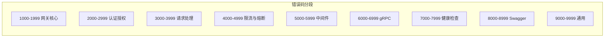
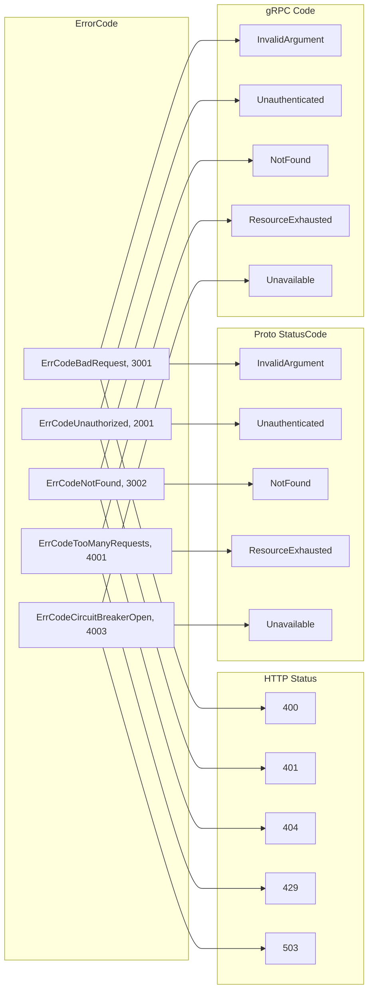

# 错误体系

## 概述

`errors` 包提供统一的错误定义和管理，包含错误码体系、`AppError` 结构体、三态映射（ErrorCode → HTTP Status / gRPC StatusCode / Proto StatusCode）和格式化工具。

> 源码目录：[errors/](../errors/)

## ErrorCode — 错误码

> 源码：[errors/code.go](../errors/code.go)

`ErrorCode` 基于 `int` 类型，按业务域分段：


```mermaid
flowchart LR
    subgraph RANGES["错误码分段"]
        R1["1000-1999 网关核心"]
        R2["2000-2999 认证授权"]
        R3["3000-3999 请求处理"]
        R4["4000-4999 限流与熔断"]
        R5["5000-5999 中间件"]
        R6["6000-6999 gRPC"]
        R7["7000-7999 健康检查"]
        R8["8000-8999 Swagger"]
        R9["9000-9999 通用"]
    end
```

| 范围 | 域 | 示例 |
|------|-----|------|
| 1000–1999 | 网关核心 | `ErrCodeGatewayNotInitialized(1001)`、`ErrCodeGatewayTimeout(1005)` |
| 1100–1199 | 配置与特性 | `ErrCodeFeatureNotRegistered(1102)`、`ErrCodeGRPCServerInitFailed(1106)` |
| 1200–1299 | 服务器与基础设施 | `ErrCodeServerCreationFailed(1201)` |
| 2000–2999 | 认证授权 | `ErrCodeUnauthorized(2001)`、`ErrCodeTokenExpired(2004)` |
| 2100–2199 | JWT 扩展 | `ErrCodeTokenMalformed(2101)`、`ErrCodeAccountLoginElsewhere(2103)` |
| 3000–3999 | 请求处理 | `ErrCodeBadRequest(3001)`、`ErrCodeNotFound(3002)` |
| 3100–3199 | 数据转换与验证 | `ErrCodePBMessageNil(3101)`、`ErrCodeMustBePointer(3108)` |
| 4000–4999 | 限流与熔断 | `ErrCodeTooManyRequests(4001)`、`ErrCodeCircuitBreakerOpen(4003)` |
| 5000–5999 | 中间件 | `ErrCodeMiddlewareError(5001)`、`ErrCodeSignatureInvalid(5007)` |
| 5100–5199 | 国际化 | `ErrCodeLanguageLoadFailed(5101)` |
| 6000–6999 | gRPC | `ErrCodeGRPCConnectionFailed(6001)`、`ErrCodeGRPCTimeout(6004)` |
| 7000–7999 | 健康检查 | `ErrCodeHealthCheckFailed(7001)` |
| 8000–8999 | Swagger | `ErrCodeSwaggerNotFound(8001)` |
| 9000–9999 | 通用 | `ErrCodeUnknown(9000)`、`ErrCodeConflict(9004)` |

## AppError — 应用错误

> 源码：[errors/error.go:AppError](../errors/error.go#L287)

```go
type AppError struct {
    Code    ErrorCode
    Message string
    Details string
}
```

### 创建

```go
// 基础创建
err := errors.NewError(errors.ErrCodeBadRequest, "invalid user ID")

// 格式化创建
err := errors.NewErrorf(errors.ErrCodeNotFound, "user %s not found", userID)

// 链式添加详情
err := errors.NewError(errors.ErrCodeUnauthorized, "").
    WithDetails("token expired at 2025-01-01").
    WithDetailsf("retry after %d seconds", 60)
```

> 源码：[error.go:NewError()](../errors/error.go#L294)、[error.go:NewErrorf()](../errors/error.go#L308)、[error.go:WithDetails()](../errors/error.go#L371)

### 包装标准错误

```go
// 自动识别：如果 err 已经是 *AppError，直接返回
appErr := errors.Wrap(stdErr, errors.ErrCodeDBQueryError)

// 包装并添加额外信息
appErr := errors.Wrapf(stdErr, errors.ErrCodeGRPCConnectionFailed, "service %s", "user-service")
```

> 源码：[error.go:Wrap()](../errors/error.go#L383)、[error.go:Wrapf()](../errors/error.go#L395)

### 字段访问与错误接口

`AppError` 实现了 `error` 与 `fmt.Stringer` 接口，并提供字段访问器：

```go
// 实现 error 接口：[code] message 或 [code] message: details
err.Error()

// 实现 Stringer 接口，等价于 Error()
err.String()

// 字段访问器
appErr.GetCode()      // ErrorCode
appErr.GetMessage()   // 标准消息（来自 errorMessages 映射）
appErr.GetDetails()   // 错误详情（可为空）
```

> 源码：[error.go:Error()](../errors/error.go#L313)、[error.go:String()](../errors/error.go#L321)、[error.go:GetCode()](../errors/error.go#L326)、[error.go:GetMessage()](../errors/error.go#L331)、[error.go:GetDetails()](../errors/error.go#L336)

### 三态映射

每个 `ErrorCode` 自动映射到三种状态码：


```mermaid
flowchart LR
    subgraph EC["ErrorCode"]
        E1["ErrCodeBadRequest, 3001"]
        E2["ErrCodeUnauthorized, 2001"]
        E3["ErrCodeNotFound, 3002"]
        E4["ErrCodeTooManyRequests, 4001"]
        E5["ErrCodeCircuitBreakerOpen, 4003"]
    end

    subgraph HTTP["HTTP Status"]
        H1["400"]
        H2["401"]
        H3["404"]
        H4["429"]
        H5["503"]
    end

    subgraph PROTO["Proto StatusCode"]
        P1["InvalidArgument"]
        P2["Unauthenticated"]
        P3["NotFound"]
        P4["ResourceExhausted"]
        P5["Unavailable"]
    end

    subgraph GRPC["gRPC Code"]
        G1["InvalidArgument"]
        G2["Unauthenticated"]
        G3["NotFound"]
        G4["ResourceExhausted"]
        G5["Unavailable"]
    end

    E1 --> H1
    E2 --> H2
    E3 --> H3
    E4 --> H4
    E5 --> H5

    E1 --> P1
    E2 --> P2
    E3 --> P3
    E4 --> P4
    E5 --> P5

    E1 --> G1
    E2 --> G2
    E3 --> G3
    E4 --> G4
    E5 --> G5
```

| 映射 | 方法 | 源码 |
|------|------|------|
| HTTP Status | `appErr.GetHTTPStatus()` | [error.go:L341](../errors/error.go#L341) |
| Proto StatusCode | `appErr.GetStatusCode()` | [error.go:L349](../errors/error.go#L349) |
| gRPC codes | `appErr.ToGRPCError()` | [error.go:L412](../errors/error.go#L412) |

映射示例：

| ErrorCode | HTTP Status | Proto StatusCode | gRPC Code |
|-----------|-------------|------------------|-----------|
| `ErrCodeBadRequest(3001)` | 400 | `InvalidArgument` | `InvalidArgument` |
| `ErrCodeUnauthorized(2001)` | 401 | `Unauthenticated` | `Unauthenticated` |
| `ErrCodeNotFound(3002)` | 404 | `NotFound` | `NotFound` |
| `ErrCodeTooManyRequests(4001)` | 429 | `ResourceExhausted` | `ResourceExhausted` |
| `ErrCodeCircuitBreakerOpen(4003)` | 503 | `Unavailable` | `Unavailable` |

### 转换为 Result

```go
result := appErr.ToResult()
// result.Code   = 400  (HTTP Status)
// result.Error  = "invalid user ID" (Details 优先，否则 Message)
// result.Status = StatusCode_InvalidArgument
```

> 源码：[error.go:ToResult()](../errors/error.go#L357)

### 转换为 gRPC Error

```go
grpcErr := appErr.ToGRPCError()
// 返回 status.Error(codes.InvalidArgument, "Bad request: invalid user ID")
```

> 源码：[error.go:ToGRPCError()](../errors/error.go#L412)

内部将 `commonapis.StatusCode` 转换为标准 `google.golang.org/grpc/codes`：

```go
switch statusCode {
case commonapis.StatusCode_InvalidArgument:
    code = codes.InvalidArgument
case commonapis.StatusCode_Unauthenticated:
    code = codes.Unauthenticated
// ... 完整映射
}
```

### 判断与提取

```go
// 判断错误码是否匹配
if errors.IsErrorCode(err, errors.ErrCodeNotFound) {
    // 处理 404
}

// 从任意 error 提取 ErrorCode
code := errors.GetErrorCode(err) // 如果不是 AppError，返回 ErrCodeUnknown

// 获取错误代码对应的标准消息字符串（未知则返回 "Unknown error"）
msg := errors.ErrorCodeString(errors.ErrCodeNotFound) // "Not found"
```

> 源码：[error.go:IsErrorCode()](../errors/error.go#L471)、[error.go:GetErrorCode()](../errors/error.go#L479)、[error.go:ErrorCodeString()](../errors/error.go#L487)

## Formatter — 格式化工具

> 源码：[errors/formatter.go](../errors/formatter.go)

提供常用消息格式化函数，统一错误消息风格：

```go
// 初始化错误
msg := errors.FormatInitError("Redis", err)
// "初始化Redis失败: connection refused"

// 启动错误
msg := errors.FormatStartupError("gRPC server", err)
// "启动gRPC server失败: address already in use"

// 配置错误
msg := errors.FormatConfigError("加载签名密钥", err)

// 连接信息
msg := errors.FormatConnectionInfo("gRPC", "localhost:9000")
// "🌐 gRPC端点: localhost:9000"

// 关闭信息
msg := errors.FormatShutdownInfo("SIGTERM")
// " 🛑 收到信号 SIGTERM，开始优雅关闭..."
```

| 函数 | 用途 | 源码 |
|------|------|------|
| `FormatInitError(component, err)` | 初始化失败 | [formatter.go:L29](../errors/formatter.go#L29) |
| `FormatStartupError(service, err)` | 启动失败 | [formatter.go:L34](../errors/formatter.go#L34) |
| `FormatConfigError(operation, err)` | 配置操作失败 | [formatter.go:L39](../errors/formatter.go#L39) |
| `FormatConnectionInfo(service, endpoint)` | 连接信息 | [formatter.go:L44](../errors/formatter.go#L44) |
| `FormatShutdownInfo(signal)` | 关闭信号 | [formatter.go:L64](../errors/formatter.go#L64) |
| `FormatPanicError(operation, err)` | Panic 错误 | [formatter.go:L74](../errors/formatter.go#L74) |

## 业务错误码与国际化（biz.go）

> 源码：[errors/biz.go](../errors/biz.go)

`biz.go` 提供业务错误码到 gRPC 状态码的可注册映射，以及基于 i18n 的错误消息解析。各微服务在 bootstrap 阶段注册自己的映射规则，运行时自动查找。

### 注册与映射

```go
// 批量注册业务错误码 → gRPC codes 映射（bootstrap 阶段调用，仅一次）
errors.RegisterBizCodeMap(map[string]codes.Code{
    "user_not_found":     codes.NotFound,
    "order_status_error": codes.FailedPrecondition,
})

// 注册单个业务错误码映射
errors.RegisterBizCode("payment_failed", codes.Internal)

// 运行时查找：精确匹配 → _not_found 后缀 → 兜底 Internal
grpcCode := errors.MapBizCodeToGRPCCode("user_not_found") // codes.NotFound
```

> 源码：[biz.go:RegisterBizCodeMap()](../errors/biz.go#L33)、[biz.go:RegisterBizCode()](../errors/biz.go#L40)、[biz.go:MapBizCodeToGRPCCode()](../errors/biz.go#L49)

### 转换为 gRPC Error（包级函数）

> 注意：`biz.go` 中的 `ToGRPCError` 是**包级函数**（接收 `context` 与业务码），与 `AppError.ToGRPCError()` 方法不同。

```go
// 通过 i18n 键获取消息并构建标准 gRPC 错误
err := errors.ToGRPCError(ctx, "user_not_found")

// 支持模板变量替换（例如 error.hello → "你好 {name}"）
err := errors.ToGRPCErrorWithTemplate(ctx, "error.hello", map[string]interface{}{
    "name": "张三",
})
```

> 源码：[biz.go:ToGRPCError()](../errors/biz.go#L66)、[biz.go:ToGRPCErrorWithTemplate()](../errors/biz.go#L74)

### i18n 消息与错误串解析

```go
// 获取国际化消息字符串（翻译失败则返回 bizCode 本身）
msg := errors.NewI18nError(ctx, "user_not_found")

// 获取带模板变量的国际化消息字符串
msg := errors.NewI18nErrorWithTemplate(ctx, "error.hello", map[string]interface{}{
    "name": "张三",
})

// 从 gRPC 错误字符串中提取 JSON 内的 msg 字段；非 JSON 则返回原串
msg := errors.ExtractRpcErrorMsg(rpcErr.Error())
```

> 源码：[biz.go:NewI18nError()](../errors/biz.go#L82)、[biz.go:NewI18nErrorWithTemplate()](../errors/biz.go#L87)、[biz.go:ExtractRpcErrorMsg()](../errors/biz.go#L94)

## 完整示例

### Service 层使用

```go
func (s *UserService) GetUser(ctx context.Context, req *pb.GetUserRequest) (*pb.GetUserResponse, error) {
    if req.Id == "" {
        return nil, errors.NewError(errors.ErrCodeMissingParameter, "user ID is required").
            ToGRPCError()
    }

    user, err := s.repo.FindByID(req.Id)
    if err != nil {
        return nil, errors.Wrapf(err, errors.ErrCodeDBQueryError, "find user %s", req.Id).
            ToGRPCError()
    }
    if user == nil {
        return nil, errors.NewErrorf(errors.ErrCodeNotFound, "user %s not found", req.Id).
            ToGRPCError()
    }

    return &pb.GetUserResponse{User: user.ToProto()}, nil
}
```

### HTTP Handler 使用

```go
func (h *Handler) CreateUser(w http.ResponseWriter, r *http.Request) {
    var req CreateUserRequest
    if err := json.NewDecoder(r.Body).Decode(&req); err != nil {
        response.WriteAppErrorf(w, errors.ErrCodeBadRequest, "invalid request body: %v", err)
        return
    }

    if err := h.service.CreateUser(r.Context(), &req); err != nil {
        if appErr, ok := err.(*errors.AppError); ok {
            response.WriteAppError(w, appErr)
        } else {
            response.WriteInternalServerErrorResult(w, "internal error")
        }
    }

    response.WriteSuccessResult(w, "user created")
}
```

## 下一步

- [HTTP 响应工具](./RESPONSE.md) — 了解 AppError 如何被写入 HTTP 响应
- [熔断器](./BREAKER.md) — 了解熔断器如何使用错误码
