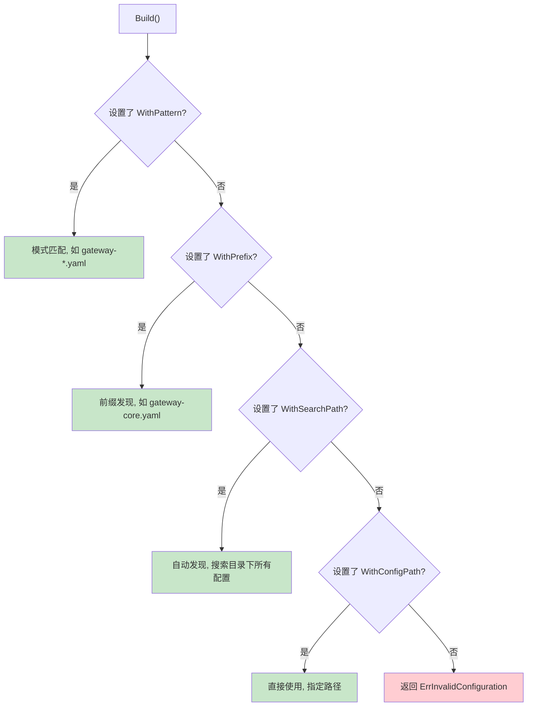
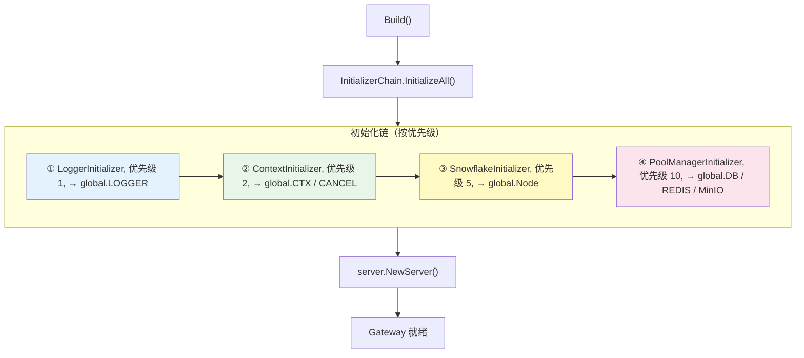

# Gateway 构建器

## 概述

`GatewayBuilder` 使用链式调用 API 构建 Gateway 实例。源码位于 [gateway.go:GatewayBuilder](../gateway.go#L56)。

## 链式 API

### NewGateway()

> 源码：[gateway.go:NewGateway()](../gateway.go#L95)

```go
gw, err := gateway.NewGateway().
    WithSearchPath("resources").
    WithEnvironment(goconfig.EnvProduction).
    WithPrefix("gateway-my-service").
    WithHotReload(nil).
    Build()
```

### 构建选项

| 方法 | 说明 | 源码 |
|------|------|------|
| `WithConfigPath(path)` | 直接指定配置文件路径 | [gateway.go:L103](../gateway.go#L103) |
| `WithSearchPath(path)` | 设置配置文件搜索目录 | [gateway.go:L110](../gateway.go#L110) |
| `WithEnvironment(env)` | 设置运行环境 | [gateway.go:L117](../gateway.go#L117) |
| `WithPrefix(prefix)` | 设置配置文件前缀 | [gateway.go:L123](../gateway.go#L123) |
| `WithPattern(pattern)` | 设置文件匹配模式 | [gateway.go:L130](../gateway.go#L130) |
| `WithHotReload(config)` | 启用热更新（nil 使用默认） | [gateway.go:L137](../gateway.go#L137) |
| `WithContext(ctx)` | 设置上下文 | [gateway.go:L146](../gateway.go#L146) |
| `WithContextOptions(opts)` | 设置上下文选项 | [gateway.go:L153](../gateway.go#L153) |
| `Silent()` | 静默启动（不显示 banner） | [gateway.go:L158](../gateway.go#L158) |
| `WithGrpcGatewayMiddleware(mw)` | 添加 gRPC-Gateway 中间件 | [gateway.go:L163](../gateway.go#L163) |

### 构建方法

| 方法 | 说明 | 源码 |
|------|------|------|
| `Build()` | 构建 Gateway（不启动） | [gateway.go:L168](../gateway.go#L168) |
| `BuildAndStart()` | 构建并启动 | [gateway.go:L236](../gateway.go#L236) |
| `MustBuildAndStart()` | 构建并启动（失败 panic） | [gateway.go:L252](../gateway.go#L252) |

## 配置发现策略

`Build()` 内部根据设置自动选择配置发现策略，优先级从高到低：



> 源码：[gateway.go:Build()](../gateway.go#L168) 中的 switch-case 逻辑

## 示例

### 使用前缀发现（最常用）

```go
gw, err := gateway.NewGateway().
    WithSearchPath("resources").
    WithEnvironment(goconfig.GetEnvironment()).
    WithPrefix("gateway-my-service").
    WithHotReload(nil).
    Build()
```

配置文件位置：`resources/gateway-my-service.yaml`

### 使用模式匹配

```go
gw, err := gateway.NewGateway().
    WithSearchPath("resources").
    WithPattern("gateway-*.yaml").
    WithEnvironment(goconfig.EnvProduction).
    Build()
```

### 直接指定路径

```go
gw, err := gateway.NewGateway().
    WithConfigPath("/etc/myapp/config.yaml").
    WithEnvironment(goconfig.EnvProduction).
    Build()
```

### 构建并启动

```go
gw, err := gateway.NewGateway().
    WithSearchPath("resources").
    WithPrefix("gateway-my-service").
    WithEnvironment(goconfig.GetEnvironment()).
    BuildAndStart()
```

## 初始化链

`Build()` 内部自动执行 `InitializerChain`，按优先级初始化组件：



> 源码：[initializer.go:GetDefaultInitializerChain()](../global/initializer.go#L310)

| 优先级 | 初始化器 | 说明 | 源码 |
|--------|---------|------|------|
| 1 | LoggerInitializer | 日志器 | [initializer.go:L219](../global/initializer.go#L219) |
| 2 | ContextInitializer | 全局上下文 | [initializer.go:L293](../global/initializer.go#L293) |
| 5 | SnowflakeInitializer | 雪花 ID 生成器 | [initializer.go:L240](../global/initializer.go#L240) |
| 10 | PoolManagerInitializer | 连接池管理器 | [initializer.go:L265](../global/initializer.go#L265) |

初始化完成后，以下全局变量自动可用：

```go
gwglobal.LOGGER    // 日志器
gwglobal.DB        // 数据库连接
gwglobal.REDIS     // Redis 连接
gwglobal.MinIO     // MinIO 连接
gwglobal.Node      // 雪花 ID 节点
```

## 热更新

启用热更新后，配置文件变更会自动触发回调：

```go
gw, err := gateway.NewGateway().
    WithSearchPath("resources").
    WithPrefix("gateway-my-service").
    WithHotReload(nil).  // nil 使用默认配置（3秒轮询）
    Build()
```

默认热更新配置：
- 轮询间隔：3 秒
- 变更后自动重新初始化日志器
- 配置变更回调优先级：-100（高优先级）

> 源码：[gateway.go:registerGlobalConfigCallbacks()](../gateway.go#L283)

## Gateway 实例方法

构建完成后，Gateway 实例提供以下核心方法：

| 方法 | 说明 | 源码 |
|------|------|------|
| `RegisterService(fn)` | 注册 gRPC 服务 | [gateway.go:L336](../gateway.go#L336) |
| `RegisterGatewayHandler(fn)` | 注册 HTTP Handler | [gateway.go:L348](../gateway.go#L348) |
| `RegisterHandler(pattern, handler)` | 注册自定义 HTTP 路由 | [gateway.go:L365](../gateway.go#L365) |
| `RegisterHTTPRoute(pattern, fn)` | 注册 HTTP 路由（便捷） | [gateway.go:L373](../gateway.go#L373) |
| `RegisterHTTPRoutes(routes)` | 批量注册 HTTP 路由 | [gateway.go:L381](../gateway.go#L381) |
| `AddGrpcGatewayMiddleware(mw)` | 添加 gRPC-Gateway 中间件 | [gateway.go:L389](../gateway.go#L389) |
| `AddGrpcGatewayMiddlewareProvider(fn)` | 添加中间件提供器 | [gateway.go:L396](../gateway.go#L396) |
| `RebuildHTTPGateway()` | 重建 HTTP Gateway | [gateway.go:L403](../gateway.go#L403) |
| `GetConfig()` | 获取网关配置 | [gateway.go:L420](../gateway.go#L420) |
| `SetDynamicSignatureProvider(p)` | 设置动态签名提供器 | [gateway.go:L425](../gateway.go#L425) |
| `SetDynamicRateLimitProvider(p)` | 设置动态限流提供器 | [gateway.go:L432](../gateway.go#L432) |
| `Run()` | 启动并等待信号 | [gateway.go:L448](../gateway.go#L448) |
| `Start()` | 启动（显示 banner） | [gateway.go:L441](../gateway.go#L441) |
| `StartSilent()` | 静默启动 | [gateway.go:L445](../gateway.go#L445) |
| `Stop()` | 停止服务 | [gateway.go:L468](../gateway.go#L468) |
| `EnableSwagger()` | 启用 Swagger 文档 | [server/swagger.go:L22](../server/swagger.go#L22) |

## 下一步

- [服务注册](./SERVICE-REGISTRATION.md) — 了解如何注册 gRPC 和 HTTP 服务
- [全局变量与初始化器](./GLOBAL.md) — 了解初始化链和全局状态
