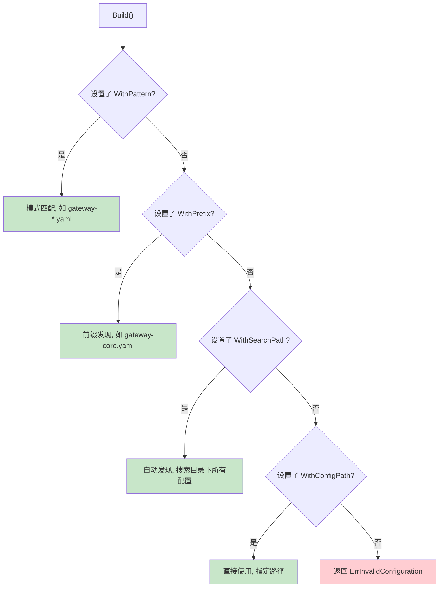
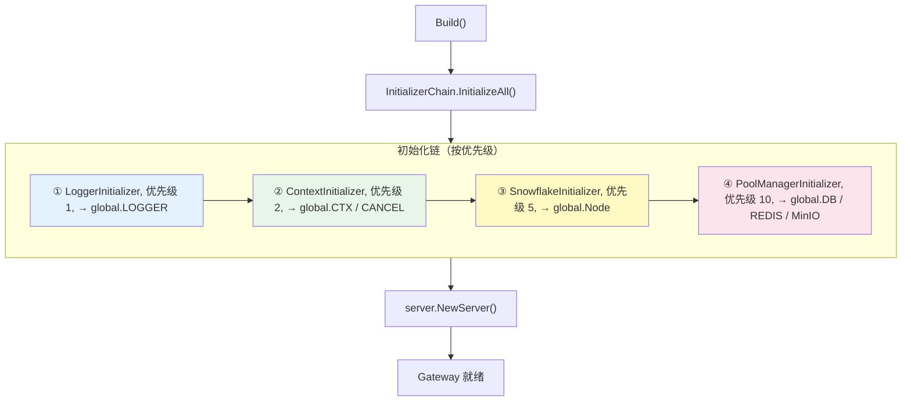

# Gateway 构建器

## 概述

`GatewayBuilder` 使用链式调用 API 构建 Gateway 实例。源码位于 [gateway.go:GatewayBuilder](../gateway.go#L64)。

## 链式 API

### NewGateway()

> 源码：[gateway.go:NewGateway()](../gateway.go#L119)

```go
gw, err := gateway.NewGateway().
    WithSearchPath("resources").
    WithEnvironment(goconfig.EnvProduction).
    WithPrefix("gateway-my-service").
    WithHotReload(nil).
    Build()
```

### 构建选项

| 方法 | 说明 | 源码 |
|------|------|------|
| `WithConfigPath(path)` | 直接指定配置文件路径 | [gateway.go:L127](../gateway.go#L127) |
| `WithSearchPath(path)` | 设置配置文件搜索目录 | [gateway.go:L133](../gateway.go#L133) |
| `WithEnvironment(env)` | 设置运行环境 | [gateway.go:L140](../gateway.go#L140) |
| `WithPrefix(prefix)` | 设置配置文件前缀 | [gateway.go:L146](../gateway.go#L146) |
| `WithPattern(pattern)` | 设置文件匹配模式 | [gateway.go:L153](../gateway.go#L153) |
| `WithHotReload(config)` | 启用热更新（nil 使用默认） | [gateway.go:L160](../gateway.go#L160) |
| `WithContext(ctx)` | 设置上下文 | [gateway.go:L169](../gateway.go#L169) |
| `WithContextOptions(opts)` | 设置上下文选项 | [gateway.go:L177](../gateway.go#L177) |
| `Silent()` | 静默启动（不显示 banner） | [gateway.go:L183](../gateway.go#L183) |
| `WithGrpcGatewayMiddleware(mw)` | 添加 gRPC-Gateway 中间件 | [gateway.go:L189](../gateway.go#L189) |

### 构建方法

| 方法 | 说明 | 源码 |
|------|------|------|
| `Build()` | 构建 Gateway（不启动） | [gateway.go:L195](../gateway.go#L195) |
| `BuildAndStart(ctx ...context.Context)` | 构建并启动 | [gateway.go:L290](../gateway.go#L290) |
| `MustBuildAndStart(ctx ...context.Context)` | 构建并启动（失败 panic） | [gateway.go:L311](../gateway.go#L311) |

## 配置发现策略

`Build()` 内部根据设置自动选择配置发现策略，优先级从高到低：


```mermaid
flowchart TD
    BUILD["Build()"] --> CHECK_PATTERN{"设置了 WithPattern?"}
    CHECK_PATTERN -->|是| PATTERN["模式匹配, 如 gateway-*.yaml"]
    CHECK_PATTERN -->|否| CHECK_PREFIX{"设置了 WithPrefix?"}
    CHECK_PREFIX -->|是| PREFIX["前缀发现, 如 gateway-core.yaml"]
    CHECK_PREFIX -->|否| CHECK_SEARCH{"设置了 WithSearchPath?"}
    CHECK_SEARCH -->|是| AUTO["自动发现, 搜索目录下所有配置"]
    CHECK_SEARCH -->|否| CHECK_PATH{"设置了 WithConfigPath?"}
    CHECK_PATH -->|是| DIRECT["直接使用, 指定路径"]
    CHECK_PATH -->|否| ERROR["返回 ErrInvalidConfiguration"]

    style PATTERN fill:#c8e6c9
    style PREFIX fill:#c8e6c9
    style AUTO fill:#c8e6c9
    style DIRECT fill:#c8e6c9
    style ERROR fill:#ffcdd2
```

> 源码：[gateway.go:Build()](../gateway.go#L195) 中的 switch-case 逻辑

## 示例

### 使用前缀发现（最常用）

```go
gw, err := gateway.NewGateway().
    WithSearchPath("resources").
    WithEnvironment(goconfig.GetEnvironment()).
    WithPrefix("gateway-my-service").
    WithHotReload(nil).
    Build()
```

配置文件位置：`resources/gateway-my-service.yaml`

### 使用模式匹配

```go
gw, err := gateway.NewGateway().
    WithSearchPath("resources").
    WithPattern("gateway-*.yaml").
    WithEnvironment(goconfig.EnvProduction).
    Build()
```

### 直接指定路径

```go
gw, err := gateway.NewGateway().
    WithConfigPath("/etc/myapp/config.yaml").
    WithEnvironment(goconfig.EnvProduction).
    Build()
```

### 构建并启动

```go
gw, err := gateway.NewGateway().
    WithSearchPath("resources").
    WithPrefix("gateway-my-service").
    WithEnvironment(goconfig.GetEnvironment()).
    BuildAndStart()
```

## 初始化链

`Build()` 内部自动执行 `InitializerChain`，按优先级初始化组件：


```mermaid
flowchart TD
    BUILD["Build()"] --> INIT["InitializerChain.InitializeAll()"]

    subgraph CHAIN["初始化链（按优先级）"]
        I1["① LoggerInitializer, 优先级 1, → global.LOGGER"]
        I2["② ContextInitializer, 优先级 2, → global.CTX / CANCEL"]
        I3["③ SnowflakeInitializer, 优先级 5, → global.Node"]
        I4["④ PoolManagerInitializer, 优先级 10, → global.DB / REDIS / MinIO"]
        I1 --> I2 --> I3 --> I4
    end

    INIT --> CHAIN
    CHAIN --> SERVER["server.NewServer()"]
    SERVER --> READY["Gateway 就绪"]

    style I1 fill:#e3f2fd
    style I2 fill:#e8f5e9
    style I3 fill:#fff9c4
    style I4 fill:#fce4ec
```

> 源码：[initializer.go:GetDefaultInitializerChain()](../global/initializer.go#L388)

| 优先级 | 初始化器 | 说明 | 源码 |
|--------|---------|------|------|
| 1 | LoggerInitializer | 日志器 | [initializer.go:L229](../global/initializer.go#L229) |
| 2 | ContextInitializer | 全局上下文 | [initializer.go:L343](../global/initializer.go#L343) |
| 5 | SnowflakeInitializer | 雪花 ID 生成器 | [initializer.go:L255](../global/initializer.go#L255) |
| 10 | PoolManagerInitializer | 连接池管理器 | [initializer.go:L289](../global/initializer.go#L289) |

初始化完成后，以下全局变量自动可用：

```go
gwglobal.LOGGER    // 日志器
gwglobal.DB        // 数据库连接
gwglobal.REDIS     // Redis 连接
gwglobal.MinIO     // MinIO 连接
gwglobal.Node      // 雪花 ID 节点
```

## 热更新

启用热更新后，配置文件变更会自动触发回调：

```go
gw, err := gateway.NewGateway().
    WithSearchPath("resources").
    WithPrefix("gateway-my-service").
    WithHotReload(nil).  // nil 使用默认配置（3秒轮询）
    Build()
```

默认热更新配置：
- 轮询间隔：3 秒
- 变更后自动重新初始化日志器
- 配置变更回调优先级：-100（高优先级）

> 源码：[gateway.go:registerGlobalConfigCallbacks()](../gateway.go#L370)

## Gateway 实例方法

构建完成后，Gateway 实例提供以下核心方法：

### 服务注册

| 方法 | 说明 | 源码 |
|------|------|------|
| `RegisterService(fn)` | 注册 gRPC 服务 | [gateway.go:L426](../gateway.go#L426) |
| `RegisterGatewayHandler(fn)` | 注册 gRPC-Gateway Handler（本地调用） | [gateway.go:L441](../gateway.go#L441) |
| `RegisterProxyHandler(fn, endpoint, dialOpts...)` | 注册代理处理器（远程 endpoint） | [gateway.go:L462](../gateway.go#L462) |
| `RegisterProxyHandlerByServiceName(serviceName, fn)` | 通过服务名注册代理处理器（共享连接） | [gateway.go:L495](../gateway.go#L495) |
| `GetGRPCEndpoint(serviceName)` | 获取 gRPC 客户端端点地址 | [gateway.go:L560](../gateway.go#L560) |
| `AutoRegister()` | 自动注册所有 gRPC 客户端与 HTTP Handler | [gateway.go:L617](../gateway.go#L617) |
| `AutoRegisterWithHealthCheck(checker)` | 自动注册（带健康检查器） | [gateway.go:L623](../gateway.go#L623) |

### HTTP 路由

| 方法 | 说明 | 源码 |
|------|------|------|
| `RegisterHandler(pattern, handler)` | 注册自定义 HTTP 路由 | [gateway.go:L584](../gateway.go#L584) |
| `RegisterHTTPRoute(pattern, fn)` | 注册 HTTP 路由（便捷） | [gateway.go:L593](../gateway.go#L593) |
| `RegisterHTTPRoutes(routes)` | 批量注册 HTTP 路由 | [gateway.go:L602](../gateway.go#L602) |

### 中间件

| 方法 | 说明 | 源码 |
|------|------|------|
| `AddGrpcGatewayMiddleware(mw)` | 添加 gRPC-Gateway 中间件 | [gateway.go:L683](../gateway.go#L683) |
| `AddGrpcGatewayMiddlewareProvider(fn)` | 添加中间件提供器 | [gateway.go:L690](../gateway.go#L690) |
| `RebuildHTTPGateway()` | 重建 HTTP Gateway | [gateway.go:L697](../gateway.go#L697) |
| `SetDynamicSignatureProvider(p)` | 设置动态签名提供器 | [gateway.go:L751](../gateway.go#L751) |
| `SetDynamicRateLimitProvider(p)` | 设置动态限流提供器 | [gateway.go:L759](../gateway.go#L759) |

### 配置与监听器

| 方法 | 说明 | 源码 |
|------|------|------|
| `GetConfig()` | 获取网关配置 | [gateway.go:L746](../gateway.go#L746) |
| `GetGatewayConfig()` | 获取网关配置（直接字段） | [gateway.go:L925](../gateway.go#L925) |
| `GetListener(name)` | 按名称获取监听器配置 | [gateway.go:L930](../gateway.go#L930) |
| `GetListenerEndpoint(name)` | 按名称获取监听器端点地址 | [gateway.go:L938](../gateway.go#L938) |
| `RegisterConfigCallbacks()` | 注册配置变更回调 | [gateway.go:L946](../gateway.go#L946) |
| `Context()` | 获取 Gateway 上下文 | [gateway.go:L767](../gateway.go#L767) |

### 生命周期

| 方法 | 说明 | 源码 |
|------|------|------|
| `Run()` | 启动并等待关闭信号 | [gateway.go:L798](../gateway.go#L798) |
| `Start()` | 启动（显示 banner） | [gateway.go:L783](../gateway.go#L783) |
| `StartSilent()` | 静默启动 | [gateway.go:L788](../gateway.go#L788) |
| `StartWithBanner()` | 启动并显示 banner | [gateway.go:L807](../gateway.go#L807) |
| `Stop()` | 停止服务 | [gateway.go:L841](../gateway.go#L841) |
| `WaitForShutdown()` | 等待关闭信号并优雅关闭 | [gateway.go:L1232](../gateway.go#L1232) |
| `OnShutdown(fn)` | 注册应用级关闭回调（Stop 前执行） | [gateway.go:L1242](../gateway.go#L1242) |

### 连接池与资源

| 方法 | 说明 | 源码 |
|------|------|------|
| `GetPoolManager()` | 获取连接池管理器 | [gateway.go:L1100](../gateway.go#L1100) |
| `GetDB()` | 获取数据库连接 | [gateway.go:L1105](../gateway.go#L1105) |
| `InitDatabaseModels(models...)` | 初始化数据库模型（AutoMigrate） | [gateway.go:L1119](../gateway.go#L1119) |
| `GetRedis()` | 获取 Redis 客户端 | [gateway.go:L1141](../gateway.go#L1141) |
| `GetMinIO()` | 获取 MinIO 客户端 | [gateway.go:L1149](../gateway.go#L1149) |
| `GetSnowflake()` | 获取雪花 ID 生成器 | [gateway.go:L1157](../gateway.go#L1157) |
| `HealthCheck()` | 获取所有连接的健康状态 | [gateway.go:L1165](../gateway.go#L1165) |

### 诊断与信息

| 方法 | 说明 | 源码 |
|------|------|------|
| `PrintStartupInfo()` | 打印启动信息 | [gateway.go:L864](../gateway.go#L864) |
| `PrintShutdownInfo()` | 打印关闭信息 | [gateway.go:L871](../gateway.go#L871) |
| `PrintShutdownComplete()` | 打印关闭完成信息 | [gateway.go:L878](../gateway.go#L878) |
| `PrintAPIRegistrationSummary()` | 打印 API 注册汇总 | [gateway.go:L885](../gateway.go#L885) |

### WebSocket

| 方法 | 说明 | 源码 |
|------|------|------|
| `GetWebSocketService()` | 获取 WebSocket 服务实例 | [gateway.go:L1285](../gateway.go#L1285) |
| `IsWebSocketEnabled()` | 检查 WebSocket 是否启用 | [gateway.go:L1293](../gateway.go#L1293) |

### 其他（继承自 Server）

| 方法 | 说明 | 源码 |
|------|------|------|
| `EnableSwagger()` | 启用 Swagger 文档 | [server/swagger.go:L19](../server/swagger.go#L19) |

## 包级便捷函数

| 函数 | 说明 | 源码 |
|------|------|------|
| `QuickStart(configPath ...string)` | 快速启动（默认配置路径与自动发现） | [gateway.go:L1177](../gateway.go#L1177) |
| `QuickStartWithConfigFile(path)` | 使用指定配置文件快速启动 | [gateway.go:L1199](../gateway.go#L1199) |
| `QuickStartWithConfigFilePrefix(path, prefix)` | 使用指定配置文件和前缀快速启动 | [gateway.go:L1215](../gateway.go#L1215) |

## 下一步

- [服务注册](./SERVICE-REGISTRATION.md) — 了解如何注册 gRPC 和 HTTP 服务
- [全局变量与初始化器](./GLOBAL.md) — 了解初始化链和全局状态
