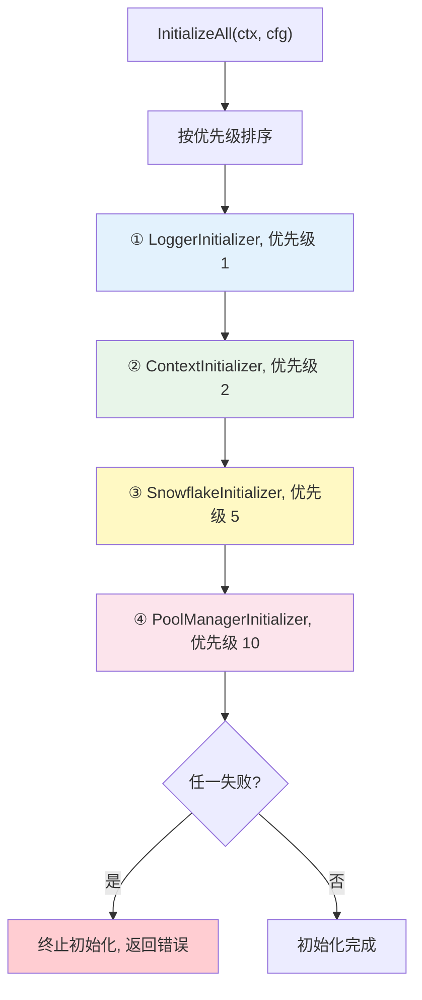
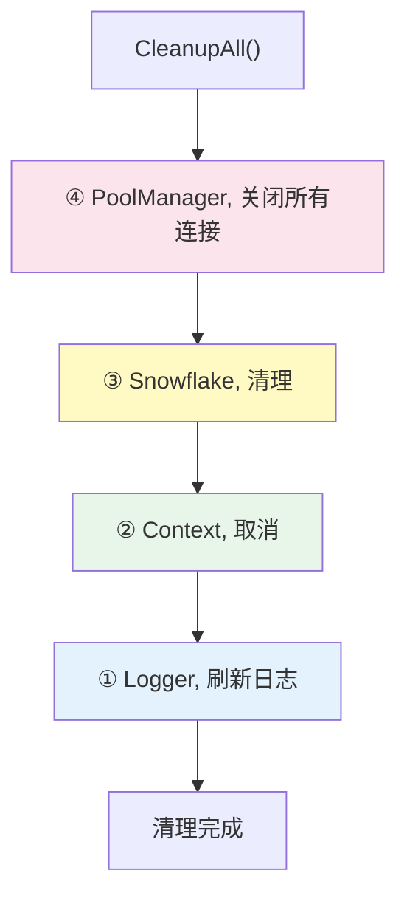

# 全局变量与初始化器

## 概述

`global` 包管理 Gateway 的全局状态，包括全局变量、初始化器链和 ID 生成器。所有连接实例由 `PoolManager` 统一管理，全局变量仅作为便捷引用。

> 源码目录：[global/](../global/)

## 全局变量

> 源码：[global/global.go](../global/global.go)

```go
var (
    GATEWAY        *gwconfig.Gateway                 // 网关配置
    LOGGER         logger.ILogger                    // 日志器
    POOL_MANAGER   *cpool.Manager                    // 连接池管理器（所有连接的唯一管理者）
    CONFIG_MANAGER *goconfig.IntegratedConfigManager // 统一配置管理器
    CTX            context.Context                   // 全局上下文
    CANCEL         context.CancelFunc                // 上下文取消函数
    WSCHUB         *gowsc.Hub                        // WebSocket 服务实例
    Node           *snowflake.Node                   // 雪花 ID 节点
    LOG            logger.ILogger                    // 日志器别名（兼容旧代码）
    DB             *gorm.DB                          // 数据库连接（便捷引用）
    REDIS          *redis.Client                     // Redis 连接（便捷引用）
    MinIO          *minio.Client                     // MinIO 连接（便捷引用）
    DATAMASKER     *desensitize.DataMasker           // 数据脱敏器
    GPerFix        string                   = "gw_"  // 全局表前缀
)
```

> 源码：[global.go:L40-L55](../global/global.go#L40)

### 便捷访问函数

| 函数 | 返回类型 | 源码 |
|------|---------|------|
| `GetConfig()` | `*gwconfig.Gateway` | [global.go:L155](../global/global.go#L155) |
| `GetLogger()` | `logger.ILogger` | [global.go:L160](../global/global.go#L160) |
| `GetPoolManager()` | `*cpool.Manager` | [global.go:L165](../global/global.go#L165) |
| `GetContext()` | `context.Context` | [global.go:L170](../global/global.go#L170) |
| `GetDB()` | `*gorm.DB` | [global.go:L175](../global/global.go#L175) |
| `GetRedis()` | `*redis.Client` | [global.go:L180](../global/global.go#L180) |
| `GetMinIO()` | `*minio.Client` | [global.go:L185](../global/global.go#L185) |
| `GetClickHouse()` | `clickhouse.Conn` | [global.go:L190](../global/global.go#L190) |
| `GetNats()` | `*natsclient.NatsConn` | [global.go:L198](../global/global.go#L198) |
| `GetNatsX()` | `*natsx.Client` | [global.go:L206](../global/global.go#L206) |
| `GetSnowflakeNode()` | `*snowflake.Node` | [global.go:L214](../global/global.go#L214) |
| `GetWebSocketService()` | `*gowsc.Hub` | [global.go:L219](../global/global.go#L219) |
| `GetGatewayConfig()` | `*gwconfig.Gateway` | [global.go:L224](../global/global.go#L224) |
| `GetConfigManager()` | `*goconfig.IntegratedConfigManager` | [global.go:L229](../global/global.go#L229) |
| `IsInitialized()` | `bool` | [global.go:L234](../global/global.go#L234) |
| `GetEnvironment()` | `goconfig.EnvironmentType` | [global.go:L251](../global/global.go#L251) |

### 示例

```go
// 获取数据库连接
db := gwglobal.GetDB()
db.Find(&users)

// 获取 Redis
rdb := gwglobal.GetRedis()
rdb.Set(ctx, "key", "value", 10*time.Minute)

// 获取 ClickHouse（从 PoolManager 获取，无独立全局变量）
chConn := gwglobal.GetClickHouse()

// 获取 NATS
natsConn := gwglobal.GetNats()

// 检查是否已初始化
if gwglobal.IsInitialized() {
    // ...
}
```

### 资源清理

> 源码：[global.go:CleanupGlobal()](../global/global.go#L76)

```go
gwglobal.CleanupGlobal()
```

清理顺序：
1. 取消全局上下文（CANCEL）
2. 关闭 PoolManager（自动关闭所有连接：DB、Redis、MinIO、ClickHouse、NATS 等）
3. 停止配置管理器
4. 全局变量置空

### 配置热重载

> 源码：[global.go:ReloadConfig()](../global/global.go#L239)

```go
if err := gwglobal.ReloadConfig(); err != nil {
    logger.Error("Failed to reload config: %v", err)
}
```

## InitializerChain — 初始化器链

> 源码：[global/initializer.go](../global/initializer.go)

按优先级顺序初始化组件，逆序清理。

### Initializer 接口

> 源码：[initializer.go:Initializer](../global/initializer.go#L22)

```go
type Initializer interface {
    Name() string
    Priority() int
    Initialize(ctx context.Context, cfg *gwconfig.Gateway) error
    Cleanup() error
    HealthCheck() error
}
```

### 内置初始化器

| 优先级 | 名称 | 说明 | 源码 |
|--------|------|------|------|
| 1 | Logger | 日志器 | [initializer.go:L219](../global/initializer.go#L219) |
| 2 | Context | 全局上下文 | [initializer.go:L293](../global/initializer.go#L293) |
| 5 | Snowflake | 雪花 ID 生成器 | [initializer.go:L240](../global/initializer.go#L240) |
| 10 | PoolManager | 连接池管理器 | [initializer.go:L265](../global/initializer.go#L265) |

### 自定义初始化器

```go
type MyInitializer struct{}

func (i *MyInitializer) Name() string       { return "MyComponent" }
func (i *MyInitializer) Priority() int      { return 20 }
func (i *MyInitializer) Initialize(ctx context.Context, cfg *gwconfig.Gateway) error {
    // 初始化逻辑
    return nil
}
func (i *MyInitializer) Cleanup() error     { return nil }
func (i *MyInitializer) HealthCheck() error { return nil }

// 注册到初始化链
chain := global.GetDefaultInitializerChain()
chain.Register(&MyInitializer{})
```

### 初始化流程

> 源码：[initializer.go:InitializeAll()](../global/initializer.go#L71)



```go
chain := global.GetDefaultInitializerChain()
err := chain.InitializeAll(ctx, cfg)
```

### 清理流程

> 源码：[initializer.go:CleanupAll()](../global/initializer.go#L117)



```go
err := chain.CleanupAll()
```

逆序调用 `Cleanup()`，确保依赖关系正确。

### 健康检查

```go
results := chain.HealthCheckAll()
// results = map[string]error{
//     "Logger":      nil,
//     "Context":     nil,
//     "Snowflake":   nil,
//     "PoolManager": fmt.Errorf("component redis health check failed"),
// }
```

## ID 生成器

> 源码：[global/idgen.go](../global/idgen.go)

基于 Snowflake 的短 ID 生成器：

```go
// 生成 8 位短 ID（默认）
id := gwglobal.NewSnowflakeID()

// 生成 12 位短 ID
id12 := gwglobal.NewSnowflakeID12()

// 生成指定长度的短 ID
idN := gwglobal.NewSnowflakeIDWithLength(16)

// 获取 WorkerID 和 DatacenterID
workerID := gwglobal.GetSnowflakeWorkerID()
dcID := gwglobal.GetSnowflakeDatacenterID()
```

> 源码：[idgen.go:NewSnowflakeID()](../global/idgen.go#L24)、[idgen.go:NewSnowflakeID12()](../global/idgen.go#L29)、[idgen.go:NewSnowflakeIDWithLength()](../global/idgen.go#L34)

## 下一步

- [连接池管理](./CONNECTION-POOL.md) — 了解 PoolManager 管理的所有连接
- [Gateway 构建器](./GATEWAY-BUILDER.md) — 了解初始化链如何被触发
