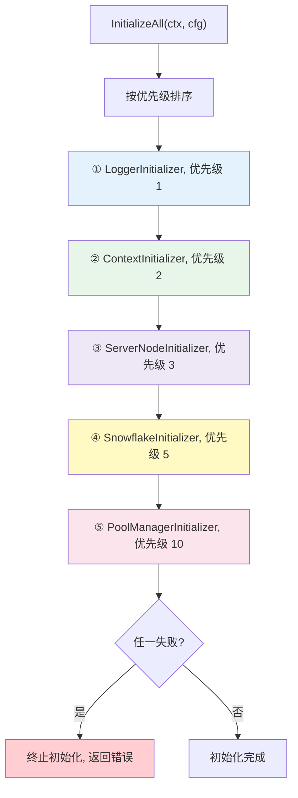
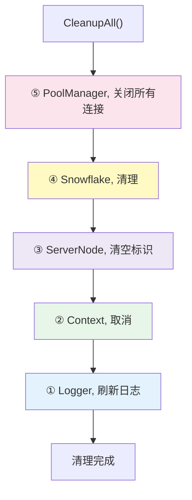

# 全局变量与初始化器

## 概述

`global` 包管理 Gateway 的全局状态，包括全局变量、初始化器链和 ID 生成器。所有连接实例由 `PoolManager` 统一管理，全局变量仅作为便捷引用。

> 源码目录：[global/](../global/)

## 全局变量

> 源码：[global/global.go](../global/global.go)

```go
var (
    GATEWAY        *gwconfig.Gateway                 // 网关配置
    LOGGER         logger.ILogger                    // 日志器
    POOL_MANAGER   *cpool.Manager                    // 连接池管理器（所有连接的唯一管理者）
    CONFIG_MANAGER *goconfig.IntegratedConfigManager // 统一配置管理器
    CTX            context.Context                   // 全局上下文
    CANCEL         context.CancelFunc                // 上下文取消函数
    WSCHUB         *gowsc.Hub                        // 全局 WebSocket 服务实例
    Node           *snowflake.Node                   // 雪花算法节点（用于分布式 ID 生成）
    LOG            logger.ILogger                    // 日志器别名（兼容旧代码）
    DB             *gorm.DB                          // 数据库连接（便捷引用，实际由 PoolManager 管理）
    REDIS          *redis.Client                     // Redis 连接（便捷引用，实际由 PoolManager 管理）
    MinIO          *minio.Client                     // MinIO 连接（便捷引用，实际由 PoolManager 管理）
    DATAMASKER     *desensitize.DataMasker           // 数据脱敏器
    SERVER_NODE    string                            // 当前服务节点标识（K8s 环境下为 Pod 名称），用于响应头和 gRPC metadata 透传
    GPerFix        string                   = "gw_"  // 全局表前缀
)
```

> 源码：[global.go:L33-L49](../global/global.go#L33)

### 便捷访问函数

| 函数 | 返回类型 | 源码 |
|------|---------|------|
| `EnsureLoggerInitialized()` | `error` | [global.go:L52](../global/global.go#L52) |
| `GetConfig()` | `*gwconfig.Gateway` | [global.go:L118](../global/global.go#L118) |
| `GetLogger()` | `logger.ILogger` | [global.go:L123](../global/global.go#L123) |
| `GetPoolManager()` | `*cpool.Manager` | [global.go:L128](../global/global.go#L128) |
| `GetContext()` | `context.Context` | [global.go:L133](../global/global.go#L133) |
| `GetDB()` | `*gorm.DB` | [global.go:L138](../global/global.go#L138) |
| `GetRedis()` | `*redis.Client` | [global.go:L143](../global/global.go#L143) |
| `GetMinIO()` | `*minio.Client` | [global.go:L148](../global/global.go#L148) |
| `GetClickHouse()` | `*gorm.DB` | [global.go:L154](../global/global.go#L154) |
| `GetNats()` | `*natsclient.NatsConn` | [global.go:L163](../global/global.go#L163) |
| `GetNatsX()` | `*natsx.Client` | [global.go:L173](../global/global.go#L173) |
| `GetSnowflakeNode()` | `*snowflake.Node` | [global.go:L181](../global/global.go#L181) |
| `GetServerNode()` | `string` | [global.go:L187](../global/global.go#L187) |
| `GetWebSocketService()` | `*gowsc.Hub` | [global.go:L192](../global/global.go#L192) |
| `GetGatewayConfig()` | `*gwconfig.Gateway` | [global.go:L197](../global/global.go#L197) |
| `GetConfigManager()` | `*goconfig.IntegratedConfigManager` | [global.go:L202](../global/global.go#L202) |
| `IsInitialized()` | `bool` | [global.go:L207](../global/global.go#L207) |
| `ReloadConfig()` | `error` | [global.go:L212](../global/global.go#L212) |
| `GetEnvironment()` | `goconfig.EnvironmentType` | [global.go:L230](../global/global.go#L230) |

### 示例

```go
// 获取数据库连接
db := gwglobal.GetDB()
db.Find(&users)

// 获取 Redis
rdb := gwglobal.GetRedis()
rdb.Set(ctx, "key", "value", 10*time.Minute)

// 获取 ClickHouse（从 PoolManager 获取，无独立全局变量）
chConn := gwglobal.GetClickHouse()

// 获取 NATS
natsConn := gwglobal.GetNats()

// 获取服务节点标识（K8s 环境下为 Pod 名称）
serverNode := gwglobal.GetServerNode()

// 检查是否已初始化
if gwglobal.IsInitialized() {
    // ...
}
```

### 资源清理

> 源码：[global.go:CleanupGlobal()](../global/global.go#L72)

```go
gwglobal.CleanupGlobal()
```

清理顺序：
1. 取消全局上下文（CANCEL）
2. 关闭 PoolManager（自动关闭所有连接：DB、Redis、MinIO、ClickHouse、NATS 等）
3. 停止配置管理器
4. 全局变量置空

### 日志器初始化

> 源码：[global.go:EnsureLoggerInitialized()](../global/global.go#L52)

```go
// 在主流程初始化前确保 LOGGER/LOG 可用，避免 nil panic
if err := gwglobal.EnsureLoggerInitialized(); err != nil {
    panic(err)
}
```

若 `LOGGER` 已初始化则直接返回；否则通过 `logger.New()` 创建并同步赋值给 `LOG` 别名。

### 配置热重载

> 源码：[global.go:ReloadConfig()](../global/global.go#L212)

```go
if err := gwglobal.ReloadConfig(); err != nil {
    logger.Error("Failed to reload config: %v", err)
}
```

## InitializerChain — 初始化器链

> 源码：[global/initializer.go](../global/initializer.go)

按优先级顺序初始化组件，逆序清理。

### Initializer 接口

> 源码：[initializer.go:Initializer](../global/initializer.go#L30)

```go
type Initializer interface {
    Name() string
    Priority() int
    Initialize(ctx context.Context, cfg *gwconfig.Gateway) error
    Cleanup() error
    HealthCheck() error
}
```

初始化器还可选实现 `InitializerTimeout` 接口（`InitTimeout() time.Duration`）以自定义单个初始化超时；未实现时使用默认值 `defaultInitTimeout = 15 * time.Second`，避免单个组件网络问题导致整条初始化链卡死。

### 内置初始化器

| 优先级 | 名称 | 说明 | 源码 |
|--------|------|------|------|
| 1 | Logger | 日志器 | [initializer.go:L230](../global/initializer.go#L230) |
| 2 | Context | 全局上下文 | [initializer.go:L344](../global/initializer.go#L344) |
| 3 | ServerNode | 服务节点标识（K8s 环境下为 Pod 名称） | [initializer.go:L366](../global/initializer.go#L366) |
| 5 | Snowflake | 雪花 ID 生成器 | [initializer.go:L256](../global/initializer.go#L256) |
| 10 | PoolManager | 连接池管理器 | [initializer.go:L290](../global/initializer.go#L290) |

### 自定义初始化器

```go
type MyInitializer struct{}

func (i *MyInitializer) Name() string       { return "MyComponent" }
func (i *MyInitializer) Priority() int      { return 20 }
func (i *MyInitializer) Initialize(ctx context.Context, cfg *gwconfig.Gateway) error {
    // 初始化逻辑
    return nil
}
func (i *MyInitializer) Cleanup() error     { return nil }
func (i *MyInitializer) HealthCheck() error { return nil }

// 注册到初始化链
chain := global.GetDefaultInitializerChain()
chain.Register(&MyInitializer{})
```

### 初始化流程

> 源码：[initializer.go:InitializeAll()](../global/initializer.go#L98)


```mermaid
flowchart TD
    START["InitializeAll(ctx, cfg)"] --> SORT["按优先级排序"]
    SORT --> I1["① LoggerInitializer, 优先级 1"]
    I1 --> I2["② ContextInitializer, 优先级 2"]
    I2 --> I3["③ ServerNodeInitializer, 优先级 3"]
    I3 --> I4["④ SnowflakeInitializer, 优先级 5"]
    I4 --> I5["⑤ PoolManagerInitializer, 优先级 10"]
    I5 --> CHECK{"任一失败?"}
    CHECK -->|是| ABORT["终止初始化, 返回错误"]
    CHECK -->|否| DONE["初始化完成"]

    style I1 fill:#e3f2fd
    style I2 fill:#e8f5e9
    style I3 fill:#ede7f6
    style I4 fill:#fff9c4
    style I5 fill:#fce4ec
    style ABORT fill:#ffcdd2
```

```go
chain := global.GetDefaultInitializerChain()
err := chain.InitializeAll(ctx, cfg)

// 或使用封装好的快捷函数（内部等价于上面两步）
err := global.InitializeWithDefaults(ctx, cfg)
```

### 清理流程

> 源码：[initializer.go:CleanupAll()](../global/initializer.go#L174)


```mermaid
flowchart TD
    CLEANUP["CleanupAll()"] --> I5["⑤ PoolManager, 关闭所有连接"]
    I5 --> I4["④ Snowflake, 清理"]
    I4 --> I3["③ ServerNode, 清空标识"]
    I3 --> I2["② Context, 取消"]
    I2 --> I1["① Logger, 刷新日志"]
    I1 --> DONE["清理完成"]

    style I5 fill:#fce4ec
    style I4 fill:#fff9c4
    style I3 fill:#ede7f6
    style I2 fill:#e8f5e9
    style I1 fill:#e3f2fd
```

```go
err := chain.CleanupAll()

// 或使用封装好的快捷函数
err := global.CleanupWithDefaults()
```

逆序调用 `Cleanup()`，确保依赖关系正确。

### 健康检查

```go
results := chain.HealthCheckAll()
// results = map[string]error{
//     "Logger":      nil,
//     "Context":     nil,
//     "ServerNode":  nil,
//     "Snowflake":   nil,
//     "PoolManager": fmt.Errorf("component redis health check failed"),
// }
```

## ID 生成器

> 源码：[global/idgen.go](../global/idgen.go)

`idgen.go` 同时维护两套生成器：基于 `idgen.NewSnowflakeGenerator` 的 Snowflake 短 ID，以及基于 `idgen.NewShortFlakeGenerator` 的 ShortFlake 短 ID。workerID / datacenterID / nodeID 在包初始化时由 `osx` 自动推导。

### Snowflake 短 ID

```go
// 生成 8 位短 ID（默认长度 defaultSnowflakeShortIDLength = 8）
id := gwglobal.NewSnowflakeID()

// 生成 12 位短 ID
id12 := gwglobal.NewSnowflakeID12()

// 生成指定长度的短 ID
idN := gwglobal.NewSnowflakeIDWithLength(16)

// 获取 WorkerID 和 DatacenterID
workerID := gwglobal.GetSnowflakeWorkerID()
dcID := gwglobal.GetSnowflakeDatacenterID()
```

> 源码：[idgen.go:NewSnowflakeID()](../global/idgen.go#L31)、[idgen.go:NewSnowflakeID12()](../global/idgen.go#L36)、[idgen.go:NewSnowflakeIDWithLength()](../global/idgen.go#L41)、[idgen.go:GetSnowflakeWorkerID()](../global/idgen.go#L46)、[idgen.go:GetSnowflakeDatacenterID()](../global/idgen.go#L51)

### ShortFlake 短 ID

适合用于日志链路、轻量请求标识等需要更短字符串的场景。

```go
// 生成 ShortFlake 跟踪 ID 字符串，例如 "206546a9f7640"
traceID := gwglobal.NewShortFlakeID()

// 生成 ShortFlake 请求 ID 字符串，例如 "569909589276225-1"
requestID := gwglobal.NewShortFlakeRequestID()

// 生成 ShortFlake 原始数字 ID，例如 569909589276226
rawID := gwglobal.NewShortFlakeRawID()

// 获取当前进程 ShortFlake 使用的 nodeID（限制在 0~63）
nodeID := gwglobal.GetShortFlakeNodeID()
```

> 源码：[idgen.go:NewShortFlakeID()](../global/idgen.go#L64)、[idgen.go:NewShortFlakeRequestID()](../global/idgen.go#L69)、[idgen.go:NewShortFlakeRawID()](../global/idgen.go#L74)、[idgen.go:GetShortFlakeNodeID()](../global/idgen.go#L79)

## 扩展配置读取

> 源码：[global/extensions.go](../global/extensions.go)

`GATEWAY.Extensions` 中可存放任意自定义键值；下列函数提供类型安全与回退读取：

```go
// 泛型读取，支持 string/bool/数值/[]byte/map[string]any/[]any
str, ok := global.GetExtensionAs[string]("api-key")
num, ok := global.GetExtensionAs[int]("max-retry")
flag, ok := global.GetExtensionAs[bool]("enabled")

// 环境变量优先，为空时回退到 gateway extensions（适合密钥等敏感配置）
val := global.GetEnvOrExtension("MY_API_KEY", "api-key")
```

| 函数 | 签名 | 源码 |
|------|------|------|
| `GetExtensionAs[T]` | `func GetExtensionAs[T types.Convertible](key string) (T, bool)` | [extensions.go:L28](../global/extensions.go#L28) |
| `GetEnvOrExtension` | `func GetEnvOrExtension(envKey, extKey string) string` | [extensions.go:L38](../global/extensions.go#L38) |

## 下一步

- [连接池管理](./CONNECTION-POOL.md) — 了解 PoolManager 管理的所有连接
- [Gateway 构建器](./GATEWAY-BUILDER.md) — 了解初始化链如何被触发
