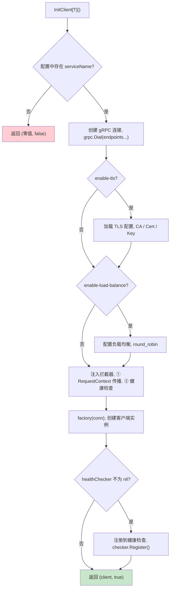

# gRPC 客户端

## 概述

`cpool/grpc` 包提供泛型辅助函数 `InitClient`，用于快速初始化 gRPC 客户端连接，支持健康检查、TLS、负载均衡等特性。

> 源码目录：[cpool/grpc/](../cpool/grpc/)

## 客户端初始化流程



## InitClient 泛型辅助

> 源码：[cpool/grpc/client.go](../cpool/grpc/client.go)

```go
func InitClient[T any](
    healthChecker *HealthChecker,
    clients map[string]*gwconfig.GRPCClient,
    serviceName string,
    factory func(grpc.ClientConnInterface) T,
) (T, bool)
```

### 参数说明

| 参数 | 类型 | 说明 |
|------|------|------|
| healthChecker | `*HealthChecker` | 健康检查管理器（可选，传 nil） |
| clients | `map[string]*gwconfig.GRPCClient` | gRPC 客户端配置（从 Gateway 配置获取） |
| serviceName | `string` | 目标服务名称（对应配置文件中的 key） |
| factory | `func(grpc.ClientConnInterface) T` | 客户端工厂函数（如 `pb.NewXxxServiceClient`） |

返回值：`(客户端实例, 是否成功)`

## 基础用法

### 无健康检查

```go
func (g *MyGateway) setupGRPCClients() error {
    config := g.gateway.GetConfig()
    clients := config.GRPC.Clients

    if client, ok := grpcpool.InitClient(nil, clients, "user-service", userpb.NewUserServiceClient); ok {
        g.userServiceClient = client
        gwglobal.LOGGER.Info("User service client initialized")
    } else {
        gwglobal.LOGGER.Warn("User service client initialization failed, check config")
    }

    return nil
}
```

### 带健康检查

> 源码：[cpool/grpc/health.go](../cpool/grpc/health.go)

```go
type MyGateway struct {
    gateway       *gateway.Gateway
    healthChecker *grpcpool.HealthChecker
}

func NewMyGateway() *MyGateway {
    return &MyGateway{
        healthChecker: grpcpool.NewHealthChecker(),
    }
}

func (g *MyGateway) setupGRPCClients() error {
    config := g.gateway.GetConfig()
    clients := config.GRPC.Clients

    // 带健康检查的客户端初始化
    if client, ok := grpcpool.InitClient(g.healthChecker, clients, "user-service", userpb.NewUserServiceClient); ok {
        g.userServiceClient = client
        gwglobal.LOGGER.Info("User service client initialized")
    }

    // 启动定期健康检查
    endpoints := grpcpool.BuildEndpointMap(clients)
    g.healthChecker.StartPeriodicCheck(3*time.Second, endpoints)

    return nil
}
```

## HealthChecker

> 源码：[cpool/grpc/health.go](../cpool/grpc/health.go)

```go
checker := grpcpool.NewHealthChecker()
```

核心方法：

| 方法 | 说明 |
|------|------|
| `Register(name, conn, endpoint)` | 注册服务到健康检查 |
| `IsHealthy(name) bool` | 检查服务是否健康 |
| `GetServiceHealth(name) (bool, bool)` | 获取健康状态（健康, 是否已注册） |
| `StartPeriodicCheck(interval, endpoints)` | 启动定期 TCP 端口探测 |
| `GetHealthStatus() map[string]bool` | 获取所有服务健康状态 |
| `Close()` | 关闭所有客户端连接 |

健康检查采用 **TCP 端口探测** 方式，默认间隔 3 秒：

```go
endpoints := grpcpool.BuildEndpointMap(clients)
checker.StartPeriodicCheck(3*time.Second, endpoints)
```

## ServiceGuard — 服务可用性校验

在业务代码中校验服务依赖是否可用：

```go
err := grpcpool.NewServiceGuard("user-service").
    WithClient(g.userClient).
    WithHealthChecker(g.healthChecker.IsHealthy).
    Ensure()
if err != nil {
    return status.Errorf(codes.Unavailable, "user service unavailable: %v", err)
}
```

## TLS 配置

```yaml
grpc:
  clients:
    user-service:
      endpoints:
        - "user-service:9000"
      enable-tls: true
      tls-ca-file: "/etc/certs/ca.pem"
      tls-cert-file: "/etc/certs/client.pem"
      tls-key-file: "/etc/certs/client.key"
```

支持三种模式：
- **单向认证**：仅设置 `enable-tls: true` + `tls-ca-file`
- **双向认证**：额外设置 `tls-cert-file` + `tls-key-file`
- **跳过验证**：仅设置 `enable-tls: true`（InsecureSkipVerify）

## 负载均衡

```yaml
grpc:
  clients:
    user-service:
      endpoints:
        - "user-service-1:9000"
        - "user-service-2:9000"
      enable-load-balance: true
      load-balance-policy: "round_robin"
```

## 连接参数

```yaml
grpc:
  clients:
    user-service:
      endpoints:
        - "user-service:9000"
      keepalive-time: 10
      keepalive-timeout: 3
      max-recv-msg-size: 16777216
      max-send-msg-size: 16777216
      wait-for-ready: true
      connection-timeout: 30
```

## 客户端拦截器

InitClient 自动注入以下拦截器：

1. **RequestContext 传播拦截器** — 确保 trace_id 在服务调用链中传递
2. **健康检查拦截器** — 服务不可用时返回 `Unavailable` 错误

## 下一步

- [请求上下文](./REQUEST-CONTEXT.md) — 了解全链路上下文传递
- [服务注册](./SERVICE-REGISTRATION.md) — 了解如何注册服务
