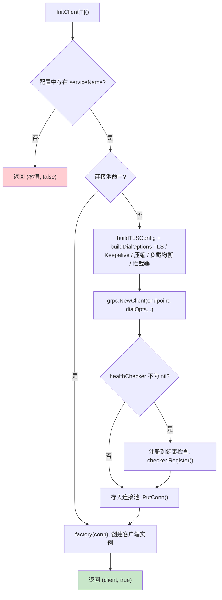

# gRPC 客户端

## 概述

`cpool/grpc` 包提供泛型辅助函数 `InitClient`，用于快速初始化 gRPC 客户端连接，支持健康检查、TLS、负载均衡等特性。

> 源码目录：[cpool/grpc/](../cpool/grpc/)

## 客户端初始化流程


```mermaid
flowchart TD
    CALL["InitClient[T]()"] --> CHECK_CFG{"配置中存在 serviceName?"}
    CHECK_CFG -->|否| FAIL["返回 (零值, false)"]
    CHECK_CFG -->|是| POOL{"连接池命中?"}

    POOL -->|是| FACTORY
    POOL -->|否| BUILD["buildTLSConfig + buildDialOptions TLS / Keepalive / 压缩 / 负载均衡 / 拦截器"]
    BUILD --> DIAL["grpc.NewClient(endpoint, dialOpts...)"]

    DIAL --> CHECK_HC{"healthChecker 不为 nil?"}
    CHECK_HC -->|是| REGISTER["注册到健康检查, checker.Register()"]
    CHECK_HC -->|否| CACHE
    REGISTER --> CACHE["存入连接池, PutConn()"]
    CACHE --> FACTORY["factory(conn), 创建客户端实例"]
    FACTORY --> SUCCESS["返回 (client, true)"]

    style FAIL fill:#ffcdd2
    style SUCCESS fill:#c8e6c9
```

## InitClient 泛型辅助

> 源码：[cpool/grpc/client.go](../cpool/grpc/client.go)

```go
func InitClient[T any](
    healthChecker *HealthChecker,
    clients map[string]*gwconfig.GRPCClient,
    serviceName string,
    factory func(grpc.ClientConnInterface) T,
) (T, bool)
```

### 参数说明

| 参数 | 类型 | 说明 |
|------|------|------|
| healthChecker | `*HealthChecker` | 健康检查管理器（可选，传 nil） |
| clients | `map[string]*gwconfig.GRPCClient` | gRPC 客户端配置（从 Gateway 配置获取） |
| serviceName | `string` | 目标服务名称（对应配置文件中的 key） |
| factory | `func(grpc.ClientConnInterface) T` | 客户端工厂函数（如 `pb.NewXxxServiceClient`） |

返回值：`(客户端实例, 是否成功)`

## InitClientTo 便捷封装

> 源码：[cpool/grpc/client.go](../cpool/grpc/client.go)

`InitClientTo` 是 `InitClient` 的便捷封装，成功时将客户端赋值到 `*target` 并记录 Info 日志，失败时记录 Warn 日志，减少调用方样板代码。

```go
func InitClientTo[T any](
    healthChecker *HealthChecker,
    clients map[string]*gwconfig.GRPCClient,
    serviceName, label string,
    factory func(grpc.ClientConnInterface) T,
    target *T,
) bool
```

```go
grpcpool.InitClientTo(g.healthChecker, clients, "user-service", "UserService",
    userpb.NewUserServiceClient, &g.userClient)
```

## InitClientAny 反射调用入口

> 源码：[cpool/grpc/client.go](../cpool/grpc/client.go)

`InitClientAny` 与 `InitClient` 逻辑相同，但工厂函数和返回值均为 `interface{}`，便于自动注册场景下的反射调用。

```go
func InitClientAny(
    healthChecker *HealthChecker,
    clients map[string]*gwconfig.GRPCClient,
    serviceName string,
    factory func(grpc.ClientConnInterface) interface{},
) (interface{}, bool)
```

## BuildDialOptions 构建拨号选项

> 源码：[cpool/grpc/client.go](../cpool/grpc/client.go)

公开方法，根据客户端配置构建完整的 `[]grpc.DialOption`，包括 TLS、keepalive、消息大小、HTTP/2 窗口、压缩、负载均衡与拦截器链。

```go
func BuildDialOptions(clientCfg *gwconfig.GRPCClient, serviceName string, healthChecker *HealthChecker) []grpc.DialOption
```

## 连接池辅助函数

> 源码：[cpool/grpc/client.go](../cpool/grpc/client.go)

`InitClient` 内部维护按服务名缓存 `*grpc.ClientConn` 的全局连接池，重复初始化同一服务会复用已有连接。以下函数提供池的直接访问：

| 函数 | 签名 | 说明 |
|------|------|------|
| `GetConn` | `func(serviceName string) (*grpc.ClientConn, bool)` | 从连接池获取指定服务的连接 |
| `PutConn` | `func(serviceName string, conn *grpc.ClientConn)` | 将连接存入连接池 |
| `BuildEndpointMap` | `func(clients map[string]*gwconfig.GRPCClient) map[string]string` | 从配置构建服务名到首端点的映射 |

```go
endpoints := grpcpool.BuildEndpointMap(clients)
g.healthChecker.StartPeriodicCheck(grpcpool.DefaultHealthCheckInterval, endpoints)
```

`DefaultHealthCheckInterval` 为包级常量，值为 `3 * time.Second`。

## 基础用法

### 无健康检查

```go
func (g *MyGateway) setupGRPCClients() error {
    config := g.gateway.GetConfig()
    clients := config.GRPC.Clients

    if client, ok := grpcpool.InitClient(nil, clients, "user-service", userpb.NewUserServiceClient); ok {
        g.userServiceClient = client
        gwglobal.LOGGER.Info("User service client initialized")
    } else {
        gwglobal.LOGGER.Warn("User service client initialization failed, check config")
    }

    return nil
}
```

### 带健康检查

> 源码：[cpool/grpc/health.go](../cpool/grpc/health.go)

```go
type MyGateway struct {
    gateway       *gateway.Gateway
    healthChecker *grpcpool.HealthChecker
}

func NewMyGateway() *MyGateway {
    return &MyGateway{
        healthChecker: grpcpool.NewHealthChecker(),
    }
}

func (g *MyGateway) setupGRPCClients() error {
    config := g.gateway.GetConfig()
    clients := config.GRPC.Clients

    // 带健康检查的客户端初始化
    if client, ok := grpcpool.InitClient(g.healthChecker, clients, "user-service", userpb.NewUserServiceClient); ok {
        g.userServiceClient = client
        gwglobal.LOGGER.Info("User service client initialized")
    }

    // 启动定期健康检查
    endpoints := grpcpool.BuildEndpointMap(clients)
    g.healthChecker.StartPeriodicCheck(3*time.Second, endpoints)

    return nil
}
```

## HealthChecker

> 源码：[cpool/grpc/health.go](../cpool/grpc/health.go)

```go
checker := grpcpool.NewHealthChecker()
```

核心方法：

| 方法 | 说明 |
|------|------|
| `Register(name, conn, endpoint)` | 注册服务到健康检查（同步执行首次 TCP 探测） |
| `IsHealthy(name) bool` | 检查服务是否健康 |
| `GetServiceHealth(name) (bool, bool)` | 获取健康状态（健康, 是否已注册） |
| `StartPeriodicCheck(interval, endpoints)` | 启动定期 TCP 端口探测 |
| `GetHealthStatus() map[string]bool` | 获取所有服务健康状态 |
| `SetOnRecover(fn func(serviceName string))` | 设置服务从不可用恢复为可用时的回调（用于重新发现服务和注册路由） |
| `Close()` | 关闭所有客户端连接 |

健康检查采用 **TCP 端口探测** 方式，默认间隔 3 秒：

```go
endpoints := grpcpool.BuildEndpointMap(clients)
checker.StartPeriodicCheck(3*time.Second, endpoints)
```

## ServiceGuard — 服务可用性校验

> 源码：[cpool/grpc/health.go](../cpool/grpc/health.go)

在业务代码中校验服务依赖是否可用。`NewServiceGuard` 返回值类型 `ServiceGuard`，支持链式调用：

| 方法 | 说明 |
|------|------|
| `NewServiceGuard(serviceName) ServiceGuard` | 创建服务校验器 |
| `WithServiceName(name) ServiceGuard` | 设置服务名称 |
| `WithClient(client any) ServiceGuard` | 设置客户端实例（nil 则校验失败） |
| `WithHealthChecker(fn func(string) bool) ServiceGuard` | 设置健康检查函数（传 `checker.IsHealthy`） |
| `Ensure() error` | 执行校验，客户端未初始化返回 `FailedPrecondition`，服务不可用返回 `Unavailable` |

```go
err := grpcpool.NewServiceGuard("user-service").
    WithClient(g.userClient).
    WithHealthChecker(g.healthChecker.IsHealthy).
    Ensure()
if err != nil {
    return status.Errorf(codes.Unavailable, "user service unavailable: %v", err)
}
```

也可使用独立函数 `EnsureServiceReady(client any, isHealthy func(string) bool, serviceName string) error` 直接校验。

## 健康检查拦截器

> 源码：[cpool/grpc/health.go](../cpool/grpc/health.go)

`InitClient` / `BuildDialOptions` 自动注入以下拦截器，服务不可用时短路返回 `Unavailable` 错误：

| 函数 | 签名 |
|------|------|
| `UnaryClientHealthInterceptor` | `func(serviceName string, checker *HealthChecker) grpc.UnaryClientInterceptor` |
| `StreamClientHealthInterceptor` | `func(serviceName string, checker *HealthChecker) grpc.StreamClientInterceptor` |

## TLS 配置

```yaml
grpc:
  clients:
    user-service:
      endpoints:
        - "user-service:9000"
      enable-tls: true
      tls-ca-file: "/etc/certs/ca.pem"
      tls-cert-file: "/etc/certs/client.pem"
      tls-key-file: "/etc/certs/client.key"
```

支持三种模式：
- **单向认证**：仅设置 `enable-tls: true` + `tls-ca-file`
- **双向认证**：额外设置 `tls-cert-file` + `tls-key-file`
- **跳过验证**：仅设置 `enable-tls: true`（InsecureSkipVerify）

## 负载均衡

```yaml
grpc:
  clients:
    user-service:
      endpoints:
        - "user-service-1:9000"
        - "user-service-2:9000"
      enable-load-balance: true
      load-balance-policy: "round_robin"
```

## 连接参数

```yaml
grpc:
  clients:
    user-service:
      endpoints:
        - "user-service:9000"
      keepalive-time: 10
      keepalive-timeout: 3
      max-recv-msg-size: 16777216
      max-send-msg-size: 16777216
      wait-for-ready: true
      connection-timeout: 30
```

## 客户端拦截器

`InitClient` / `BuildDialOptions` 自动注入以下拦截器链（顺序：RequestContext → 日志 → 健康检查）：

1. **RequestContext 传播拦截器** — 确保 trace_id 在服务调用链中传递（`middleware.UnaryClientRequestContextInterceptor`）
2. **调用日志拦截器** — 记录 gRPC 调用耗时与结果（`middleware.UnaryClientLoggingInterceptor(serviceName)`）
3. **健康检查拦截器** — 服务不可用时短路返回 `Unavailable` 错误（`UnaryClientHealthInterceptor`）

Stream 调用同样注入三个对应的 Stream 拦截器。此外还注入 `otelgrpc.NewClientHandler()` StatsHandler，将 HTTP 侧的 OTel trace 传播到下游 gRPC 服务。

## 压缩

> 源码：[cpool/grpc/compression.go](../cpool/grpc/compression.go)

启用客户端压缩后，`buildDialOptions` 会通过 `grpc.UseCompressor(compressType)` 注册压缩编解码器。支持三种压缩算法常量：

| 常量 | 值 |
|------|------|
| `GRPCCompressGzip` | `"gzip"` |
| `GRPCCompressSnappy` | `"snappy"` |
| `GRPCCompressZstd` | `"zstd"` |

关键函数：

| 函数 | 签名 | 说明 |
|------|------|------|
| `RegisterCompressor` | `func(c encoding.Compressor)` | 注册压缩编解码器到全局与 gRPC encoding 包 |
| `EnsureCompressorRegistered` | `func(name string)` | 确保指定压缩器已注册（未注册则按名称注册） |
| `ResolveCompressType` | `func(compressType gwconfig.GRPCCompressType) string` | 解析压缩类型，空值降级为 `gzip` |
| `ApplyClientCompression` | `func(cfg *gwconfig.GRPCClient)` | 按客户端配置确保压缩器注册 |
| `ApplyServerCompression` | `func(cfg *gwconfig.GRPCServer)` | 按服务端配置确保压缩器注册 |
| `GetCompressCallOption` | `func(cfg *gwconfig.GRPCClient) []grpc.CallOption` | 获取压缩 CallOption |

```yaml
grpc:
  clients:
    user-service:
      endpoints:
        - "user-service:9000"
      enable-compression: true
      compression-type: "gzip"   # gzip | snappy | zstd
```

## 自动注册（基于 gRPC Server Reflection）

> 源码：[cpool/grpc/auto_register.go](../cpool/grpc/auto_register.go)

基于 gRPC Server Reflection 自动发现服务并动态注册 HTTP handler，业务层无需写任何注册胶水代码。前提：gRPC server 需启用 `reflection.Register(server)`。

### 核心类型

| 类型 | 说明 |
|------|------|
| `ReflectionServiceInfo` | 通过 reflection 获取的单个服务信息，含 `ServiceName` 字段 |
| `HTTPRoute` | HTTP 路由映射，含 `ServiceName`、`MethodName`、`HTTPMethod`、`HTTPPath`、`BodyField` 字段 |
| `AutoRegisterResult` | 自动注册结果，含 `Clients`、`Handlers`、`TotalClients`、`TotalHandlers`、`SkippedManual` 字段，提供 `Summary() string` 方法 |

### 核心函数

| 函数 | 签名 | 说明 |
|------|------|------|
| `AutoRegister` | `func(ctx context.Context, healthChecker *HealthChecker, mux *runtime.ServeMux, clients map[string]*gwconfig.GRPCClient) *AutoRegisterResult` | 一站式入口：连接 + 发现 + 注册 HTTP handler |
| `InitConnectionsAndDiscover` | `func(ctx context.Context, healthChecker *HealthChecker, clients map[string]*gwconfig.GRPCClient) []string` | 初始化所有连接并通过 reflection 发现服务（不注册 handler） |
| `DiscoverAllServices` | `func(ctx context.Context, clients map[string]*gwconfig.GRPCClient)` | 并发 discovery 所有服务，注册 FileDescriptorProto |
| `RegisterDynamicHandlers` | `func(ctx context.Context, mux *runtime.ServeMux, clients map[string]*gwconfig.GRPCClient) ([]string, error)` | 基于 reflection 结果动态注册 HTTP handler |
| `RediscoverAndRegisterService` | `func(ctx context.Context, mux *runtime.ServeMux, serviceName string) error` | 重新发现并注册单个服务（用于服务恢复健康后重放） |
| `GetReflectionRegistry` | `func(serviceName string) []ReflectionServiceInfo` | 获取已发现的服务列表 |
| `GetRoutes` | `func() []HTTPRoute` | 获取所有已注册的 HTTP 路由 |
| `ClearRegistry` | `func()` | 清空 reflection 发现的服务和路由（主要用于测试） |

```go
result := grpcpool.AutoRegister(ctx, g.healthChecker, mux, config.GRPC.Clients)
g.healthChecker.SetOnRecover(func(serviceName string) {
    _ = grpcpool.RediscoverAndRegisterService(ctx, mux, serviceName)
})
fmt.Println(result.Summary())
```

## 下一步

- [请求上下文](./REQUEST-CONTEXT.md) — 了解全链路上下文传递
- [服务注册](./SERVICE-REGISTRATION.md) — 了解如何注册服务
