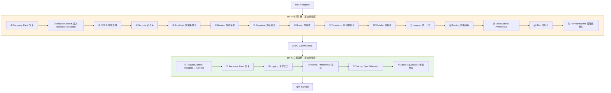
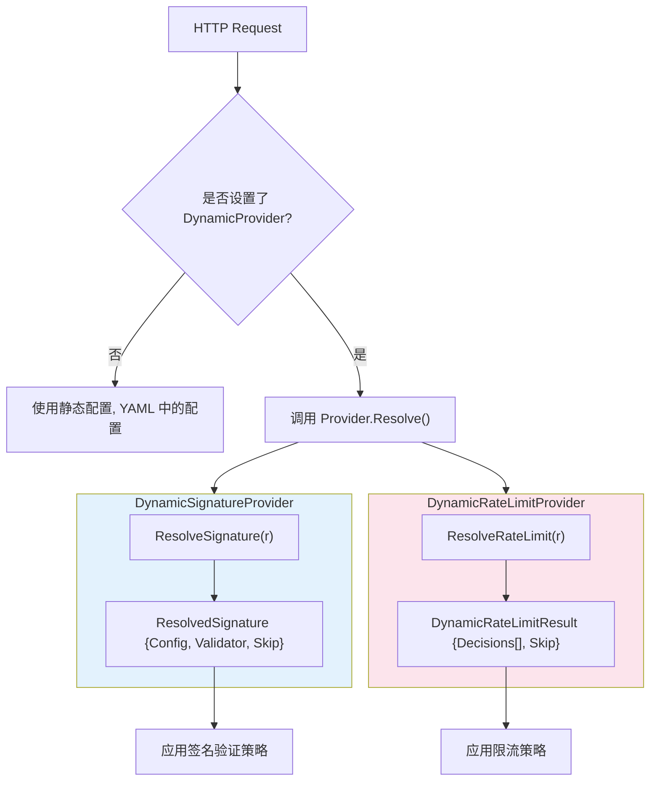

# 中间件系统

## 概述

go-rpc-gateway 提供完整的中间件体系，覆盖 HTTP 和 gRPC 双协议。所有中间件由 `Manager` 统一管理，通过配置文件按需启用。

> 源码目录：[middleware/](../middleware/)

## 中间件执行链



## Manager — 中间件管理器

> 源码：[middleware/manager.go](../middleware/manager.go)

`Manager` 从 Gateway 配置自动创建并初始化所有启用的中间件：

```go
manager, err := middleware.NewManager(cfg)
```

Manager 内部管理的组件：

| 组件 | 源码 | 说明 |
|------|------|------|
| MetricsManager | [observability.go](../middleware/observability.go) | Prometheus 指标 |
| TracingManager | [tracing.go](../middleware/tracing.go) | OpenTelemetry 链路追踪 |
| RateLimiter | [ratelimit.go](../middleware/ratelimit.go) | 多策略限流 |
| I18nManager | [i18n.go](../middleware/i18n.go) | 国际化 |
| PBValidationMiddleware | [pb_validation.go](../middleware/pb_validation.go) | PB 参数验证 |
| SwaggerMiddleware | go-swagger | Swagger 文档 |

动态提供器（运行时注入）：



```go
gateway.SetDynamicSignatureProvider(provider)
gateway.SetDynamicRateLimitProvider(provider)
```

> 源码：[dynamic.go:DynamicSignatureProvider](../middleware/dynamic.go#L29)、[dynamic.go:DynamicRateLimitProvider](../middleware/dynamic.go#L46)

### DynamicSignatureProvider — 动态签名提供器

> 源码：[middleware/dynamic.go](../middleware/dynamic.go)

允许在运行时按请求动态决定签名验证策略，而非使用全局静态配置。

```go
type ResolvedSignature struct {
    Config    *signature.Signature   // 该请求使用的签名配置
    Validator SignatureValidator     // 该请求使用的验证器
    Skip      bool                   // 是否跳过签名验证
}

type DynamicSignatureProvider interface {
    ResolveSignature(r *http.Request) (*ResolvedSignature, *gwerrors.AppError)
}
```

实现示例：

```go
type MySignatureProvider struct{}

func (p *MySignatureProvider) ResolveSignature(r *http.Request) (*middleware.ResolvedSignature, *gwerrors.AppError) {
    path := r.URL.Path

    if strings.HasPrefix(path, "/api/v1/public/") {
        return &middleware.ResolvedSignature{Skip: true}, nil
    }

    tenantID := r.Header.Get("X-Tenant-ID")
    cfg := getTenantSignatureConfig(tenantID)

    return &middleware.ResolvedSignature{
        Config:    cfg,
        Validator: middleware.NewHMACValidator(cfg.SecretKey),
        Skip:      false,
    }, nil
}

gateway.SetDynamicSignatureProvider(&MySignatureProvider{})
```

### DynamicRateLimitProvider — 动态限流提供器

> 源码：[middleware/dynamic.go](../middleware/dynamic.go)

允许在运行时按请求动态决定限流策略，支持多规则组合。

```go
type RateLimitDecision struct {
    Rule     *ratelimit.LimitRule   // 限流规则
    Key      string                 // 限流 Key（如 "user:123"）
    Strategy ratelimit.Strategy     // 限流策略实例
}

type DynamicRateLimitResult struct {
    Decisions []RateLimitDecision   // 一条请求可触发多条限流决策
    Skip      bool                  // 是否跳过限流
}

type DynamicRateLimitProvider interface {
    ResolveRateLimit(r *http.Request) (*DynamicRateLimitResult, *gwerrors.AppError)
}
```

实现示例：

```go
type MyRateLimitProvider struct{}

func (p *MyRateLimitProvider) ResolveRateLimit(r *http.Request) (*middleware.DynamicRateLimitResult, *gwerrors.AppError) {
    userID := r.Header.Get("X-User-ID")
    path := r.URL.Path

    var decisions []middleware.RateLimitDecision

    if strings.HasPrefix(path, "/api/v1/login") {
        ip := r.RemoteAddr
        decisions = append(decisions, middleware.RateLimitDecision{
            Rule:     &ratelimit.LimitRule{RPS: 5, Burst: 10, Window: 60},
            Key:      "login:" + ip,
            Strategy: slidingWindowStrategy,
        })
    }

    if userID != "" {
        decisions = append(decisions, middleware.RateLimitDecision{
            Rule:     &ratelimit.LimitRule{RPS: 100, Burst: 200},
            Key:      "user:" + userID,
            Strategy: tokenBucketStrategy,
        })
    }

    return &middleware.DynamicRateLimitResult{Decisions: decisions}, nil
}

gateway.SetDynamicRateLimitProvider(&MyRateLimitProvider{})
```

### ContextScopeReader — 作用域读取适配器

> 源码：[middleware/scope_reader.go](../middleware/scope_reader.go)

将 go-rpc-gateway 的请求上下文适配为外部作用域读取接口，供限流等中间件获取租户/角色等维度信息：

```go
type ContextScopeReader struct{}

func (ContextScopeReader) GetDomain(ctx context.Context) string   // 从 context 获取 Domain
func (ContextScopeReader) GetTenantID(ctx context.Context) string // 从 context 获取 TenantID
func (ContextScopeReader) GetRoleCode(ctx context.Context) string // 从 context 获取 RoleCode
```

> 源码：[scope_reader.go:L17-L29](../middleware/scope_reader.go#L17)

## 类型定义与责任链

> 源码：[middleware/types.go](../middleware/types.go)

```go
type MiddlewareFunc func(http.Handler) http.Handler

// ChainFunc 创建中间件链（逆序包装，保证执行顺序）
func ChainFunc(middlewares ...MiddlewareFunc) MiddlewareFunc
```

## HTTP 中间件

### RecoveryMiddleware — Panic 恢复

> 源码：[middleware/recovery.go](../middleware/recovery.go)

捕获 HTTP handler 中的 panic，返回 500 错误响应而非崩溃。

```yaml
middleware:
  recovery:
    enabled: true
```

### LoggingMiddleware — 统一日志

> 源码：[middleware/logging.go](../middleware/logging.go)

记录 HTTP 和 gRPC 请求的统一日志，包含请求方法、路径、状态码、耗时等信息。

```go
logger := middleware.NewRequestLogger(ctx)
logger.LogRequest(method, path, statusCode, duration)
```

### CORSMiddleware — 跨域资源共享

> 源码：[middleware/security.go:L49](../middleware/security.go#L49)

```yaml
middleware:
  cors:
    allowed-headers:
      - "Authorization"
      - "Content-Type"
    allowed-methods:
      - "GET"
      - "POST"
    allowed-origins:
      - "https://example.com"
```

### SecurityMiddleware — 安全头

> 源码：[middleware/security.go](../middleware/security.go)

包含 CSP、CSRF Token、安全头等安全相关中间件。

### RateLimitMiddleware — 多策略限流

> 源码：[middleware/ratelimit.go](../middleware/ratelimit.go)

支持多种限流策略和多级别限流：

| 策略 | Key 格式 | 说明 |
|------|---------|------|
| 令牌桶 | `ratelimit:rps_{n}:burst_{n}` | 固定 RPS + 突发 |
| 滑动窗口 | `{prefix}:{key}:win_{v}:rps_{n}` | 平滑限流 |
| 固定窗口 | `{prefix}:win_{v}:rps_{n}` | 简单计数 |

多级别限流维度：

| 级别 | Key 格式 | 说明 |
|------|---------|------|
| 路由+用户 | `route:{path}:user:{uid}` | 每个用户每路由独立限流 |
| 路由+IP | `route:{path}:ip:{ip}` | 每个 IP 每路由独立限流 |
| 路由 | `route:{path}` | 每路由独立限流 |
| IP | `ip:{ip}` | 每 IP 限流 |
| 用户 | `user:{uid}` | 每用户限流 |

```yaml
middleware:
  rate-limit:
    enabled: true
    rules:
      - path: "/api/v1/login"
        strategy: "sliding-window"
        window: 60s
        rps: 10
        level: "ip"
```

### BreakerMiddleware — 熔断器

> 源码：[middleware/breaker.go](../middleware/breaker.go)

```yaml
middleware:
  breaker:
    enabled: true
    failure-threshold: 5
    success-threshold: 3
    volume-threshold: 10
    timeout: 30s
    prevention-paths:
      - "/api/v1/external/*"
    exclude-paths:
      - "/api/v1/health"
```

### SignatureMiddleware — 签名验证

> 源码：[middleware/signature.go](../middleware/signature.go)

支持 HMAC 和 RSA 两种签名算法：

```yaml
middleware:
  signature:
    enabled: true
    algorithm: "hmac-sha256"
    secret-key: "your-secret-key"
    header-name: "X-Signature"
    ignore-paths:
      - "/api/v1/public/*"
```

### NonceMiddleware — 防重放

> 源码：[middleware/nonce.go](../middleware/nonce.go)

使用 Redis INCR 原子操作记录 Nonce 使用次数，检测重放攻击：

```yaml
middleware:
  signature:
    enabled: true
    nonce-header: "X-Nonce"
    nonce-ttl: 300s
```

### TimestampMiddleware — 时间戳验证

> 源码：[middleware/timestamp.go](../middleware/timestamp.go)

验证请求时间戳是否在有效时间窗口内，防止重放攻击：

```yaml
middleware:
  signature:
    enabled: true
    timestamp-header: "X-Timestamp"
    timestamp-tolerance: 300s
```

### WhitelistMiddleware — 白名单规则引擎

> 源码：[middleware/whitelist.go](../middleware/whitelist.go)

支持灵活的规则配置：

```go
type WhitelistRule interface {
    Match(method, path string) bool
    Description() string
    Priority() int
}
```

内置规则类型：

| 规则 | 说明 |
|------|------|
| PathPrefixRule | 路径前缀匹配 |
| PathExactRule | 路径精确匹配 |
| PathRegexRule | 正则匹配 |
| IPRule | IP/CIDR 匹配 |
| MethodRule | HTTP 方法匹配 |
| CompositeRule | 组合规则（AND/OR） |

```go
manager := middleware.NewWhitelistManager()
manager.AddRule(middleware.NewPathPrefixRule("/api/v1/public", 1))
manager.AddRule(middleware.NewIPRule("10.0.0.0/8", 2))
isAllowed := manager.IsAllowed("GET", "/api/v1/public/health")
```

### TracingMiddleware — 链路追踪

> 源码：[middleware/tracing.go](../middleware/tracing.go)

集成 OpenTelemetry，支持 Zipkin 和 OTLP HTTP 导出器：

```yaml
middleware:
  tracing:
    enabled: true
    service-name: "my-service"
    exporter-type: "zipkin"
    endpoint: "http://zipkin:9411/api/v2/spans"
```

### ObservabilityMiddleware — 可观测性

> 源码：[middleware/observability.go](../middleware/observability.go)

统一管理 Prometheus 指标（HTTP + gRPC）：

```go
type MetricsManager struct {
    registry      *prometheus.Registry
    serverMetrics *grpc_prometheus.ServerMetrics
    clientMetrics *grpc_prometheus.ClientMetrics
    httpMetrics   *HTTPMetrics
    panicCounter  prometheus.Counter
}
```

```yaml
monitoring:
  metrics:
    enabled: true
    path: "/metrics"
```

### I18nMiddleware — 国际化

> 源码：[middleware/i18n.go](../middleware/i18n.go)

```go
manager, err := middleware.NewI18nManager(cfg.Middleware.I18N)

// 从 JSON 字符串加载
loader, err := middleware.NewJSONMessageLoader(messagesJSON)

// 从文件加载
loader := middleware.NewFileMessageLoader("./locales")

// 从上下文获取
i18nCtx := middleware.I18nFromContext(ctx)
```

### HealthManager — 健康检查

> 源码：[middleware/health.go](../middleware/health.go)

```go
type HealthChecker interface {
    Name() string
    Check(ctx context.Context) HealthStatus
}

type HealthStatus struct {
    Status    string        // "ok", "warning", "error"
    Message   string
    Latency   time.Duration
    Details   interface{}
    CheckedAt time.Time
}
```

内置检查器：RedisChecker、MySQLChecker。

```go
healthManager := middleware.NewHealthManager()
healthManager.RegisterChecker(middleware.NewRedisChecker(5*time.Second))
healthManager.RegisterChecker(middleware.NewMySQLChecker(5*time.Second))
status := healthManager.CheckAll(ctx)
```

### PProfServer — 性能分析

> 源码：[middleware/pprof.go](../middleware/pprof.go)

```yaml
pprof:
  enabled: true
  host: "0.0.0.0"
  port: 6060
```

### PathNormalizer — 智能路径规范化

> 源码：[middleware/path_normalizer.go](../middleware/path_normalizer.go)

基于前缀匹配自动学习动态参数模式：

```
/v1/buckets/my-bucket/objects   → /v1/buckets/:param/objects
/v1/buckets/your-bucket/objects → /v1/buckets/:param/objects
```

## gRPC 中间件

### InterceptorManager — gRPC 拦截器管理器

> 源码：[middleware/grpc_interceptors.go](../middleware/grpc_interceptors.go)

```go
type InterceptorManager struct {
    logger        *logger.Logger
    serverMetrics *grpc_prometheus.ServerMetrics
    clientMetrics *grpc_prometheus.ClientMetrics
    panicCounter  prometheus.Counter
}
```

提供 Unary 和 Stream 拦截器：
- Recovery 拦截器（panic 恢复）
- Logging 拦截器（请求日志）
- Prometheus 指标拦截器
- OpenTelemetry 追踪拦截器
- Validator 拦截器

### PBValidationMiddleware — PB 参数验证

> 源码：[middleware/pb_validation.go](../middleware/pb_validation.go)

基于 go-pbmo Validator 的通用参数验证，支持规则注册和自动类型识别：

```go
mw := middleware.NewPBValidationMiddleware(enabled, skipPaths)
mw.RegisterTypeResolver("/api/v1/users/", func(body []byte) (interface{}, error) {
    return proto.Unmarshal(body, &pb.CreateUserRequest{})
})
```

### ConversionMiddleware — PB ↔ GORM Model 转换

> 源码：[middleware/pb_converter.go](../middleware/pb_converter.go)

自动转换 gRPC 请求/响应与 GORM Model：

```go
cm := middleware.NewConversionMiddleware(logger, true)
cm.RegisterConverter("UserService", pbConverter)
```

### StructTagValidator — struct tag gRPC 校验

> 源码：[middleware/struct_tag_validator.go](../middleware/struct_tag_validator.go)

基于 go-playground/validator 的 struct tag 校验拦截器，配合 protoc-go-inject-tag 在 pb 生成代码字段上注入 `validate:"..."` 标签：

```go
// Unary 拦截器
grpc.Server(
    grpc.UnaryInterceptor(middleware.StructTagValidatorUnaryInterceptor()),
)
```

## 基础设施

### ResponseWriter — 统一响应写入器

> 源码：[middleware/response_writer.go](../middleware/response_writer.go)

```go
type ResponseWriter struct {
    http.ResponseWriter
    statusCode   int
    bytesWritten int64
    body         *bytes.Buffer
    captureBody  bool
}
```

使用 sync.Pool 对象池减少内存分配，供多个中间件共享使用。

## 下一步

- [请求上下文](./REQUEST-CONTEXT.md) — 了解全链路上下文传递
- [Server 内部机制](./SERVER.md) — 了解中间件如何被初始化和挂载
