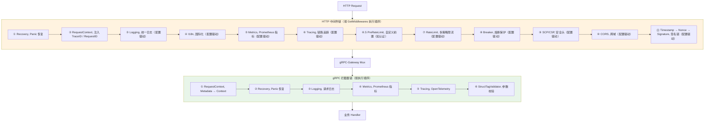
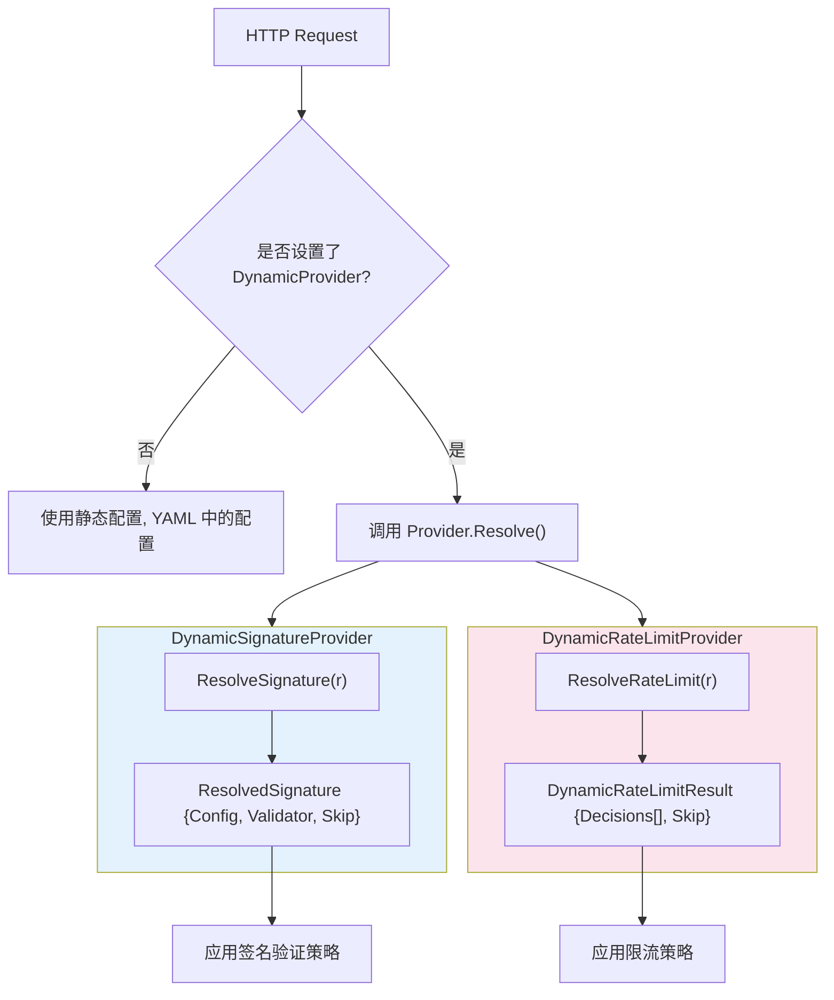

# 中间件系统

## 概述

go-rpc-gateway 提供完整的中间件体系，覆盖 HTTP 和 gRPC 双协议。所有中间件由 `Manager` 统一管理，通过配置文件按需启用。

> 源码目录：[middleware/](../middleware/)

## 中间件执行链


```mermaid
flowchart TD
    REQ["HTTP Request"] --> MW_CHAIN["HTTP 中间件链"]

    subgraph MW_CHAIN["HTTP 中间件链（按 GetMiddlewares 执行顺序）"]
        M1["① Recovery, Panic 恢复"]
        M2["② RequestContext, 注入 TraceID / RequestID"]
        M3["③ Logging, 统一日志（配置驱动）"]
        M4["④ I18n, 国际化（配置驱动）"]
        M5["⑤ Metrics, Prometheus 指标（配置驱动）"]
        M6["⑥ Tracing, 链路追踪（配置驱动）"]
        M6b["⑥.5 PreRateLimit, 自定义前置（如认证）"]
        M7["⑦ RateLimit, 多策略限流（配置驱动）"]
        M8["⑧ Breaker, 熔断保护（配置驱动）"]
        M9["⑨ SCP/CSP, 安全头（配置驱动）"]
        M10["⑩ CORS, 跨域（配置驱动）"]
        M11["⑪ Timestamp → Nonce → Signature, 签名链（配置驱动）"]

        M1 --> M2 --> M3 --> M4 --> M5 --> M6 --> M6b --> M7 --> M8 --> M9 --> M10 --> M11
    end

    MW_CHAIN --> GW_MUX["gRPC-Gateway Mux"]

    GW_MUX --> GRPC_CHAIN["gRPC 拦截器链"]

    subgraph GRPC_CHAIN["gRPC 拦截器链（按执行顺序）"]
        G1["① RequestContext, Metadata → Context"]
        G2["② Recovery, Panic 恢复"]
        G3["③ Logging, 请求日志"]
        G4["④ Metrics, Prometheus 指标"]
        G5["⑤ Tracing, OpenTelemetry"]
        G6["⑥ StructTagValidator, 参数校验"]

        G1 --> G2 --> G3 --> G4 --> G5 --> G6
    end

    GRPC_CHAIN --> HANDLER["业务 Handler"]

    style MW_CHAIN fill:#fff3e0
    style GRPC_CHAIN fill:#e8f5e9
```

## Manager — 中间件管理器

> 源码：[middleware/manager.go](../middleware/manager.go)

`Manager` 从 Gateway 配置自动创建并初始化所有启用的中间件：

```go
func NewManager(cfg *gwconfig.Gateway) (*Manager, error)
func (m *Manager) UpdateConfig(cfg *gwconfig.Gateway) error          // 热重载（保留动态提供器）
func (m *Manager) HTTPMiddleware(handler http.Handler) http.Handler  // 应用 HTTP 中间件链
func (m *Manager) GetMiddlewares() []MiddlewareFunc                  // 获取按序的中间件链
func (m *Manager) AddPreRateLimitMiddleware(mw ...HTTPMiddleware)    // 注入限流前中间件（如认证）
func (m *Manager) MetricsHandler() http.Handler                      // Prometheus 抓取端点
func (m *Manager) SwaggerHandler() http.Handler
func (m *Manager) GetMetricsManager() *MetricsManager
func (m *Manager) GetBreakerManager() *BreakerManager
```

Manager 内部管理的组件：

| 组件 | 源码 | 说明 |
| ------ | ------ | ------ |
| MetricsManager | [observability.go](../middleware/observability.go) | Prometheus 指标 |
| TracingManager | [tracing.go](../middleware/tracing.go) | OpenTelemetry 链路追踪 |
| RateLimiter | [ratelimit.go](../middleware/ratelimit.go) | 多策略限流 |
| BreakerManager | [breaker.go](../middleware/breaker.go) | 熔断器（按路径隔离） |
| I18nManager | [i18n.go](../middleware/i18n.go) | 国际化 |
| SwaggerMiddleware | go-swagger | Swagger 文档 |

动态提供器（运行时注入）：


```mermaid
flowchart TD
    REQ["HTTP Request"] --> DYN_CHECK{"是否设置了 DynamicProvider?"}

    DYN_CHECK -->|否| STATIC["使用静态配置, YAML 中的配置"]
    DYN_CHECK -->|是| DYN_RESOLVE["调用 Provider.Resolve()"]

    subgraph SIGNATURE["DynamicSignatureProvider"]
        DS_RESOLVE["ResolveSignature(r)"]
        DS_RESULT["ResolvedSignature {Config, Validator, Skip}"]
        DS_RESOLVE --> DS_RESULT
    end

    subgraph RATELIMIT["DynamicRateLimitProvider"]
        DR_RESOLVE["ResolveRateLimit(r)"]
        DR_RESULT["DynamicRateLimitResult {Decisions[], Skip}"]
        DR_RESOLVE --> DR_RESULT
    end

    DYN_RESOLVE --> SIGNATURE
    DYN_RESOLVE --> RATELIMIT

    DS_RESULT --> APPLY_SIG["应用签名验证策略"]
    DR_RESULT --> APPLY_RL["应用限流策略"]

    style SIGNATURE fill:#e3f2fd
    style RATELIMIT fill:#fce4ec
```

```go
gateway.SetDynamicSignatureProvider(provider)
gateway.SetDynamicRateLimitProvider(provider)
```

> 源码：[dynamic.go:DynamicSignatureProvider](../middleware/dynamic.go#L29)、[dynamic.go:DynamicRateLimitProvider](../middleware/dynamic.go#L46)

### DynamicSignatureProvider — 动态签名提供器

> 源码：[middleware/dynamic.go](../middleware/dynamic.go)

允许在运行时按请求动态决定签名验证策略，而非使用全局静态配置。

```go
type ResolvedSignature struct {
    Config    *signature.Signature   // 该请求使用的签名配置
    Validator SignatureValidator     // 该请求使用的验证器
    Skip      bool                   // 是否跳过签名验证
}

type DynamicSignatureProvider interface {
    ResolveSignature(r *http.Request) (*ResolvedSignature, *gwerrors.AppError)
}
```

实现示例：

```go
type MySignatureProvider struct{}

func (p *MySignatureProvider) ResolveSignature(r *http.Request) (*middleware.ResolvedSignature, *gwerrors.AppError) {
    path := r.URL.Path

    if strings.HasPrefix(path, "/api/v1/public/") {
        return &middleware.ResolvedSignature{Skip: true}, nil
    }

    tenantID := r.Header.Get("X-Tenant-ID")
    cfg := getTenantSignatureConfig(tenantID)

    return &middleware.ResolvedSignature{
        Config:    cfg,
        Validator: &middleware.HMACValidator{},
        Skip:      false,
    }, nil
}

gateway.SetDynamicSignatureProvider(&MySignatureProvider{})
```

### DynamicRateLimitProvider — 动态限流提供器

> 源码：[middleware/dynamic.go](../middleware/dynamic.go)

允许在运行时按请求动态决定限流策略，支持多规则组合。

```go
type RateLimitDecision struct {
    Rule     *ratelimit.LimitRule   // 限流规则
    Key      string                 // 限流 Key（如 "user:123"）
    Strategy ratelimit.Strategy     // 限流策略实例
}

type DynamicRateLimitResult struct {
    Decisions []RateLimitDecision   // 一条请求可触发多条限流决策
    Skip      bool                  // 是否跳过限流
}

type DynamicRateLimitProvider interface {
    ResolveRateLimit(r *http.Request) (*DynamicRateLimitResult, *gwerrors.AppError)
}
```

实现示例：

```go
type MyRateLimitProvider struct{}

func (p *MyRateLimitProvider) ResolveRateLimit(r *http.Request) (*middleware.DynamicRateLimitResult, *gwerrors.AppError) {
    userID := r.Header.Get("X-User-ID")
    path := r.URL.Path

    var decisions []middleware.RateLimitDecision

    if strings.HasPrefix(path, "/api/v1/login") {
        ip := r.RemoteAddr
        decisions = append(decisions, middleware.RateLimitDecision{
            Rule:     &ratelimit.LimitRule{RequestsPerSecond: 5, BurstSize: 10, WindowSize: 60 * time.Second},
            Key:      "login:" + ip,
            Strategy: ratelimit.StrategySlidingWindow,
        })
    }

    if userID != "" {
        decisions = append(decisions, middleware.RateLimitDecision{
            Rule:     &ratelimit.LimitRule{RequestsPerSecond: 100, BurstSize: 200},
            Key:      "user:" + userID,
            Strategy: ratelimit.StrategyTokenBucket,
        })
    }

    return &middleware.DynamicRateLimitResult{Decisions: decisions}, nil
}

gateway.SetDynamicRateLimitProvider(&MyRateLimitProvider{})
```

### ContextScopeReader — 作用域读取适配器

> 源码：[middleware/scope_reader.go](../middleware/scope_reader.go)

将 go-rpc-gateway 的请求上下文适配为外部作用域读取接口，供限流等中间件获取租户/角色等维度信息：

```go
type ContextScopeReader struct{}

func (ContextScopeReader) GetDomain(ctx context.Context) string   // 从 context 获取 Domain
func (ContextScopeReader) GetTenantID(ctx context.Context) string // 从 context 获取 TenantID
func (ContextScopeReader) GetRoleCode(ctx context.Context) string // 从 context 获取 RoleCode
```

> 源码：[scope_reader.go:L17-L29](../middleware/scope_reader.go#L17)

## 类型定义与责任链

> 源码：[middleware/types.go](../middleware/types.go)

```go
type MiddlewareFunc func(http.Handler) http.Handler

// ChainFunc 创建中间件链（逆序包装，保证执行顺序）
func ChainFunc(middlewares ...MiddlewareFunc) MiddlewareFunc
```

## HTTP 中间件

### RecoveryMiddleware — Panic 恢复

> 源码：[middleware/recovery.go](../middleware/recovery.go)

捕获 HTTP handler 中的 panic，返回 500 错误响应而非崩溃。

```yaml
middleware:
  recovery:
    enabled: true
```

### LoggingMiddleware — 统一日志

> 源码：[middleware/logging.go](../middleware/logging.go)

记录 HTTP 和 gRPC 请求的统一日志，包含请求方法、路径、状态码、耗时等信息。

```go
logger := middleware.NewRequestLogger(ctx)
fields := middleware.NewLogFields().
    Add(constants.LogFieldMethod, method).
    Add(constants.LogFieldPath, path).
    AddValue(constants.LogFieldStatus, statusCode).
    AddValue(constants.LogFieldDuration, duration.Milliseconds()).
    AddRequestContext(ctx)
logger.Log(constants.LogLevelInfo, constants.LogMsgHTTPRequest, fields)
```

### CORSMiddleware — 跨域资源共享

> 源码：[middleware/security.go:L34](../middleware/security.go#L34)

```yaml
cors:
  allowed-headers:
    - "Authorization"
    - "Content-Type"
  allowed-methods:
    - "GET"
    - "POST"
  allowed-origins:
    - "https://example.com"
```

### SCPMiddleware — 安全头 / CSP

> 源码：[middleware/security.go](../middleware/security.go)

从配置读取 CSP 策略，设置基础安全头部（X-Content-Type-Options、X-Frame-Options、X-XSS-Protection、HSTS、Referrer-Policy、Content-Security-Policy）。

```go
func SCPMiddleware(cspConfig *security.CSP) HTTPMiddleware
```

同文件还提供：

- `CSRFProtectionMiddleware(enabled bool) HTTPMiddleware` — CSRF 防护
- `IPWhitelistMiddleware(allowedIPs []string) HTTPMiddleware` — IP 白名单
- `PathProtectionMiddleware(pathPrefix string, cfg *security.ServiceProtection) HTTPMiddleware` — 路径级保护（pprof/swagger/metrics 等敏感端点）
- `CSRFTokenHandler(w http.ResponseWriter, r *http.Request)` — CSRF Token 端点

### RateLimitMiddleware — 多策略限流

> 源码：[middleware/ratelimit.go](../middleware/ratelimit.go)

支持多种限流策略和多级别限流：

```go
type RateLimiter interface {
    Allow(ctx context.Context, key string, rule *ratelimit.LimitRule) (bool, error)
    Reset(ctx context.Context, key string) error
}

func NewTokenBucketLimiter(cfg *ratelimit.RateLimit) *TokenBucketLimiter    // 令牌桶（atomic，无锁）
func NewSlidingWindowLimiter(config *ratelimit.RateLimit) *SlidingWindowLimiter // 滑动窗口（Redis + Lua）
func NewFixedWindowLimiter(config *ratelimit.RateLimit) *FixedWindowLimiter // 固定窗口（atomic）
func (f *FixedWindowLimiter) Stop()                                         // 停止清理协程

func RateLimitMiddleware(config *ratelimit.RateLimit) HTTPMiddleware
func RateLimitMiddlewareWithProvider(config *ratelimit.RateLimit, provider DynamicRateLimitProvider) HTTPMiddleware
```

| 策略 | Key 格式 | 说明 |
| ------ | --------- | ------ |
| 令牌桶 | `{key}:rps_{n}:burst_{n}` | 固定 RPS + 突发 |
| 滑动窗口 | `{prefix}:{key}:win_{v}:rps_{n}` | 平滑限流 |
| 固定窗口 | `{prefix}:win_{v}:rps_{n}` | 简单计数 |

多级别限流维度（规则解析优先级：路由白名单 > 路由黑名单 > 路由限流 > IP 规则 > 用户规则 > 全局规则）：

| 级别 | Key 格式 | 说明 |
| ------ | --------- | ------ |
| 路由+用户 | `route:{path}:user:{uid}` | 每个用户每路由独立限流 |
| 路由+IP | `route:{path}:ip:{ip}` | 每个 IP 每路由独立限流 |
| 路由 | `route:{path}` | 每路由独立限流 |
| IP | `ip:{ip}` | 每 IP 限流 |
| 用户 | `user:{uid}` | 每用户限流 |

### BreakerMiddleware — 熔断器

> 源码：[middleware/breaker.go](../middleware/breaker.go)

三态断路器（`BreakerClosed` / `BreakerOpen` / `BreakerHalfOpen`），按路径维护独立断路器实例。HTTP 中间件由 `BreakerHTTPMiddleware(manager *BreakerManager) func(http.Handler) http.Handler` 提供，打开时返回 503 JSON：

```go
func NewBreakerManager(cfg *breakerconfig.CircuitBreaker) *BreakerManager
func (m *BreakerManager) GetBreaker(path string) *Breaker
func (m *BreakerManager) IsPathProtected(path string) bool
func (m *BreakerManager) GetHealthStatus() BreakerHealthStatus
func (m *BreakerManager) GetAllBreakerSnapshots() map[string]BreakerSnapshot
```

```yaml
middleware:
  circuit-breaker:
    enabled: true
    failure-threshold: 5
    success-threshold: 3
    volume-threshold: 10
    timeout: 30
    prevention-paths:
      - "/api/v1/external/"
    exclude-paths:
      - "/api/v1/health"
```

### SignatureMiddleware — 签名验证

> 源码：[middleware/signature.go](../middleware/signature.go)

支持 HMAC 和 RSA 两种签名算法，签名数据格式为 `timestamp + queryString + body`（从 `RequestCommonMeta` 读取 Timestamp/Signature）：

```go
type SignatureValidator interface {
    Validate(r *http.Request, config *signature.Signature) error
}

// 自动根据 config.Type 选择验证器（hmac → HMACValidator，rsa → RSAValidator）
func SignatureMiddleware(config *signature.Signature) HTTPMiddleware

// 按请求动态解析配置/验证器
func SignatureMiddlewareWithProvider(config *signature.Signature, provider DynamicSignatureProvider) HTTPMiddleware

// 使用自定义验证器（内部通过 staticSignatureProvider 适配）
func SignatureMiddlewareWithValidator(config *signature.Signature, validator SignatureValidator) HTTPMiddleware

// 验证器构造
func NewRSAValidator(publicKeyPEM []byte) (*RSAValidator, error)
// HMACValidator 为空结构体，直接 &HMACValidator{} 使用（generateSignature 为私有方法）
```

```yaml
middleware:
  signature:
    enabled: true
    type: "hmac"            # hmac / rsa
    algorithm: "sha256"     # HMAC 哈希算法
    secret-key: "your-secret-key"
    public-key-pem: ""      # RSA 模式下配置公钥 PEM
    ignore-paths:
      - "/api/v1/public/*"
    require-timestamp: true
    require-nonce: true
    timeout-window: 300s
    nonce-key-prefix: "nonce:"
    nonce-ttl: 300s
```

### NonceMiddleware — 防重放

> 源码：[middleware/nonce.go](../middleware/nonce.go)

使用 Redis INCR 原子操作记录 Nonce 使用次数，检测重放攻击。Nonces 从 `RequestCommonMeta.Nonce` 读取，受 `require-nonce` 开关控制：

```go
func NonceMiddleware(config *signature.Signature) HTTPMiddleware
```

### TimestampMiddleware — 时间戳验证

> 源码：[middleware/timestamp.go](../middleware/timestamp.go)

验证请求时间戳是否在有效时间窗口内，防止重放攻击。时间戳从 `RequestCommonMeta.Timestamp` 读取，受 `require-timestamp` 开关控制：

```go
func TimestampMiddleware(config *signature.Signature) HTTPMiddleware
```

### WhitelistManager — 白名单规则引擎

> 源码：[middleware/whitelist.go](../middleware/whitelist.go)

通用白名单规则引擎（独立的规则管理器，非 HTTP 中间件链的一环），支持灵活的规则配置：

```go
type WhitelistRule interface {
    Match(method, path string) bool
    Description() string
    Priority() int
}
```

内置规则类型：

| 规则 | 说明 |
| ------ | ------ |
| PathPrefixRule | 路径前缀匹配 |
| ExactPathRule | 路径精确匹配（含方法） |
| PathGlobRule | 路径 Glob 通配符匹配 |
| PathSuffixRule | 路径后缀匹配 |
| RegexRule | 正则匹配 |
| MethodRule | HTTP 方法匹配 |
| CustomRule | 自定义匹配函数 |
| IPRule / CIDRRule | IP/CIDR 匹配（实现 IPWhitelistRule 接口） |

```go
manager := middleware.NewWhitelistManager()
middleware.NewRuleBuilder(manager).
    AddPathPrefix("/api/v1/public", "公开 API").
    AddCIDR([]string{"10.0.0.0/8"}, "内网网段").
    Build()
isAllowed := manager.IsWhitelisted("GET", "/api/v1/public/health")
isAllowedWithIP := manager.IsWhitelistedWithIP("GET", "/api/v1/public/health", "10.0.1.2")
```

> 全局便捷方法：`DefaultWhitelistManager()`、`RegisterWhitelistRule(rule)`、`IsWhitelisted(method, path)`、`IsWhitelistedWithIP(method, path, clientIP)`。详见 [WHITELIST_USAGE.md](../middleware/WHITELIST_USAGE.md)。

### Tracing — 链路追踪

> 源码：[middleware/tracing.go](../middleware/tracing.go)

集成 OpenTelemetry，支持 zipkin、otlphttp、otlpgrpc、otlp、console、noop 导出器。中间件构造函数为 `Tracing`（返回 `MiddlewareFunc`），由 `Manager.HTTPTracingMiddleware()` 暴露：

```go
func NewTracingManager(cfg *tracing.Tracing) (*TracingManager, error)
func Tracing(manager *TracingManager) MiddlewareFunc
```

```yaml
middleware:
  tracing:
    enabled: true
    service-name: "my-service"
    exporter-type: "otlphttp"        # zipkin / otlphttp / otlpgrpc / otlp / console / noop
    exporter-endpoint: "http://127.0.0.1:30017/api/default"
    sampler-type: "always"           # always / never / probability / parent_based
    sampler-probability: 1.0
```

### MetricsManager — 可观测性

> 源码：[middleware/observability.go](../middleware/observability.go)

统一管理 Prometheus 指标（HTTP + gRPC）。HTTP 指标中间件由 `HTTPMetricsMiddleware(m *MetricsManager) MiddlewareFunc` 提供，亦可通过 `Manager.HTTPMetricsMiddleware()` 获取：

```go
type MetricsManager struct {
    registry          *prometheus.Registry
    serverMetrics     *grpc_prometheus.ServerMetrics
    clientMetrics     *grpc_prometheus.ClientMetrics
    httpMetrics       *HTTPMetrics
    panicCounter      prometheus.Counter
    rateLimitRejected *prometheus.CounterVec // 限流拒绝计数器（按 strategy 打标）
    config            *monitoring.Monitoring
}

func NewMetricsManager(cfg *monitoring.Monitoring) *MetricsManager
func (mm *MetricsManager) Handler() http.Handler            // Prometheus 抓取处理器
func (mm *MetricsManager) RecordRateLimitRejected(strategy string)
func (mm *MetricsManager) SetPoolHealthFn(fn func() map[string]bool)
func (mm *MetricsManager) SetBreakerStatsFn(fn func() []BreakerStat)
func (mm *MetricsManager) SetWSCStatsFn(fn func() *WSCStats)
```

```yaml
monitoring:
  metrics:
    enabled: true
    path: "/metrics"
```

### I18nMiddleware — 国际化

> 源码：[middleware/i18n.go](../middleware/i18n.go)

```go
// 创建 i18n 管理器
manager, err := middleware.NewI18nManager(cfg.Middleware.I18N)

// 构造 HTTP 中间件（配置驱动，由 Manager.I18nMiddleware() 暴露）
mw := middleware.I18nWithManager(manager)
// 或使用默认配置：mw := middleware.I18n()

// 从 JSON 字符串加载消息
loader, err := middleware.NewJSONMessageLoader(messagesJSON)

// 从文件加载消息
loader := middleware.NewFileMessageLoader("./locales")

// 从上下文获取 i18n 上下文
i18nCtx := middleware.I18nFromContext(ctx)

// 翻译函数
msg := middleware.T(ctx, "welcome")
msg = middleware.TWithMap(ctx, "user.created", map[string]any{"name": "张三"})
language := middleware.GetLanguage(ctx)
```

gRPC 拦截器：`UnaryServerI18nInterceptor(manager)`、`StreamServerI18nInterceptor(manager)`。

### HealthManager — 健康检查

> 源码：[middleware/health.go](../middleware/health.go)

```go
type HealthChecker interface {
    Name() string
    Check(ctx context.Context) HealthStatus
}

type HealthStatus struct {
    Status    string        // "ok", "warning", "error"
    Message   string
    Latency   time.Duration
    Details   interface{}
    CheckedAt time.Time
}
```

内置检查器：RedisChecker、MySQLChecker。

```go
healthManager := middleware.NewHealthManager()
healthManager.RegisterChecker(middleware.NewRedisChecker(5*time.Second))
healthManager.RegisterChecker(middleware.NewMySQLChecker(5*time.Second))
result := healthManager.Check(ctx, true) // detailed=true 时执行所有 checker
handler := healthManager.HTTPHandler()  // 返回 http.HandlerFunc
```

### PProfServer — 性能分析

> 源码：[middleware/pprof.go](../middleware/pprof.go)

独立端口的 pprof 服务器，支持采样配置、认证与 IP 白名单：

```go
func NewPProfServer(cfg *gopprof.PProf) *PProfServer
func (s *PProfServer) Start() error
func (s *PProfServer) Shutdown(ctx context.Context) error
func StartPProfServer(cfg *gopprof.PProf) error // 便捷启动
```

```yaml
pprof:
  enabled: true
  port: 6060
  path-prefix: "/debug/pprof"
```

### PathNormalizer — 智能路径规范化

> 源码：[middleware/path_normalizer.go](../middleware/path_normalizer.go)

基于前缀匹配自动学习动态参数模式：

```
/v1/buckets/my-bucket/objects   → /v1/buckets/:param/objects
/v1/buckets/your-bucket/objects → /v1/buckets/:param/objects
```

## gRPC 中间件

gRPC 拦截器以独立函数形式提供，并由 `Manager` 暴露为便捷方法（均按配置启用，未启用时返回 `nil`）：

| 职责 | Manager 方法 | 底层函数 |
| ------ | ------ | ------ |
| 请求上下文（metadata → context） | — | `UnaryServerRequestContextInterceptor()`、`StreamServerRequestContextInterceptor()` |
| 日志 | `UnaryServerInterceptor()` / `StreamServerInterceptor()` | `UnaryServerLoggingInterceptor()`、`StreamServerLoggingInterceptor()` |
| Prometheus 指标 | `GRPCMetricsInterceptor()` | `GRPCMetricsInterceptor(m *MetricsManager)` |
| OpenTelemetry 追踪 | `GRPCTracingInterceptor()` | `GRPCTracingInterceptor(m *TracingManager)` |
| 限流 | `GRPCRateLimitUnaryInterceptor()` / `GRPCRateLimitStreamInterceptor()` | `GRPCRateLimitUnaryInterceptor(cfg, limiter)`、`GRPCRateLimitStreamInterceptor(cfg, limiter)` |
| i18n | `GRPCUnaryI18nInterceptor()` / `GRPCStreamI18nInterceptor()` | `UnaryServerI18nInterceptor(manager)`、`StreamServerI18nInterceptor(manager)` |
| struct tag 参数校验 | `GRPCStructTagValidatorInterceptor()` / `GRPCStructTagValidatorStreamInterceptor()` | `StructTagValidatorUnaryInterceptor()`、`StructTagValidatorStreamInterceptor()` |

客户端日志拦截器：`UnaryClientLoggingInterceptor(serviceName)`、`StreamClientLoggingInterceptor(serviceName)`；客户端上下文拦截器：`UnaryClientRequestContextInterceptor()`、`StreamClientRequestContextInterceptor()`。

### StructTagValidator — struct tag gRPC 校验

> 源码：[middleware/struct_tag_validator.go](../middleware/struct_tag_validator.go)

基于 go-argus 的 struct tag 校验拦截器，配合 protoc-go-inject-tag 在 pb 生成代码字段上注入 `validate:"..."` 标签，支持 Unary、Stream 与 grpc-gateway HTTP 三种模式：

```go
// Unary 拦截器（返回 GRPCInterceptor = grpc.UnaryServerInterceptor）
grpc.Server(
    grpc.UnaryInterceptor(middleware.StructTagValidatorUnaryInterceptor()),
    grpc.StreamInterceptor(middleware.StructTagValidatorStreamInterceptor()),
)

// 本地 Handler 模式下，通过 runtime.WithMiddlewares 注入 HTTP 校验中间件
runtime.WithMiddlewares(middleware.StructTagValidatorGatewayMiddleware())

// 注册路由对应的请求消息类型，未注册的路由会被跳过
middleware.RegisterGatewayMessageType(http.MethodPost, "/v1/platforms", func() any {
    return &tenantpb.CreatePlatformRequest{}
})
```

## 基础设施

### ResponseWriter — 统一响应写入器

> 源码：[middleware/response_writer.go](../middleware/response_writer.go)

```go
type ResponseWriter struct {
    http.ResponseWriter
    statusCode   int           // HTTP 状态码
    bytesWritten int64         // 写入的字节数
    wroteHeader  bool          // 是否已写入头部
    hijacked     bool          // 是否被劫持（WebSocket 等）
    body         *bytes.Buffer // 响应体缓存
    captureBody  bool          // 是否捕获响应体
}

func NewResponseWriter(w http.ResponseWriter) *ResponseWriter
func (rw *ResponseWriter) Release()                       // 归还对象池
func (rw *ResponseWriter) EnableBodyCapture()             // 启用响应体捕获
func (rw *ResponseWriter) GetBody() []byte                // 获取捕获的响应体
func (rw *ResponseWriter) StatusCode() int
func (rw *ResponseWriter) BytesWritten() int64
func (rw *ResponseWriter) IsSuccess() / IsClientError() / IsServerError() / IsError() bool
```

使用 sync.Pool 对象池减少内存分配，供多个中间件共享使用。

## 下一步

- [请求上下文](./REQUEST-CONTEXT.md) — 了解全链路上下文传递
- [Server 内部机制](./SERVER.md) — 了解中间件如何被初始化和挂载
