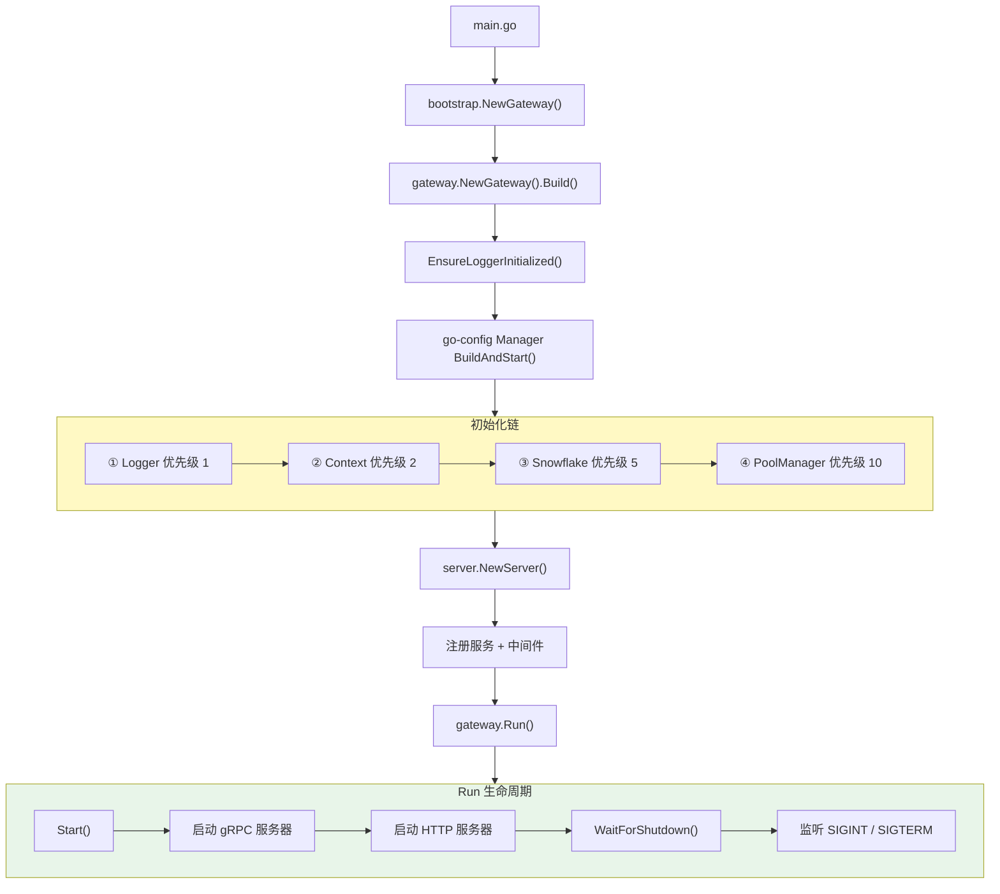

# 快速入门

## 最小示例

```go
package main

import (
    "log"
    "os"

    goconfig "github.com/kamalyes/go-config"
    "github.com/kamalyes/go-rpc-gateway/gateway"
)

func main() {
    gw, err := gateway.NewGateway().
        WithSearchPath("resources").
        WithEnvironment(goconfig.GetEnvironment()).
        WithPrefix("gateway-my-service").
        WithHotReload(nil).
        BuildAndStart()
    if err != nil {
        log.Fatalf("Gateway startup failed: %v", err)
        os.Exit(1)
    }

    // 注册你的服务...
    // gw.RegisterService(...)
    // gw.RegisterGatewayHandler(...)

    gw.Run()
}
```

> 源码参考：[gateway.go:NewGateway()](../gateway.go#L95)

## 配置文件

在 `resources/` 目录下创建 `gateway-my-service.yaml`：

```yaml
name: "my-service"

grpc:
  server:
    enable: true
    host: "0.0.0.0"
    port: 9000

http-server:
  host: "0.0.0.0"
  port: 8080

database:
  enabled: true
  db-name: mydb
  host: "127.0.0.1"
  port: 3306
  username: root
  password: "secret"

cache:
  enabled: true
  host: "127.0.0.1"
  port: 6379
```

## Bootstrap 模式拆分

推荐将启动逻辑拆分到 `bootstrap/` 包中，保持 `main.go` 极简：

### main.go

```go
package main

import (
    "log"
    "os"

    "my-service/bootstrap"
)

func main() {
    gw := bootstrap.NewGateway()
    if err := gw.Run(); err != nil {
        log.Fatalf("Gateway startup failed: %v", err)
        os.Exit(1)
    }
}
```

### bootstrap/server.go — 构建 Gateway

```go
package bootstrap

import (
    goconfig "github.com/kamalyes/go-config"
    "github.com/kamalyes/go-rpc-gateway/gateway"
    gwglobal "github.com/kamalyes/go-rpc-gateway/global"
)

type MyGateway struct {
    gateway *gateway.Gateway
    // ... 你的服务字段
}

func NewGateway() *MyGateway {
    return &MyGateway{}
}

func (g *MyGateway) Run() error {
    // 1. 构建 Gateway
    gw, err := gateway.NewGateway().
        WithSearchPath("resources").
        WithEnvironment(goconfig.GetEnvironment()).
        WithPrefix("gateway-my-service").
        WithHotReload(nil).
        Build()
    if err != nil {
        return err
    }
    g.gateway = gw

    // 2. 初始化服务
    g.initServices()

    // 3. 注册 gRPC 服务
    g.registerGRPCServices()

    // 4. 添加中间件并重建 HTTP Gateway
    g.gateway.AddGrpcGatewayMiddlewareProvider(g.getMiddleware)
    g.gateway.RebuildHTTPGateway()

    // 5. 注册 HTTP Handlers
    g.registerHTTPHandlers()

    // 6. 启动并等待信号
    return g.gateway.Run()
}
```

> 源码参考：[gateway.go:Build()](../gateway.go#L162)、[gateway.go:Run()](../gateway.go#L425)

### bootstrap/services.go — 初始化业务服务

```go
package bootstrap

import (
    gwglobal "github.com/kamalyes/go-rpc-gateway/global"
    "my-service/repository"
    "my-service/service"
)

func (g *MyGateway) initServices() {
    db := gwglobal.GetDB()
    redis := gwglobal.GetRedis()

    // 初始化 Repository
    userRepo := repository.NewUserRepository(db)

    // 初始化 Service
    g.userSvc = service.NewUserService(userRepo, redis)
}
```

> 源码参考：[global.go:GetDB()](../global/global.go#L160)、[global.go:GetRedis()](../global/global.go#L165)

### bootstrap/database.go — 数据库迁移（可选）

```go
package bootstrap

import (
    gwglobal "github.com/kamalyes/go-rpc-gateway/global"
    "my-service/models"
)

func (g *MyGateway) initDatabase() {
    db := gwglobal.GetDB()
    if db != nil {
        db.AutoMigrate(
            &models.User{},
            &models.Order{},
        )
    }
}
```

## 启动流程总结



> 源码参考：[initializer.go:GetDefaultInitializerChain()](../global/initializer.go#L310)

## 下一步

- [Gateway 构建器](./GATEWAY-BUILDER.md) — 了解所有构建选项
- [服务注册](./SERVICE-REGISTRATION.md) — 了解 gRPC 和 HTTP 注册模式
