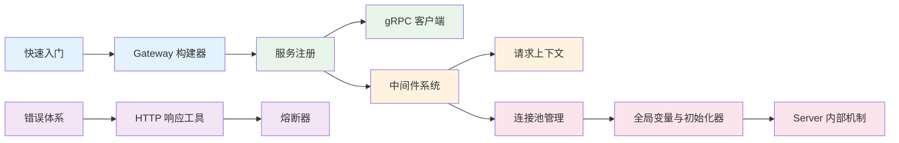

# go-rpc-gateway 文档中心

轻量级 gRPC-Gateway 框架，集成数据库、Redis、对象存储等组件，基于 go-config 配置驱动。

## 文档导读

### 新手入门

| 文档 | 说明 |
|------|------|
| [快速入门](./QUICKSTART.md) | 5 分钟上手，创建你的第一个 Gateway 服务 |
| [Gateway 构建器](./GATEWAY-BUILDER.md) | 链式构建 API、配置发现、热更新 |
| [服务注册](./SERVICE-REGISTRATION.md) | gRPC 服务注册与 HTTP Handler 注册 |

### 核心模块

| 文档 | 说明 |
|------|------|
| [gRPC 客户端](./GRPC-CLIENT.md) | InitClient 泛型辅助、健康检查、负载均衡 |
| [请求上下文](./REQUEST-CONTEXT.md) | HTTP → gRPC → Service 全链路上下文传递 |
| [中间件系统](./MIDDLEWARE.md) | 全部中间件：CORS、限流、熔断、签名、链路追踪等 |
| [连接池管理](./CONNECTION-POOL.md) | Manager 统一管理 DB/Redis/MinIO/ClickHouse/NATS 等 |
| [全局变量与初始化器](./GLOBAL.md) | 全局状态、InitializerChain、ID 生成器 |
| [Server 内部机制](./SERVER.md) | gRPC/HTTP 双服务器、生命周期、热重载、Swagger |

### 工具与参考

| 文档 | 说明 |
|------|------|
| [错误体系](./ERRORS.md) | ErrorCode 定义、AppError 结构、三态映射、gRPC 转换 |
| [HTTP 响应工具](./RESPONSE.md) | 统一 JSON 响应写入、成功/错误/健康检查响应 |
| [熔断器](./BREAKER.md) | 断路器状态机、管理器、HTTP 中间件 |

## 学习路径



## 项目结构

```
go-rpc-gateway/
├── gateway.go              # Gateway 入口与构建器
├── global/                 # 全局变量、初始化器、ID 生成器
│   ├── global.go           # 全局状态与便捷访问函数
│   ├── initializer.go      # InitializerChain 初始化器链
│   └── idgen.go            # Snowflake 短 ID 生成器
├── server/                 # 服务器核心
│   ├── server.go           # Server 结构定义
│   ├── core.go             # 核心组件初始化
│   ├── grpc.go             # gRPC 服务器
│   ├── http.go             # HTTP 服务器与 Gateway
│   ├── lifecycle.go        # 启动/停止/信号处理
│   ├── reload.go           # 配置热重载
│   ├── middleware_init.go  # 中间件管理器初始化
│   ├── swagger.go          # Swagger 文档服务
│   ├── wsc.go              # WebSocket 集成
│   ├── banner.go           # 启动横幅
│   ├── startup.go          # 启动展示
│   └── endpoint_utils.go   # API 端点收集器
├── middleware/             # 中间件
│   ├── manager.go          # 中间件管理器
│   ├── types.go            # 类型定义与责任链
│   ├── recovery.go         # Panic 恢复
│   ├── logging.go          # 统一日志
│   ├── security.go         # CORS / CSP / CSRF
│   ├── ratelimit.go        # 多策略限流
│   ├── breaker.go          # 熔断器
│   ├── signature.go        # HMAC / RSA 签名验证
│   ├── nonce.go            # Nonce 防重放
│   ├── timestamp.go        # 时间戳验证
│   ├── whitelist.go        # 白名单规则引擎
│   ├── tracing.go          # OpenTelemetry 链路追踪
│   ├── observability.go    # Prometheus 可观测性
│   ├── i18n.go             # 国际化
│   ├── health.go           # 健康检查
│   ├── pprof.go            # 性能分析
│   ├── pb_validation.go    # PB 参数验证
│   ├── pb_converter.go     # PB ↔ GORM Model 转换
│   ├── struct_tag_validator.go  # struct tag gRPC 校验
│   ├── grpc_interceptors.go     # gRPC 拦截器管理器
│   ├── request_context.go  # 请求上下文传递
│   ├── response_writer.go  # 统一 ResponseWriter
│   ├── path_normalizer.go  # 智能路径规范化
│   ├── dynamic.go          # 动态签名/限流提供器
│   └── scope_reader.go     # 作用域读取适配器
└── cpool/                  # 连接池
    ├── manager.go          # PoolManager 统一管理器
    ├── database/client.go  # 数据库（MySQL/PostgreSQL/SQLite）
    ├── redis/redis.go      # Redis
    ├── oss/storage.go      # 对象存储（S3/MinIO/阿里云 OSS）
    ├── grpc/client.go      # gRPC 客户端
    ├── grpc/health.go      # 健康检查与 ServiceGuard
    ├── jwt/jwt.go          # JWT 签发与验证
    ├── jwt/model.go        # CustomClaims 模型
    ├── clickhouse/client.go # ClickHouse
    ├── nats/client.go      # NATS / JetStream
    ├── mqtt/mqtt.go        # MQTT
    └── smtp/smtp.go        # SMTP 邮件
```
