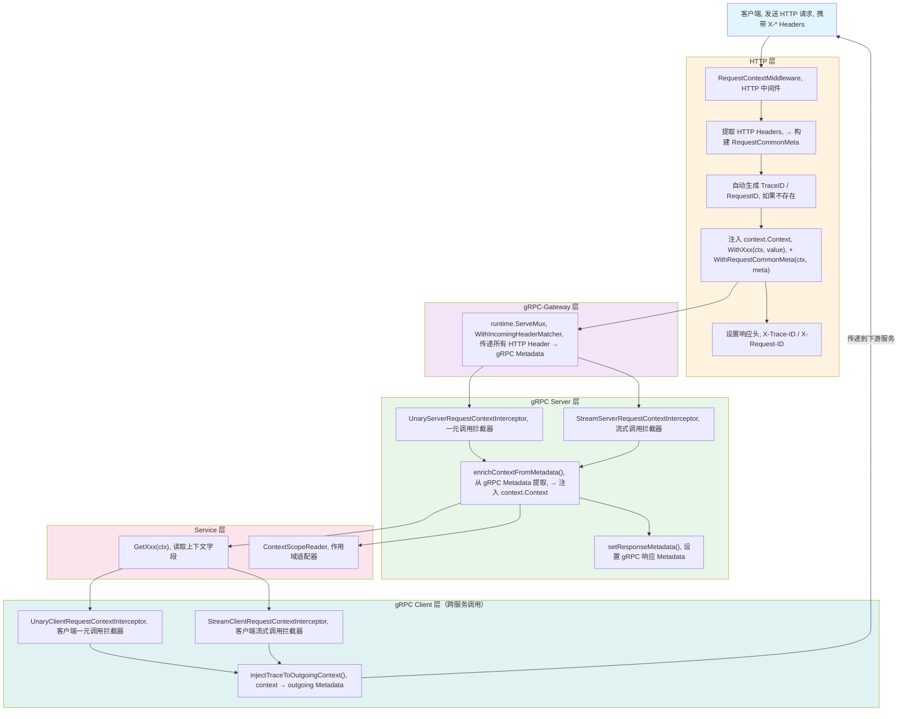
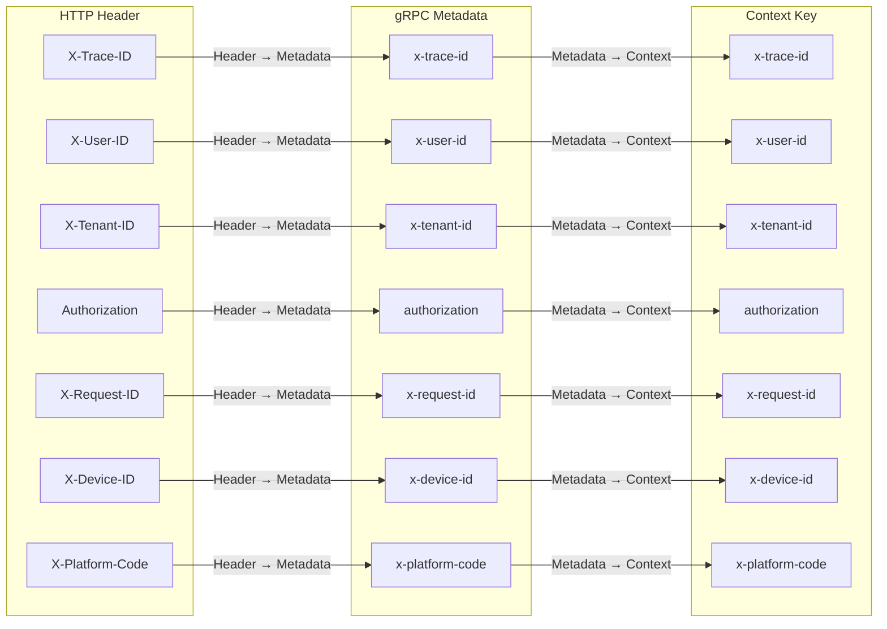
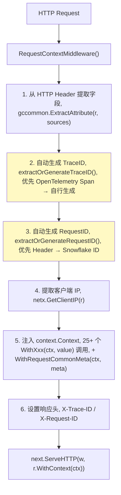
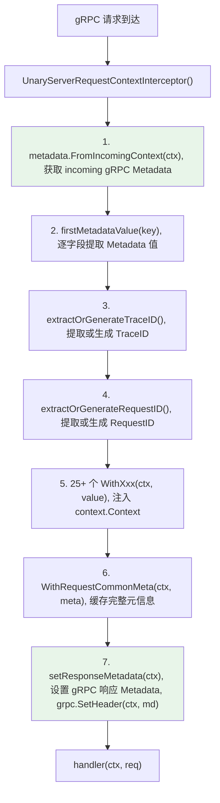
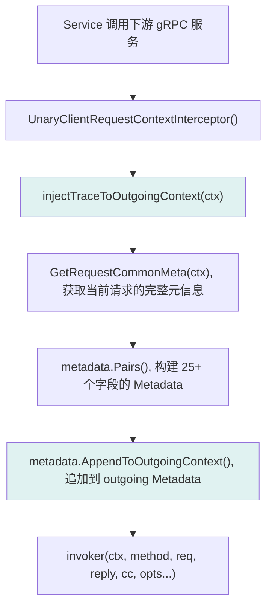
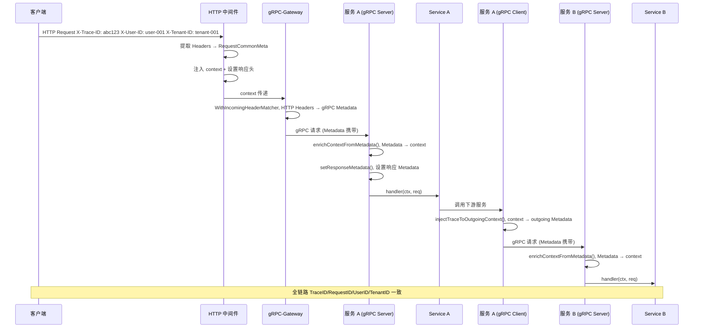

# 请求上下文

## 概述

`RequestCommonMeta` 实现 HTTP → gRPC → Service → Repository 全链路上下文传递，确保 trace\_id、tenant\_id、user\_id 等 25+ 个关键字段在整个调用链中不丢失。

> 源码：[middleware/request\_context.go](../middleware/request_context.go)

## 全链路传递流程



## RequestCommonMeta — 请求公共元信息

> 源码：[request\_context.go:RequestCommonMeta](../middleware/request_context.go#L37)

```go
type RequestCommonMeta struct {
    ID                string `json:"id" header:"X-ID"`
    TraceID           string `json:"traceID" header:"X-Trace-ID"`
    RequestID         string `json:"requestID" header:"X-Request-ID"`
    UserID            string `json:"userID" header:"X-User-ID"`
    Domain            string `json:"domain" header:"X-Domain"`
    RoleCode          string `json:"roleCode" header:"X-Role-Code"`
    TenantID          string `json:"tenantID" header:"X-Tenant-ID"`
    TenantCode        string `json:"tenantCode" header:"X-Tenant-Code"`
    SessionID         string `json:"sessionID" header:"X-Session-ID"`
    Timezone          string `json:"timezone" header:"X-Timezone"`
    Timestamp         string `json:"timestamp" header:"X-Timestamp"`
    Signature         string `json:"signature" header:"X-Signature"`
    Authorization     string `json:"authorization" header:"Authorization"`
    AccessKey         string `json:"accessKey" header:"X-Access-Key"`
    AppID             string `json:"appID" header:"X-App-ID"`
    DeviceID          string `json:"deviceID" header:"X-Device-ID"`
    AppVersion        string `json:"appVersion" header:"X-App-Version"`
    IPAddress         string `json:"ipAddress" header:"X-Forwarded-For"`
    PlatformID        string `json:"platformID" header:"X-Platform-ID"`
    PlatformCode      string `json:"platformCode" header:"X-Platform-Code"`
    RegionID          string `json:"regionID" header:"X-Region-ID"`
    RegionCode        string `json:"regionCode" header:"X-Region-Code"`
    Nonce             string `json:"nonce" header:"X-Nonce"`
    Jti               string `json:"jti" header:"X-Jti"`
    FamilyId          string `json:"familyId" header:"X-Family-ID"`
    XNsID             string `json:"xNsID" header:"X-Ns-ID"`
    GrpcMetadataXNsID string `json:"grpcMetadataXNsID" header:"Grpc-Metadata-X-Ns-ID"`
    UserAgent         string `json:"userAgent" header:"User-Agent"`
}
```

## 三层映射关系

每个字段在 HTTP Header、gRPC Metadata、Context Key 之间有固定的映射关系：



### 完整映射表

| 字段                | HTTP Header             | gRPC Metadata           | Context Key             | 便捷读取函数                      | 源码                                              |
| ----------------- | ----------------------- | ----------------------- | ----------------------- | --------------------------- | ----------------------------------------------- |
| ID                | `X-ID`                  | `x-id`                  | `x-id`                  | `GetID(ctx)`                | [metadata.go:L22](../constants/metadata.go#L22) |
| TraceID           | `X-Trace-ID`            | `x-trace-id`            | `x-trace-id`            | `GetTraceID(ctx)`           | [metadata.go:L20](../constants/metadata.go#L20) |
| RequestID         | `X-Request-ID`          | `x-request-id`          | `x-request-id`          | `GetRequestID(ctx)`         | [metadata.go:L21](../constants/metadata.go#L21) |
| UserID            | `X-User-ID`             | `x-user-id`             | `x-user-id`             | `GetUserID(ctx)`            | [metadata.go:L23](../constants/metadata.go#L23) |
| Domain            | `X-Domain`              | `x-domain`              | `x-domain`              | `GetDomain(ctx)`            | [metadata.go:L24](../constants/metadata.go#L24) |
| RoleCode          | `X-Role-Code`           | `x-role-code`           | `x-role-code`           | `GetRoleCode(ctx)`          | [metadata.go:L25](../constants/metadata.go#L25) |
| TenantID          | `X-Tenant-ID`           | `x-tenant-id`           | `x-tenant-id`           | `GetTenantID(ctx)`          | [metadata.go:L26](../constants/metadata.go#L26) |
| TenantCode        | `X-Tenant-Code`         | `x-tenant-code`         | `x-tenant-code`         | `GetTenantCode(ctx)`        | [metadata.go:L27](../constants/metadata.go#L27) |
| SessionID         | `X-Session-ID`          | `x-session-id`          | `x-session-id`          | `GetSessionID(ctx)`         | [metadata.go:L28](../constants/metadata.go#L28) |
| Timezone          | `X-Timezone`            | `x-timezone`            | `x-timezone`            | `GetTimezone(ctx)`          | [metadata.go:L29](../constants/metadata.go#L29) |
| IPAddress         | `X-Forwarded-For`       | `x-ip-address`          | `x-ip-address`          | `GetIPAddress(ctx)`         | [metadata.go:L30](../constants/metadata.go#L30) |
| AppID             | `X-App-ID`              | `x-app-id`              | `x-app-id`              | `GetAppID(ctx)`             | [metadata.go:L31](../constants/metadata.go#L31) |
| DeviceID          | `X-Device-ID`           | `x-device-id`           | `x-device-id`           | `GetDeviceID(ctx)`          | [metadata.go:L32](../constants/metadata.go#L32) |
| AppVersion        | `X-App-Version`         | `x-app-version`         | `x-app-version`         | `GetAppVersion(ctx)`        | [metadata.go:L33](../constants/metadata.go#L33) |
| PlatformID        | `X-Platform-ID`         | `x-platform-id`         | `x-platform-id`         | `GetPlatformID(ctx)`        | [metadata.go:L34](../constants/metadata.go#L34) |
| PlatformCode      | `X-Platform-Code`       | `x-platform-code`       | `x-platform-code`       | `GetPlatformCode(ctx)`      | [metadata.go:L35](../constants/metadata.go#L35) |
| RegionID          | `X-Region-ID`           | `x-region-id`           | `x-region-id`           | `GetRegionID(ctx)`          | [metadata.go:L36](../constants/metadata.go#L36) |
| RegionCode        | `X-Region-Code`         | `x-region-code`         | `x-region-code`         | `GetRegionCode(ctx)`        | [metadata.go:L37](../constants/metadata.go#L37) |
| Nonce             | `X-Nonce`               | `x-nonce`               | `x-nonce`               | `GetNonce(ctx)`             | [metadata.go:L38](../constants/metadata.go#L38) |
| Jti               | `X-Jti`                 | `x-jti`                 | `x-jti`                 | `GetJti(ctx)`               | [metadata.go:L42](../constants/metadata.go#L42) |
| FamilyId          | `X-Family-ID`           | `x-family-id`           | `x-family-id`           | `GetFamilyId(ctx)`          | [metadata.go:L43](../constants/metadata.go#L43) |
| XNsID             | `X-Ns-ID`               | `x-ns-id`               | `x-ns-id`               | `GetXNsID(ctx)`             | [metadata.go:L39](../constants/metadata.go#L39) |
| GrpcMetadataXNsID | `Grpc-Metadata-X-Ns-ID` | `grpc-metadata-x-ns-id` | `grpc-metadata-x-ns-id` | `GetGrpcMetadataXNsID(ctx)` | [metadata.go:L40](../constants/metadata.go#L40) |
| Authorization     | `Authorization`         | `authorization`         | `authorization`         | `GetAuthorization(ctx)`     | [metadata.go:L41](../constants/metadata.go#L41) |
| UserAgent         | `User-Agent`            | `x-user-agent`          | `x-user-agent`          | `GetUserAgent(ctx)`         | [metadata.go:L44](../constants/metadata.go#L44) |

> 注意：gRPC Metadata 键必须小写，这是 gRPC 协议规范。HTTP Header 使用大写 `X-` 前缀，gRPC-Gateway 的 `WithIncomingHeaderMatcher` 自动完成大小写转换。

## HTTP 中间件详解

> 源码：[request\_context.go:RequestContextMiddleware()](../middleware/request_context.go#L69)



### TraceID 生成策略

> 源码：[request\_context.go:extractOrGenerateTraceID()](../middleware/request_context.go)

1. 优先使用请求头中的 `X-Trace-ID`
2. 如果存在 OpenTelemetry Span，使用 Span 的 TraceID
3. 以上都不存在时，使用 Snowflake ID 生成器生成

### RequestID 生成策略

> 源码：[request\_context.go:extractOrGenerateRequestID()](../middleware/request_context.go)

1. 优先使用请求头中的 `X-Request-ID`
2. 不存在时，使用 Snowflake ID 生成器生成

### 可配置的数据源

每个字段的提取源可通过 `Gateway.RequestContext` 配置：

```yaml
request-context:
  trace-id-sources:
    - header: "X-Trace-ID"
    - query: "trace_id"
  user-id-sources:
    - header: "X-User-ID"
  tenant-id-sources:
    - header: "X-Tenant-ID"
```

`gccommon.ExtractAttribute(r, sources)` 按配置顺序依次尝试，取第一个非空值。

## gRPC Server 拦截器详解

> 源码：[request\_context.go:UnaryServerRequestContextInterceptor()](../middleware/request_context.go#L193)



### enrichContextFromMetadata — 核心提取逻辑

> 源码：[request\_context.go:enrichContextFromMetadata()](../middleware/request_context.go#L229)

```go
func enrichContextFromMetadata(ctx context.Context) context.Context {
    md, ok := metadata.FromIncomingContext(ctx)
    if !ok {
        md = metadata.MD{}
    }

    firstMetadataValue := func(key string) string {
        if values := md.Get(key); len(values) > 0 {
            return values[0]
        }
        return ""
    }

    traceID := extractOrGenerateTraceID(ctx, firstMetadataValue(constants.MetadataTraceID))
    requestID := extractOrGenerateRequestID(firstMetadataValue(constants.MetadataRequestID))
    // ... 25+ 个字段提取 + WithXxx 注入
}
```

### setResponseMetadata — 响应回传

> 源码：[request\_context.go:setResponseMetadata()](../middleware/request_context.go#L310)

将 `RequestCommonMeta` 中的所有字段通过 `grpc.SetHeader()` 写回 gRPC 响应 Metadata，确保下游服务或客户端可以获取到完整的上下文信息。

## gRPC Client 拦截器详解

> 源码：[request\_context.go:UnaryClientRequestContextInterceptor()](../middleware/request_context.go#L357)



### injectTraceToOutgoingContext — 核心注入逻辑

> 源码：[request\_context.go:injectTraceToOutgoingContext()](../middleware/request_context.go#L384)

```go
func injectTraceToOutgoingContext(ctx context.Context) context.Context {
    requestCommonMeta := GetRequestCommonMeta(ctx)

    md := metadata.Pairs(
        constants.MetadataID, requestCommonMeta.ID,
        constants.MetadataTraceID, requestCommonMeta.TraceID,
        constants.MetadataRequestID, requestCommonMeta.RequestID,
        // ... 25+ 个字段
    )

    return metadata.AppendToOutgoingContext(ctx, mdPairs...)
}
```

## 跨服务传递完整链路



## 便捷读取函数

> 源码：[request\_context.go:GetXxx()](../middleware/request_context.go#L460)

所有读取函数内部调用 `GetRequestCommonMeta(ctx)`，该函数有二级缓存机制：

1. **优先**：从 `context.Value(requestCommonMetaKey{})` 获取缓存的 `RequestCommonMeta`
2. **回退**：从 `context.Value(constants.MetadataXxx)` 逐字段提取，组装新的 `RequestCommonMeta`

| 函数                      | 返回字段                | 源码                                                                |
| ----------------------- | ------------------- | ----------------------------------------------------------------- |
| `GetID(ctx)`            | ID                  | [request\_context.go:L462](../middleware/request_context.go#L462) |
| `GetTraceID(ctx)`       | TraceID             | [request\_context.go:L467](../middleware/request_context.go#L467) |
| `GetRequestID(ctx)`     | RequestID           | [request\_context.go:L472](../middleware/request_context.go#L472) |
| `GetUserID(ctx)`        | UserID              | [request\_context.go:L477](../middleware/request_context.go#L477) |
| `GetDomain(ctx)`        | Domain              | [request\_context.go:L482](../middleware/request_context.go#L482) |
| `GetRoleCode(ctx)`      | RoleCode            | [request\_context.go:L487](../middleware/request_context.go#L487) |
| `GetTenantID(ctx)`      | TenantID            | [request\_context.go:L492](../middleware/request_context.go#L492) |
| `GetTenantCode(ctx)`    | TenantCode          | [request\_context.go:L497](../middleware/request_context.go#L497) |
| `GetSessionID(ctx)`     | SessionID           | [request\_context.go:L502](../middleware/request_context.go#L502) |
| `GetTimezone(ctx)`      | Timezone            | [request\_context.go:L507](../middleware/request_context.go#L507) |
| `GetIPAddress(ctx)`     | IPAddress           | [request\_context.go:L512](../middleware/request_context.go#L512) |
| `GetAppID(ctx)`         | AppID               | [request\_context.go:L537](../middleware/request_context.go#L537) |
| `GetDeviceID(ctx)`      | DeviceID            | [request\_context.go:L542](../middleware/request_context.go#L542) |
| `GetAppVersion(ctx)`    | AppVersion          | [request\_context.go:L547](../middleware/request_context.go#L547) |
| `GetPlatformID(ctx)`    | PlatformID          | [request\_context.go:L517](../middleware/request_context.go#L517) |
| `GetPlatformCode(ctx)`  | PlatformCode        | [request\_context.go:L522](../middleware/request_context.go#L522) |
| `GetRegionID(ctx)`      | RegionID            | [request\_context.go:L527](../middleware/request_context.go#L527) |
| `GetRegionCode(ctx)`    | RegionCode          | [request\_context.go:L532](../middleware/request_context.go#L532) |
| `GetNonce(ctx)`         | Nonce               | [request\_context.go:L552](../middleware/request_context.go#L552) |
| `GetJti(ctx)`           | Jti (JWT ID)        | [request\_context.go:L557](../middleware/request_context.go#L557) |
| `GetFamilyId(ctx)`      | FamilyId (Token 家族) | [request\_context.go:L562](../middleware/request_context.go#L562) |
| `GetXNsID(ctx)`         | XNsID (命名空间)        | [request\_context.go:L522](../middleware/request_context.go#L522) |
| `GetAuthorization(ctx)` | Authorization       | [request\_context.go:L507](../middleware/request_context.go#L507) |
| `GetUserAgent(ctx)`     | UserAgent           | [request\_context.go:L719](../middleware/request_context.go#L719) |

### WithXxx — 写入函数

每个字段都有对应的 `WithXxx(ctx, value)` 函数，使用 `contextx.WithValue()` 写入 context：

```go
ctx = middleware.WithTraceID(ctx, "abc123")
ctx = middleware.WithUserID(ctx, "user-001")
ctx = middleware.WithTenantID(ctx, "tenant-001")
```

> 源码：[request\_context.go:WithXxx()](../middleware/request_context.go#L572)

## 使用示例

### Service 层读取上下文

```go
func (s *UserService) GetUser(ctx context.Context, req *pb.GetUserRequest) (*pb.GetUserResponse, error) {
    tenantID := middleware.GetTenantID(ctx)
    userID := middleware.GetUserID(ctx)
    traceID := middleware.GetTraceID(ctx)
    domain := middleware.GetDomain(ctx)

    s.logger.InfoContext(ctx, "GetUser called",
        "tenant_id", tenantID,
        "user_id", userID,
        "trace_id", traceID,
        "domain", domain)

    return &pb.GetUserResponse{}, nil
}
```

### 获取完整元信息

```go
func (s *OrderService) CreateOrder(ctx context.Context, req *pb.CreateOrderRequest) (*pb.CreateOrderResponse, error) {
    meta := middleware.GetRequestCommonMeta(ctx)

    s.logger.InfoContext(ctx, "CreateOrder",
        "tenant", meta.TenantID,
        "user", meta.UserID,
        "platform", meta.PlatformCode,
        "region", meta.RegionCode,
        "app_version", meta.AppVersion,
        "device", meta.DeviceID,
        "ip", meta.IPAddress)

    return &pb.CreateOrderResponse{}, nil
}
```

### Repository 层数据隔离

```go
func (r *UserRepository) FindByID(ctx context.Context, id string) (*User, error) {
    tenantID := middleware.GetTenantID(ctx)

    var user User
    err := r.db.WithContext(ctx).
        Where("id = ? AND tenant_id = ?", id, tenantID).
        First(&user).Error

    return &user, err
}
```

## ContextScopeReader — 作用域适配器

> 源码：[middleware/scope\_reader.go](../middleware/scope_reader.go)

将请求上下文适配为外部作用域读取接口，供限流、签名等中间件获取租户/角色等维度信息：

```go
type ContextScopeReader struct{}

func (ContextScopeReader) GetDomain(ctx context.Context) string   // 从 context 获取 Domain
func (ContextScopeReader) GetTenantID(ctx context.Context) string // 从 context 获取 TenantID
func (ContextScopeReader) GetRoleCode(ctx context.Context) string // 从 context 获取 RoleCode
```

> 源码：[scope\_reader.go:L17-L29](../middleware/scope_reader.go#L17)

## 下一步

- [中间件系统](./MIDDLEWARE.md) — 了解所有中间件
- [gRPC 客户端](./GRPC-CLIENT.md) — 了解客户端拦截器如何传播上下文
- [常量参考](./CONSTANTS.md) — 查看完整的 Metadata 键和日志字段定义

