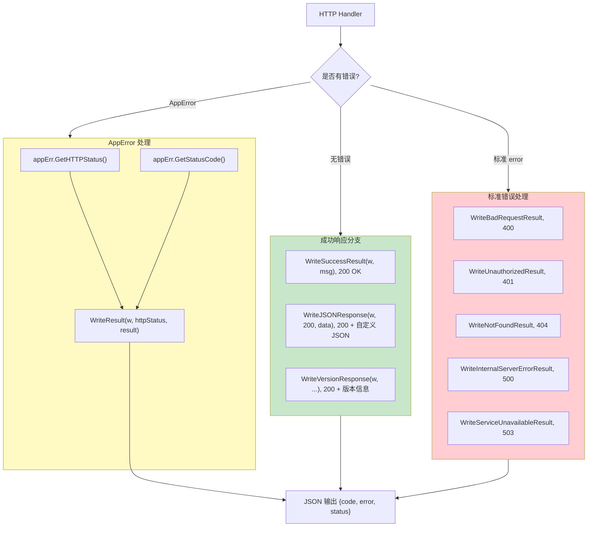

# HTTP 响应工具

## 概述

`response` 包提供标准化的 HTTP 响应写入函数，统一 JSON 输出格式，使用 `sync.Pool` 优化编码性能。

> 源码目录：[response/](../response/)

## 响应写入流程



## 核心写入函数

### WriteResult — 标准化 Result 响应

> 源码：[response/writer.go:WriteResult()](../response/writer.go#L34)

```go
func WriteResult(w http.ResponseWriter, httpStatus int, result *commonapis.Result)
```

使用 `jsonEncoderPool` 对象池减少内存分配：

```go
result := &commonapis.Result{
    Code:   200,
    Error:  "success",
    Status: commonapis.StatusCode_OK,
}
response.WriteResult(w, http.StatusOK, result)
```

输出：

```json
{"code":200,"error":"success","status":"OK"}
```

### WriteJSONResponse — 自定义 JSON 响应

> 源码：[response/writer.go:WriteJSONResponse()](../response/writer.go#L50)

```go
func WriteJSONResponse(w http.ResponseWriter, httpStatus int, data any)
```

用于非 Result 格式的自定义 JSON 响应：

```go
response.WriteJSONResponse(w, http.StatusOK, map[string]any{
    "version": "1.0.0",
    "env":     "production",
})
```

### WriteResultResponse — Server 内部使用

> 源码：[response/server.go:WriteResultResponse()](../response/server.go#L31)

与 `WriteResult` 功能相同，但不使用对象池（避免循环导入场景），供 `server` 包内部使用。

### WriteSimpleError — 简单错误响应

> 源码：[response/server.go:WriteSimpleError()](../response/server.go#L39)

```go
func WriteSimpleError(w http.ResponseWriter, httpStatus int, statusCode commonapis.StatusCode, message string)
```

不依赖 `errors` 包，用于避免循环导入的场景。

## 成功响应

> 源码：[response/success.go](../response/success.go)

### WriteSuccessResult

> 源码：[success.go:WriteSuccessResult()](../response/success.go#L22)

```go
response.WriteSuccessResult(w, "user created successfully")
```

输出：

```json
{"code":200,"error":"user created successfully","status":"OK"}
```

### WriteVersionResponse

> 源码：[success.go:WriteVersionResponse()](../response/success.go#L30)

```go
response.WriteVersionResponse(w, "1.0.0", "main", "abc1234", "2025-01-01T00:00:00Z")
```

输出：

```json
{"version":"1.0.0","git_branch":"main","git_hash":"abc1234","build_time":"2025-01-01T00:00:00Z"}
```

### WriteCSRFTokenResponse

> 源码：[success.go:WriteCSRFTokenResponse()](../response/success.go#L40)

```go
response.WriteCSRFTokenResponse(w, "csrf-token-value")
```

## 错误响应

> 源码：[response/error.go](../response/error.go)

### 便捷错误函数

| 函数 | HTTP 状态码 | Proto StatusCode | 源码 |
|------|------------|------------------|------|
| `WriteErrorResult(w, status, msg, code)` | 自定义 | 自定义 | [error.go:L22](../response/error.go#L22) |
| `WriteBadRequestResult(w, msg)` | 400 | `InvalidArgument` | [error.go:L42](../response/error.go#L42) |
| `WriteUnauthorizedResult(w, msg)` | 401 | `Unauthenticated` | [error.go:L52](../response/error.go#L52) |
| `WriteForbiddenResult(w, msg)` | 403 | `PermissionDenied` | [error.go:L57](../response/error.go#L57) |
| `WriteNotFoundResult(w, msg)` | 404 | `NotFound` | [error.go:L47](../response/error.go#L47) |
| `WriteTooManyRequestsResult(w, msg)` | 429 | `ResourceExhausted` | [error.go:L62](../response/error.go#L62) |
| `WriteInternalServerErrorResult(w, msg)` | 500 | `Internal` | [error.go:L32](../response/error.go#L32) |
| `WriteServiceUnavailableResult(w, msg)` | 503 | `Unavailable` | [error.go:L37](../response/error.go#L37) |

### AppError 响应

> 源码：[error.go:WriteAppError()](../response/error.go#L67)、[error.go:WriteAppErrorf()](../response/error.go#L72)

```go
// 直接写入 AppError
appErr := errors.NewError(errors.ErrCodeNotFound, "user not found")
response.WriteAppError(w, appErr)

// 格式化创建并写入
response.WriteAppErrorf(w, errors.ErrCodeBadRequest, "invalid field: %s", fieldName)
```

### 带错误码的错误响应

> 源码：[error.go:WriteErrorResponseWithCode()](../response/error.go#L78)

```go
response.WriteErrorResponseWithCode(w, http.StatusBadRequest, "VALIDATION_ERROR", "email format invalid")
```

自动根据 HTTP 状态码选择对应的 `StatusCode`，输出格式为 `"{errorCode}: {message}"`。

## 健康检查响应

> 源码：[response/health.go:WriteHealthCheckResult()](../response/health.go#L21)

```go
response.WriteHealthCheckResult(w, true, "redis", "connection ok", map[string]any{
    "latency_ms": 2,
})
// → 200 OK + Result{Code:200, Status:OK}

response.WriteHealthCheckResult(w, false, "redis", "connection refused", nil)
// → 503 Service Unavailable + Result{Code:503, Status:Unavailable}
```

## 类型定义

> 源码：[response/types.go](../response/types.go)

```go
type VersionInfo struct {
    Version   string `json:"version"`
    GitBranch string `json:"git_branch"`
    GitHash   string `json:"git_hash"`
    BuildTime string `json:"build_time"`
}

type CSRFTokenResponse struct {
    CSRFToken string `json:"csrf_token"`
}
```

## 完整示例

### REST API Handler

```go
func (h *UserHandler) GetUser(w http.ResponseWriter, r *http.Request) {
    userID := r.URL.Query().Get("id")
    if userID == "" {
        response.WriteBadRequestResult(w, "user ID is required")
        return
    }

    user, err := h.service.GetUser(r.Context(), userID)
    if err != nil {
        if appErr, ok := err.(*errors.AppError); ok {
            response.WriteAppError(w, appErr)
        } else {
            response.WriteInternalServerErrorResult(w, "failed to get user")
        }
        return
    }

    if user == nil {
        response.WriteNotFoundResult(w, "user not found")
        return
    }

    response.WriteJSONResponse(w, http.StatusOK, user)
}
```

### 版本端点

```go
func (h *Handler) Version(w http.ResponseWriter, r *http.Request) {
    response.WriteVersionResponse(w, Version, GitBranch, GitHash, BuildTime)
}
```

## 下一步

- [错误体系](./ERRORS.md) — 了解 AppError 和 ErrorCode
- [中间件系统](./MIDDLEWARE.md) — 了解中间件如何使用响应写入器
