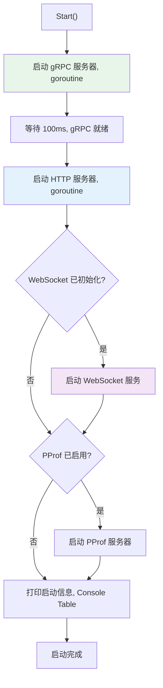
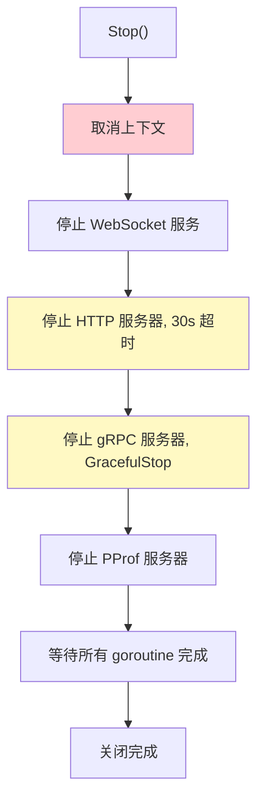
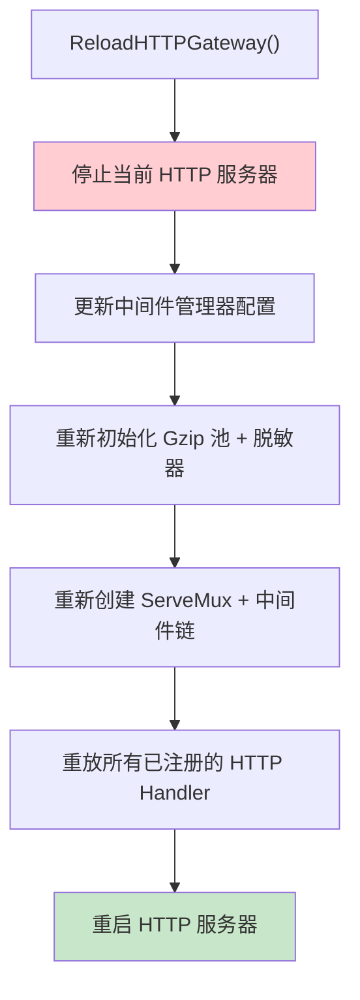
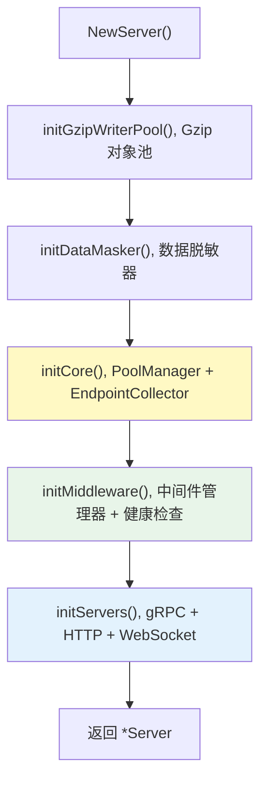

# Server 内部机制

## 概述

`server.Server` 是 Gateway 的底层服务器实现，管理 gRPC 和 HTTP 双服务器的生命周期、中间件挂载、热重载等。

> 源码目录：[server/](../server/)

## Server 结构

> 源码：[server/server.go:Server](../server/server.go#L34)

```go
type Server struct {
    config *gwconfig.Gateway

    grpcServer  *grpc.Server
    httpServer  *http.Server
    gwMux       *runtime.ServeMux
    pprofServer *middleware.PProfServer
    httpMux     *http.ServeMux

    middlewareManager *middleware.Manager
    healthManager    *middleware.HealthManager
    bannerManager    *BannerManager
    poolManager      cpool.PoolManager
    webSocketService *WebSocketService
    endpointCollector *EndpointCollector

    gzipWriterPool       *sync.Pool
    gzipSkipPathsMap     map[string]bool
    gzipSkipExtensionsMap map[string]bool
    httpRoutePatterns    map[string]struct{}
    dataMasker           *desensitize.DataMasker

    ctx    context.Context
    cancel context.CancelFunc
    wg     sync.WaitGroup
    running bool
    mu      sync.RWMutex
}
```

### 访问器方法

| 方法 | 返回类型 | 源码 |
|------|---------|------|
| `GetConfig()` | `*gwconfig.Gateway` | [server.go:L119](../server/server.go#L119) |
| `GetMiddlewareManager()` | `*middleware.Manager` | [server.go:L124](../server/server.go#L124) |
| `GetBannerManager()` | `*BannerManager` | [server.go:L129](../server/server.go#L129) |
| `GetPoolManager()` | `cpool.PoolManager` | [server.go:L134](../server/server.go#L134) |
| `GetWebSocketService()` | `*WebSocketService` | [server.go:L139](../server/server.go#L139) |
| `GetEndpointCollector()` | `*EndpointCollector` | [server.go:L144](../server/server.go#L144) |
| `GetDataMasker()` | `*desensitize.DataMasker` | [server.go:L149](../server/server.go#L149) |
| `GetGRPCServer()` | `*grpc.Server` | [server.go:L154](../server/server.go#L154) |
| `GetEndpoint()` | `string` | [server.go:L159](../server/server.go#L159) |
| `GetGatewayMux()` | `*runtime.ServeMux` | [server.go:L78](../server/server.go#L78) |

### 注册方法

| 方法 | 说明 | 源码 |
|------|------|------|
| `RegisterGRPCService(fn)` | 注册 gRPC 服务 | [server.go:L174](../server/server.go#L174) |
| `AddGrpcGatewayMiddleware(mw)` | 添加 gRPC-Gateway 中间件 | [server.go:L181](../server/server.go#L181) |
| `AddGrpcGatewayMiddlewareProvider(fn)` | 添加延迟中间件提供器 | [server.go:L187](../server/server.go#L187) |
| `RegisterHTTPRoute(pattern, handler)` | 注册 HTTP 路由 | [http.go:L455](../server/http.go#L455) |
| `RegisterHTTPHandlerFunc(pattern, fn)` | 注册 HTTP 处理函数 | [http.go:L476](../server/http.go#L476) |

## 核心组件

### 核心初始化 — core.go

> 源码：[server/core.go:initCore()](../server/core.go#L20)

```go
func (s *Server) initCore() error {
    if global.POOL_MANAGER == nil {
        return errors.NewError(errors.ErrCodeInternalServerError,
            "global POOL_MANAGER is not initialized, ensure InitializerChain has run")
    }
    s.poolManager = global.POOL_MANAGER
    s.endpointCollector = NewEndpointCollector()
    return nil
}
```

### gRPC 服务器 — grpc.go

> 源码：[server/grpc.go:initGRPCServer()](../server/grpc.go#L29)

初始化流程：

1. 检查 `grpc.server.enable` 配置 → [grpc.go:L33](../server/grpc.go#L33)
2. 监控消息大小配置（1MB–100MB 推荐范围） → [grpc.go:L41-L58](../server/grpc.go#L41)
3. Keepalive 参数配置 → [grpc.go:L63-L78](../server/grpc.go#L63)
4. 连接超时与 Enforcement Policy → [grpc.go:L80-L91](../server/grpc.go#L80)
5. 挂载 Unary 拦截器链 → [grpc.go:L95-L119](../server/grpc.go#L95)
6. 挂载 Stream 拦截器链 → [grpc.go:L121-L127](../server/grpc.go#L121)
7. 启用 gRPC 反射（reflection） → [grpc.go:L132-L135](../server/grpc.go#L132)

Unary 拦截器链（按执行顺序）：

| 顺序 | 拦截器 | 说明 |
|------|--------|------|
| 1 | `UnaryServerRequestContextInterceptor` | 注入 trace_id/request_id |
| 2 | `UnaryServerLoggingInterceptor` | 日志记录 |
| 3 | `GRPCMetricsInterceptor` | Prometheus 指标（可选） |
| 4 | `GRPCTracingInterceptor` | OpenTelemetry 追踪（可选） |
| 5 | `GRPCStructTagValidatorInterceptor` | struct tag 参数校验 |

启动 gRPC 服务器：[grpc.go:startGRPCServer()](../server/grpc.go#L142)

停止 gRPC 服务器：[grpc.go:stopGRPCServer()](../server/grpc.go#L170)

### HTTP 服务器 — http.go

> 源码：[server/http.go](../server/http.go)

#### JSON 序列化配置

> 源码：[http.go:buildServeMuxOptions()](../server/http.go#L37)

```go
func (s *Server) buildServeMuxOptions() []runtime.ServeMuxOption {
    return []runtime.ServeMuxOption{
        runtime.WithMarshalerOption(runtime.MIMEWildcard, &runtime.JSONPb{
            MarshalOptions: protojson.MarshalOptions{
                UseProtoNames:   s.config.JSON.UseProtoNames,
                EmitUnpopulated: s.config.JSON.EmitUnpopulated,
            },
            UnmarshalOptions: protojson.UnmarshalOptions{
                DiscardUnknown: s.config.JSON.DiscardUnknown,
            },
        }),
        runtime.WithIncomingHeaderMatcher(func(key string) (string, bool) {
            // Authorization 由 grpc-gateway 的 AnnotateContext 无条件转发，此处匹配会导致重复
            if strings.EqualFold(key, "authorization") {
                return key, false
            }
            return key, true
        }),
    }
}
```

#### Gzip 压缩

> 源码：[http.go:initGzipWriterPool()](../server/http.go#L63)、[http.go:gzipMiddleware()](../server/http.go#L125)

- 使用 `sync.Pool` 复用 gzip.Writer
- 预处理跳过路径和扩展名为 map（O(1) 查找）
- 在日志中间件之后执行，避免记录压缩后的乱码

#### 数据脱敏

> 源码：[http.go:initDataMasker()](../server/http.go#L168)

```go
func (s *Server) initDataMasker() {
    config := &desensitize.MaskerConfig{
        SensitiveKeys: s.config.Middleware.Logging.SensitiveKeys,
        SensitiveMask: s.config.Middleware.Logging.SensitiveMask,
        MaxBodySize:   s.config.Middleware.Logging.MaxBodySize,
    }
    s.dataMasker = desensitize.NewMasker(config)
    global.DATAMASKER = s.dataMasker
}
```

#### HTTP Gateway 初始化

> 源码：[http.go:initHTTPGateway()](../server/http.go#L179)

初始化流程：

1. 创建 gRPC-Gateway ServeMux（含 JSON 序列化 + Header 传递） → [http.go:L179](../server/http.go#L179)
2. 收集 gRPC-Gateway 中间件（静态 + 动态提供器），去重 → [http.go:L185-L218](../server/http.go#L185)
3. 创建 HTTP Mux，注册默认路由 `/` → gwMux → [http.go:L229-L232](../server/http.go#L229)
4. 注册健康检查端点 → [http.go:L238-L248](../server/http.go#L238)
5. 注册 Prometheus 指标端点 → [http.go:L250-L257](../server/http.go#L250)
6. 应用 HTTP 中间件链 → [http.go:L260-L264](../server/http.go#L260)
7. 应用 Gzip 压缩中间件 → [http.go:L268-L272](../server/http.go#L268)
8. 应用 HTTP/2 (h2c) → [http.go:L275-L279](../server/http.go#L275)
9. 创建 HTTP Server（含超时、TLS 配置） → [http.go:L282-L291](../server/http.go#L282)

#### 健康检查处理器

> 源码：[http.go:healthCheckHandler()](../server/http.go#L343)、[http.go:componentHealthCheck()](../server/http.go#L362)

- `/health` — 综合健康检查
- `/health/redis` — Redis 组件检查
- `/health/mysql` — MySQL 组件检查

#### TLS 配置

> 源码：[http.go:buildTLSConfig()](../server/http.go#L500)

```go
func (s *Server) buildTLSConfig() *tls.Config {
    config := &tls.Config{
        MinVersion:               tlsCfg.MinVersion.ToUint16(),
        PreferServerCipherSuites: tlsCfg.PreferServerCiphers,
        InsecureSkipVerify:       tlsCfg.InsecureSkipVerify,
        ClientAuth:               tlsCfg.ClientAuth.ToTLSClientAuth(),
    }
    return config
}
```

#### HTTP/2 配置

> 源码：[http.go:buildHTTP2Server()](../server/http.go#L520)

```go
func (s *Server) buildHTTP2Server() *http2.Server {
    return &http2.Server{
        MaxConcurrentStreams: h2cfg.MaxConcurrentStreams,
        MaxReadFrameSize:     h2cfg.MaxReadFrameSize,
        IdleTimeout:          time.Duration(s.config.HTTPServer.IdleTimeout) * time.Second,
    }
}
```

### 生命周期 — lifecycle.go

> 源码：[server/lifecycle.go](../server/lifecycle.go)

#### 启动流程

> 源码：[lifecycle.go:Start()](../server/lifecycle.go#L24)



#### 停止流程

> 源码：[lifecycle.go:Stop()](../server/lifecycle.go#L120)



#### 一键启动

> 源码：[lifecycle.go:Run()](../server/lifecycle.go#L236)

```go
func (s *Server) Run() error {
    if err := s.Start(); err != nil {
        return err
    }
    return s.WaitForShutdown()
}
```

#### 优雅关闭

> 源码：[lifecycle.go:WaitForShutdown()](../server/lifecycle.go#L219)

监听 `SIGINT`、`SIGTERM` 信号，触发优雅关闭。

### 中间件初始化 — middleware_init.go

> 源码：[server/middleware_init.go](../server/middleware_init.go)

```go
func (s *Server) initMiddleware() error {
    manager, err := middleware.NewManager(s.config)
    if err != nil {
        return errors.Wrap(err, errors.ErrCodeMiddlewareInitFailed)
    }
    s.middlewareManager = manager

    if err := s.initHealthManager(); err != nil {
        return errors.Wrap(err, errors.ErrCodeHealthManagerFailed)
    }
    return nil
}
```

健康检查初始化：[middleware_init.go:initHealthManager()](../server/middleware_init.go#L34)

- 注册 Redis 健康检查器 → [middleware_init.go:L40](../server/middleware_init.go#L40)
- 注册 MySQL 健康检查器 → [middleware_init.go:L46](../server/middleware_init.go#L46)

服务器组件初始化：[middleware_init.go:initServers()](../server/middleware_init.go#L54)

- 初始化 gRPC 服务器 → [middleware_init.go:L56](../server/middleware_init.go#L56)
- 初始化 HTTP Gateway → [middleware_init.go:L60](../server/middleware_init.go#L60)
- 初始化 WebSocket 服务（失败不中断） → [middleware_init.go:L64](../server/middleware_init.go#L64)

### 配置热重载 — reload.go

> 源码：[server/reload.go](../server/reload.go)

#### ApplyConfig — 更新内存配置

> 源码：[reload.go:ApplyConfig()](../server/reload.go#L20)

```go
func (s *Server) ApplyConfig(cfg *gwconfig.Gateway) {
    s.mu.Lock()
    defer s.mu.Unlock()
    s.config = cfg
    if s.bannerManager != nil {
        s.bannerManager = NewBannerManager(cfg).WithContext(s.ctx)
    }
}
```

#### ReloadHTTPGateway — 重建 HTTP 网关

> 源码：[reload.go:ReloadHTTPGateway()](../server/reload.go#L32)

热重载流程：



#### ReloadGRPCServer — 重建 gRPC 服务器

> 源码：[reload.go:ReloadGRPCServer()](../server/reload.go#L67)

重新创建 gRPC 服务器并重放所有服务注册。

#### ReloadPProfServer — 重建 PProf 服务器

> 源码：[reload.go:ReloadPProfServer()](../server/reload.go#L101)

### Swagger 文档 — swagger.go

> 源码：[server/swagger.go:EnableSwagger()](../server/swagger.go#L25)

```go
func (s *Server) EnableSwagger() error {
    if !s.config.Swagger.Enabled {
        return nil
    }
    swaggerHandler := s.middlewareManager.SwaggerHandler()
    for _, path := range s.middlewareManager.GetSwaggerPaths() {
        s.RegisterHTTPRoute(path, swaggerHandler)
    }
    return nil
}
```

- 支持单服务 Swagger 和聚合模式 → [swagger.go:L32](../server/swagger.go#L32)
- 自动修正 UIPath 避免路由冲突 → [swagger.go:L39](../server/swagger.go#L39)

### WebSocket — wsc.go

> 源码：[server/wsc.go](../server/wsc.go)

```go
type WebSocketService struct {
    hub        *wsc.Hub
    config     *wscconfig.WSC
    httpServer *http.Server
    ctx        context.Context
    cancel     context.CancelFunc
    running    atomic.Bool
}
```

> 源码：[wsc.go:WebSocketService](../server/wsc.go#L35)

go-wsc 的薄封装，职责：

1. HTTP 服务器生命周期管理 → [wsc.go:Start()](../server/wsc.go#L102)
2. 应用层配置和依赖注入 → [wsc.go:NewWebSocketService()](../server/wsc.go#L55)
3. 直接暴露 go-wsc Hub 的所有 API

回调注册方法：

| 方法 | 说明 | 源码 |
|------|------|------|
| `OnClientConnect(cb)` | 客户端连接回调 | [wsc.go:L196](../server/wsc.go#L196) |
| `OnClientDisconnect(cb)` | 客户端断开回调 | [wsc.go:L213](../server/wsc.go#L213) |
| `OnMessageReceived(cb)` | 消息接收回调 | [wsc.go:L230](../server/wsc.go#L230) |
| `OnError(cb)` | 错误处理回调 | [wsc.go:L247](../server/wsc.go#L247) |
| `OnHeartbeatTimeout(cb)` | 心跳超时回调 | [wsc.go:L266](../server/wsc.go#L266) |
| `OnHeartbeatReport(cb)` | 心跳上报回调 | [wsc.go:L283](../server/wsc.go#L283) |
| `OnBeforeHeartbeat(cb)` | 心跳处理前回调 | [wsc.go:L300](../server/wsc.go#L300) |
| `OnAfterHeartbeat(cb)` | 心跳处理后回调 | [wsc.go:L316](../server/wsc.go#L316) |
| `OnOfflineMessagePush(cb)` | 离线消息推送回调 | [wsc.go:L333](../server/wsc.go#L333) |
| `OnMessageSend(cb)` | 消息发送完成回调 | [wsc.go:L351](../server/wsc.go#L351) |
| `OnQueueFull(cb)` | 队列满回调 | [wsc.go:L368](../server/wsc.go#L368) |

### Banner — banner.go

> 源码：[server/banner.go:BannerManager](../server/banner.go#L28)

```go
type BannerManager struct {
    ctx      context.Context
    config   *gwconfig.Gateway
    features []string
}
```

启动时打印服务信息、配置摘要、端点列表等。

展示区块：

| 区块 | 方法 | 源码 |
|------|------|------|
| 基础信息 | `printFieldSection("📋 基础信息", ...)` | [banner.go:L57](../server/banner.go#L57) |
| 构建信息 | `printFieldSection("🔨 构建信息", ...)` | [banner.go:L63](../server/banner.go#L63) |
| Git 信息 | `printFieldSection("🔖 Git信息", ...)` | [banner.go:L68](../server/banner.go#L68) |
| 服务器配置 | `serverFields()` | [banner.go:L73](../server/banner.go#L73) |
| 企业级功能 | `featureLabels()` | [banner.go:L74](../server/banner.go#L74) |
| 核心端点 | `endpointFields()` | [banner.go:L75](../server/banner.go#L75) |
| 系统信息 | `printFieldSection("💻 系统信息", ...)` | [banner.go:L76](../server/banner.go#L76) |

### 端点收集器 — endpoint_utils.go

> 源码：[server/endpoint_utils.go:EndpointCollector](../server/endpoint_utils.go#L42)

```go
type EndpointCollector struct {
    mu        sync.RWMutex
    endpoints []EndpointInfo
}

type EndpointInfo struct {
    Method      string   `json:"method"`
    Path        string   `json:"path"`
    Summary     string   `json:"summary"`
    OperationID string   `json:"operation_id"`
    Tags        []string `json:"tags"`
}
```

| 方法 | 说明 | 源码 |
|------|------|------|
| `AddEndpoint(info)` | 添加端点（自动去重） | [endpoint_utils.go:L50](../server/endpoint_utils.go#L50) |
| `GetAllEndpoints()` | 获取所有端点（排序后副本） | [endpoint_utils.go:L65](../server/endpoint_utils.go#L65) |
| `LoadEndpointsFromSwaggerFile(path)` | 从 Swagger YAML 加载 | [endpoint_utils.go:L96](../server/endpoint_utils.go#L96) |
| `LoadEndpointsFromSwaggerFiles(dir)` | 批量加载目录下 `.swagger.yaml` | [endpoint_utils.go:L117](../server/endpoint_utils.go#L117) |
| `ToJSON()` | 导出 JSON | [endpoint_utils.go:L186](../server/endpoint_utils.go#L186) |
| `CreateHTTPHandler()` | 创建 HTTP 处理器 | [endpoint_utils.go:L194](../server/endpoint_utils.go#L194) |

## Server 创建流程

> 源码：[server/server.go:NewServer()](../server/server.go#L82)



```go
func NewServer() (*Server, error) {
    cfg := global.GATEWAY
    // ...
    server := &Server{config: cfg, ctx: ctx, cancel: cancel, bannerManager: ...}
    server.initGzipWriterPool()    // 1. Gzip 对象池
    server.initDataMasker()        // 2. 数据脱敏器
    server.initCore()              // 3. 核心组件（PoolManager、EndpointCollector）
    server.initMiddleware()        // 4. 中间件管理器 + 健康检查
    server.initServers()           // 5. gRPC + HTTP + WebSocket
    return server, nil
}
```

初始化顺序：

| 步骤 | 方法 | 说明 | 源码 |
|------|------|------|------|
| 1 | `initGzipWriterPool()` | 初始化 Gzip writer 对象池 | [server.go:L101](../server/server.go#L101) |
| 2 | `initDataMasker()` | 初始化数据脱敏器 | [server.go:L104](../server/server.go#L104) |
| 3 | `initCore()` | 绑定 PoolManager、初始化端点收集器 | [server.go:L107](../server/server.go#L107) |
| 4 | `initMiddleware()` | 创建中间件管理器、注册健康检查 | [server.go:L113](../server/server.go#L113) |
| 5 | `initServers()` | 初始化 gRPC/HTTP/WebSocket 服务器 | [server.go:L119](../server/server.go#L119) |

## 下一步

- [中间件系统](./MIDDLEWARE.md) — 了解所有中间件
- [连接池管理](./CONNECTION-POOL.md) — 了解 PoolManager
