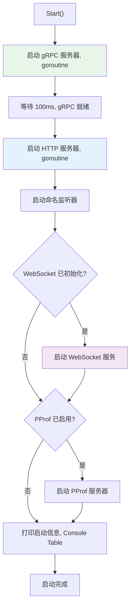
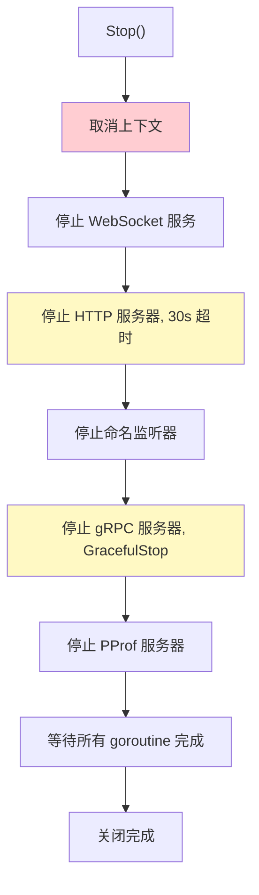
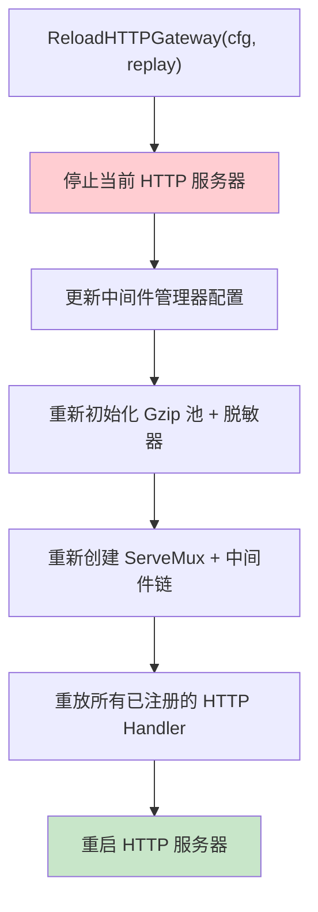
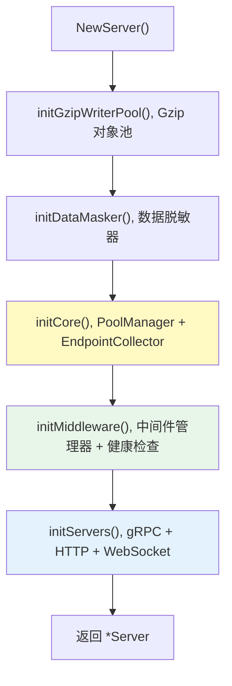

# Server 内部机制

## 概述

`server.Server` 是 Gateway 的底层服务器实现，管理 gRPC 和 HTTP 双服务器的生命周期、中间件挂载、热重载等。

> 源码目录：[server/](../server/)

## Server 结构

> 源码：[server/server.go:Server](../server/server.go#L32)

```go
type Server struct {
    config *gwconfig.Gateway

    // 服务器组件
    grpcServer  *grpc.Server
    httpServer  *http.Server
    gwMux       *runtime.ServeMux
    pprofServer *middleware.PProfServer
    httpMux     *http.ServeMux

    // 命名监听器（多端口支持，如 Ops/Tenant 分离）
    namedListeners map[string]*namedListener

    // 中间件管理器
    middlewareManager *middleware.Manager

    // grpc-gateway 中间件（runtime.Middleware）
    grpcGatewayMiddlewares         []runtime.Middleware
    grpcGatewayMiddlewareProviders []func() []runtime.Middleware

    // 健康检查管理器
    healthManager *middleware.HealthManager

    // Banner管理器
    bannerManager *BannerManager

    // 连接池管理器
    poolManager cpool.PoolManager

    // WebSocket 服务
    webSocketService *WebSocketService

    // 端点信息收集器
    endpointCollector *EndpointCollector

    // Gzip writer 对象池（用于 HTTP 压缩优化）
    gzipWriterPool *sync.Pool

    // Gzip 跳过路径和扩展名的快速查找表
    gzipSkipPathsMap      map[string]bool
    gzipSkipExtensionsMap map[string]bool
    httpRoutePatterns     map[string]struct{}

    // 数据脱敏器（用于日志敏感数据脱敏）
    dataMasker *desensitize.DataMasker

    // 状态管理
    ctx    context.Context
    cancel context.CancelFunc
    wg     sync.WaitGroup

    // 运行状态
    running bool
    mu      sync.RWMutex
}
```

### 访问器方法

| 方法 | 返回类型 | 源码 |
|------|---------|------|
| `GetGatewayMux()` | `*runtime.ServeMux` | [server.go:L89](../server/server.go#L89) |
| `GetConfig()` | `*gwconfig.Gateway` | [server.go:L145](../server/server.go#L145) |
| `GetMiddlewareManager()` | `*middleware.Manager` | [server.go:L150](../server/server.go#L150) |
| `GetBannerManager()` | `*BannerManager` | [server.go:L155](../server/server.go#L155) |
| `GetPoolManager()` | `cpool.PoolManager` | [server.go:L160](../server/server.go#L160) |
| `GetWebSocketService()` | `*WebSocketService` | [server.go:L165](../server/server.go#L165) |
| `GetEndpointCollector()` | `*EndpointCollector` | [server.go:L170](../server/server.go#L170) |
| `GetDataMasker()` | `*desensitize.DataMasker` | [server.go:L175](../server/server.go#L175) |
| `GetGRPCServer()` | `*grpc.Server` | [server.go:L180](../server/server.go#L180) |
| `GetEndpoint()` | `string` | [server.go:L185](../server/server.go#L185) |
| `GetContext()` | `context.Context` | [server.go:L193](../server/server.go#L193) |
| `GetDialOptions()` | `[]grpc.DialOption` | [server.go:L201](../server/server.go#L201) |

### 注册方法

| 方法 | 说明 | 源码 |
|------|------|------|
| `RegisterGRPCService(fn)` | 注册 gRPC 服务 | [server.go:L210](../server/server.go#L210) |
| `AddGrpcGatewayMiddleware(mw)` | 添加 gRPC-Gateway 中间件 | [server.go:L218](../server/server.go#L218) |
| `AddGrpcGatewayMiddlewareProvider(fn)` | 添加延迟中间件提供器 | [server.go:L224](../server/server.go#L224) |
| `RegisterHTTPRoute(pattern, handler)` | 注册 HTTP 路由 | [http.go:L559](../server/http.go#L559) |
| `RegisterHTTPHandlerFunc(pattern, fn)` | 注册 HTTP 处理函数 | [http.go:L583](../server/http.go#L583) |

## 核心组件

### 核心初始化 — core.go

> 源码：[server/core.go:initCore()](../server/core.go#L20)

```go
func (s *Server) initCore() error {
    if global.POOL_MANAGER == nil {
        return errors.NewError(errors.ErrCodeInternalServerError,
            "global POOL_MANAGER is not initialized, ensure InitializerChain has run")
    }
    s.poolManager = global.POOL_MANAGER
    s.endpointCollector = NewEndpointCollector()
    return nil
}
```

### gRPC 服务器 — grpc.go

> 源码：[server/grpc.go:initGRPCServer()](../server/grpc.go#L32)

初始化流程：

1. 检查 `grpc.server.enable` 配置 → [grpc.go:L37](../server/grpc.go#L37)
2. 监控消息大小配置（1MB–100MB 推荐范围） → [grpc.go:L43-L62](../server/grpc.go#L43)
3. Keepalive 参数配置 → [grpc.go:L79-L89](../server/grpc.go#L79)
4. 连接超时与 Enforcement Policy → [grpc.go:L92-L101](../server/grpc.go#L92)
5. 挂载 Unary 拦截器链 → [grpc.go:L106-L139](../server/grpc.go#L106)
6. 挂载 Stream 拦截器链 → [grpc.go:L142-L164](../server/grpc.go#L142)
7. 启用 gRPC 反射（reflection） → [grpc.go:L170-L173](../server/grpc.go#L170)

Unary 拦截器链（按执行顺序）：

| 顺序 | 拦截器 | 可选 | 说明 |
|------|--------|------|------|
| 1 | `UnaryServerRequestContextInterceptor` | 否 | 注入 trace_id/request_id |
| 2 | `UnaryServerLoggingInterceptor` | 否 | 日志记录 |
| 3 | `GRPCUnaryI18nInterceptor` | 是 | i18n 国际化上下文 |
| 4 | `GRPCMetricsInterceptor` | 是 | Prometheus 指标 |
| 5 | `GRPCTracingInterceptor` | 是 | OpenTelemetry 追踪 |
| 6 | `GRPCRateLimitUnaryInterceptor` | 是 | 限流控制 |
| 7 | `GRPCStructTagValidatorInterceptor` | 否 | struct tag 参数校验 |
| 8 | `UnaryServerCompressionInterceptor` | 是 | 响应压缩 |

启动 gRPC 服务器：[grpc.go:startGRPCServer()](../server/grpc.go#L195)

停止 gRPC 服务器：[grpc.go:stopGRPCServer()](../server/grpc.go#L225)

### HTTP 服务器 — http.go

> 源码：[server/http.go](../server/http.go)

#### JSON 序列化配置

> 源码：[http.go:buildServeMuxOptions()](../server/http.go#L43)

```go
func (s *Server) buildServeMuxOptions() []runtime.ServeMuxOption {
    useProtoNames := s.config.JSON.UseProtoNames
    emitUnpopulated := s.config.JSON.EmitUnpopulated
    discardUnknown := s.config.JSON.DiscardUnknown

    opts := []runtime.ServeMuxOption{
        runtime.WithMarshalerOption(runtime.MIMEWildcard, &runtime.JSONPb{
            MarshalOptions: protojson.MarshalOptions{
                UseProtoNames:   useProtoNames,
                EmitUnpopulated: emitUnpopulated,
            },
            UnmarshalOptions: protojson.UnmarshalOptions{
                DiscardUnknown: discardUnknown,
            },
        }),
        runtime.WithIncomingHeaderMatcher(func(key string) (string, bool) {
            // HTTP/2 规范禁止的头，转发会导致 gRPC 服务端发送 RST_STREAM
            switch strings.ToLower(key) {
            case "connection", "keep-alive", "proxy-connection",
                "transfer-encoding", "upgrade", "te":
                return key, false
            case "authorization":
                // grpc-gateway 的 AnnotateContext 已无条件转发，匹配会导致重复
                return key, false
            }
            return key, true
        }),
    }

    // 启用 Protobuf 响应支持
    if s.config.GRPC != nil && s.config.GRPC.Server != nil && s.config.GRPC.Server.EnableProtobufResp {
        opts = append(opts, runtime.WithMarshalerOption("application/x-protobuf", &protobufMarshaler{}))
        opts = append(opts, runtime.WithMarshalerOption("application/protobuf", &protobufMarshaler{}))
    }

    return opts
}
```

#### Gzip 压缩

> 源码：[http.go:initGzipWriterPool()](../server/http.go#L151)、[http.go:gzipMiddleware()](../server/http.go#L224)

- 使用 `sync.Pool` 复用 gzip.Writer
- 预处理跳过路径和扩展名为 map（O(1) 查找）
- 在日志中间件之后执行，避免记录压缩后的乱码

#### 数据脱敏

> 源码：[http.go:initDataMasker()](../server/http.go#L264)

```go
func (s *Server) initDataMasker() {
    config := &desensitize.MaskerConfig{
        SensitiveKeys: s.config.Middleware.Logging.SensitiveKeys,
        SensitiveMask: s.config.Middleware.Logging.SensitiveMask,
        MaxBodySize:   s.config.Middleware.Logging.MaxBodySize,
    }
    s.dataMasker = desensitize.NewMasker(config)
    global.DATAMASKER = s.dataMasker
}
```

#### HTTP Gateway 初始化

> 源码：[http.go:initHTTPGateway()](../server/http.go#L276)

初始化流程：

1. 创建 gRPC-Gateway ServeMux（含 JSON 序列化 + Header 传递） → [http.go:L278](../server/http.go#L278)
2. 收集 gRPC-Gateway 中间件（静态 + 动态提供器），去重 → [http.go:L281-L310](../server/http.go#L281)
3. 自动注入 struct tag 校验中间件 → [http.go:L314-L317](../server/http.go#L314)
4. 创建 HTTP Mux，注册默认路由 `/` → gwMux → [http.go:L335-L340](../server/http.go#L335)
5. 注册健康检查端点 → [http.go:L345-L354](../server/http.go#L345)
6. 注册 Prometheus 指标端点 → [http.go:L357-L369](../server/http.go#L357)
7. 应用 HTTP 中间件链 → [http.go:L372-L378](../server/http.go#L372)
8. 应用 Gzip 压缩中间件 → [http.go:L382-L385](../server/http.go#L382)
9. 应用 HTTP/2 (h2c) → [http.go:L388-L392](../server/http.go#L388)
10. 创建 HTTP Server（含超时、TLS 配置） → [http.go:L395-L404](../server/http.go#L395)

#### 重建 HTTP 网关

> 源码：[http.go:RebuildHTTPGateway()](../server/http.go#L410)

```go
func (s *Server) RebuildHTTPGateway() error {
    global.LOGGER.InfoContext(s.ctx, "🔄 重建 HTTP Gateway...")
    return s.initHTTPGateway()
}
```

用于在添加中间件后重新初始化 HTTP 网关。

#### 健康检查处理器

> 源码：[http.go:healthCheckHandler()](../server/http.go#L502)、[http.go:componentHealthCheck()](../server/http.go#L524)

- `/health` — 综合健康检查
- `/health/redis` — Redis 组件检查
- `/health/mysql` — MySQL 组件检查

#### TLS 配置

> 源码：[http.go:buildTLSConfig()](../server/http.go#L603)

```go
func (s *Server) buildTLSConfig() *tls.Config {
    config := &tls.Config{
        MinVersion:               tlsCfg.MinVersion.ToUint16(),
        PreferServerCipherSuites: tlsCfg.PreferServerCiphers,
        InsecureSkipVerify:       tlsCfg.InsecureSkipVerify,
        ClientAuth:               tlsCfg.ClientAuth.ToTLSClientAuth(),
    }
    return config
}
```

#### HTTP/2 配置

> 源码：[http.go:buildHTTP2Server()](../server/http.go#L627)

```go
func (s *Server) buildHTTP2Server() *http2.Server {
    return &http2.Server{
        MaxConcurrentStreams: h2cfg.MaxConcurrentStreams,
        MaxReadFrameSize:     h2cfg.MaxReadFrameSize,
        IdleTimeout:          time.Duration(s.config.HTTPServer.IdleTimeout) * time.Second,
    }
}
```

#### 命名监听器（多端口支持）

> 源码：[http.go:namedListener](../server/http.go#L639)

```go
type namedListener struct {
    name   string
    config *gwconfig.Listener
    server *http.Server
}
```

每个命名监听器复用主 HTTP 网关的 `gwMux` 和中间件链，但监听独立的 Host:Port，适用于 Ops/Tenant 端口分离等场景。

- 初始化：[http.go:initNamedListeners()](../server/http.go#L648)
- 启动：[http.go:startNamedListeners()](../server/http.go#L697)
- 停止：[http.go:stopNamedListeners()](../server/http.go#L721)

### 生命周期 — lifecycle.go

> 源码：[server/lifecycle.go](../server/lifecycle.go)

#### 生命周期方法

| 方法 | 说明 | 源码 |
|------|------|------|
| `Start()` | 启动服务器（gRPC + HTTP + WebSocket + PProf） | [lifecycle.go:L28](../server/lifecycle.go#L28) |
| `Stop()` | 停止服务器 | [lifecycle.go:L146](../server/lifecycle.go#L146) |
| `Restart()` | 重启服务器（Stop + Start） | [lifecycle.go:L198](../server/lifecycle.go#L198) |
| `Shutdown()` | 优雅关闭（等价于 Stop） | [lifecycle.go:L210](../server/lifecycle.go#L210) |
| `IsRunning()` | 检查服务器是否运行中 | [lifecycle.go:L215](../server/lifecycle.go#L215) |
| `Wait()` | 等待所有 goroutine 结束 | [lifecycle.go:L222](../server/lifecycle.go#L222) |
| `WaitForShutdown()` | 等待关闭信号并优雅关闭 | [lifecycle.go:L227](../server/lifecycle.go#L227) |
| `Run()` | 一键启动并等待信号（Start + WaitForShutdown） | [lifecycle.go:L251](../server/lifecycle.go#L251) |

#### 启动流程

> 源码：[lifecycle.go:Start()](../server/lifecycle.go#L28)


```mermaid
flowchart TD
    START["Start()"] --> GRPC["启动 gRPC 服务器, goroutine"]
    GRPC --> WAIT["等待 100ms, gRPC 就绪"]
    WAIT --> HTTP["启动 HTTP 服务器, goroutine"]
    HTTP --> NL["启动命名监听器"]
    NL --> WS{"WebSocket 已初始化?"}
    WS -->|是| WS_START["启动 WebSocket 服务"]
    WS -->|否| PPROF_CHECK
    WS_START --> PPROF_CHECK{"PProf 已启用?"}
    PPROF_CHECK -->|是| PPROF_START["启动 PProf 服务器"]
    PPROF_CHECK -->|否| BANNER
    PPROF_START --> BANNER["打印启动信息, Console Table"]
    BANNER --> DONE["启动完成"]

    style GRPC fill:#e8f5e9
    style HTTP fill:#e3f2fd
    style WS_START fill:#f3e5f5
```

#### 停止流程

> 源码：[lifecycle.go:Stop()](../server/lifecycle.go#L146)


```mermaid
flowchart TD
    STOP["Stop()"] --> CANCEL["取消上下文"]
    CANCEL --> STOP_WS["停止 WebSocket 服务"]
    STOP_WS --> STOP_HTTP["停止 HTTP 服务器, 30s 超时"]
    STOP_HTTP --> STOP_NL["停止命名监听器"]
    STOP_NL --> STOP_GRPC["停止 gRPC 服务器, GracefulStop"]
    STOP_GRPC --> STOP_PPROF["停止 PProf 服务器"]
    STOP_PPROF --> WAIT_WG["等待所有 goroutine 完成"]
    WAIT_WG --> DONE["关闭完成"]

    style CANCEL fill:#ffcdd2
    style STOP_HTTP fill:#fff9c4
    style STOP_GRPC fill:#fff9c4
```

#### 一键启动

> 源码：[lifecycle.go:Run()](../server/lifecycle.go#L251)

```go
func (s *Server) Run() error {
    logger := global.LOGGER
    if err := s.Start(); err != nil {
        logger.WithError(err).ErrorMsg("Failed to start server")
        return err
    }
    return s.WaitForShutdown()
}
```

#### 优雅关闭

> 源码：[lifecycle.go:WaitForShutdown()](../server/lifecycle.go#L227)

监听 `SIGINT`、`SIGTERM` 信号，触发优雅关闭。

### 中间件初始化 — middleware_init.go

> 源码：[server/middleware_init.go](../server/middleware_init.go)

```go
func (s *Server) initMiddleware() error {
    manager, err := middleware.NewManager(s.config)
    if err != nil {
        return errors.Wrap(err, errors.ErrCodeMiddlewareInitFailed)
    }
    s.middlewareManager = manager

    if err := s.initHealthManager(); err != nil {
        return errors.Wrap(err, errors.ErrCodeHealthManagerFailed)
    }
    return nil
}
```

健康检查初始化：[middleware_init.go:initHealthManager()](../server/middleware_init.go#L40)

- 注册 Redis 健康检查器 → [middleware_init.go:L46](../server/middleware_init.go#L46)
- 注册 MySQL 健康检查器 → [middleware_init.go:L52](../server/middleware_init.go#L52)

服务器组件初始化：[middleware_init.go:initServers()](../server/middleware_init.go#L63)

- 初始化 gRPC 服务器 → [middleware_init.go:L65](../server/middleware_init.go#L65)
- 初始化 HTTP Gateway → [middleware_init.go:L70](../server/middleware_init.go#L70)
- 初始化命名监听器（失败不中断） → [middleware_init.go:L75](../server/middleware_init.go#L75)
- 初始化 WebSocket 服务（失败不中断） → [middleware_init.go:L80](../server/middleware_init.go#L80)
- 注入扩展指标采集函数 → [middleware_init.go:L87](../server/middleware_init.go#L87)

扩展指标采集（[middleware_init.go:injectMetricsCollectors()](../server/middleware_init.go#L94)）注入连接池健康检查、熔断器统计、WebSocket 统计采集函数，在 Prometheus scrape 时按需调用。

### 配置热重载 — reload.go

> 源码：[server/reload.go](../server/reload.go)

#### ApplyConfig — 更新内存配置

> 源码：[reload.go:ApplyConfig()](../server/reload.go#L24)

```go
func (s *Server) ApplyConfig(cfg *gwconfig.Gateway) {
    s.mu.Lock()
    defer s.mu.Unlock()
    s.config = cfg
    if s.bannerManager != nil {
        s.bannerManager = NewBannerManager(cfg).WithContext(s.ctx)
    }
}
```

#### ReloadHTTPGateway — 重建 HTTP 网关

> 源码：[reload.go:ReloadHTTPGateway()](../server/reload.go#L35)

签名：`ReloadHTTPGateway(cfg *gwconfig.Gateway, replay func() error) error`

热重载流程：


```mermaid
flowchart TD
    RELOAD["ReloadHTTPGateway(cfg, replay)"] --> STOP_HTTP["停止当前 HTTP 服务器"]
    STOP_HTTP --> UPDATE_MW["更新中间件管理器配置"]
    UPDATE_MW --> REINIT["重新初始化 Gzip 池 + 脱敏器"]
    REINIT --> REBUILD_MUX["重新创建 ServeMux + 中间件链"]
    REBUILD_MUX --> REPLAY["重放所有已注册的 HTTP Handler"]
    REPLAY --> RESTART["重启 HTTP 服务器"]

    style STOP_HTTP fill:#ffcdd2
    style RESTART fill:#c8e6c9
```

#### ReloadGRPCServer — 重建 gRPC 服务器

> 源码：[reload.go:ReloadGRPCServer()](../server/reload.go#L78)

签名：`ReloadGRPCServer(cfg *gwconfig.Gateway, registrars []func(*grpc.Server)) error`

重新创建 gRPC 服务器并重放所有服务注册。

#### ReloadPProfServer — 重建 PProf 服务器

> 源码：[reload.go:ReloadPProfServer()](../server/reload.go#L119)

签名：`ReloadPProfServer(cfg *gwconfig.Gateway) error`

### Swagger 文档 — swagger.go

> 源码：[server/swagger.go:EnableSwagger()](../server/swagger.go#L19)

```go
func (s *Server) EnableSwagger() error {
    if !s.config.Swagger.Enabled {
        return nil
    }
    // 处理聚合配置
    // 验证并修正 UIPath 避免路由冲突
    swaggerHandler := s.middlewareManager.SwaggerHandler()
    for _, path := range s.middlewareManager.GetSwaggerPaths() {
        s.RegisterHTTPRoute(path, swaggerHandler)
    }
    return nil
}
```

- 支持单服务 Swagger 和聚合模式 → [swagger.go:L26](../server/swagger.go#L26)
- 自动修正 UIPath 避免路由冲突 → [swagger.go:L34](../server/swagger.go#L34)

### Swagger 文件嵌入 — swagger_embed.go

> 源码：[server/swagger_embed.go](../server/swagger_embed.go)

#### SwaggerFileProvider 接口

> 源码：[swagger_embed.go:SwaggerFileProvider](../server/swagger_embed.go#L22)

```go
type SwaggerFileProvider interface {
    GetSwaggerFiles() map[string][]byte
    GetSwaggerFile(path string) ([]byte, error)
}
```

#### EmbeddedSwaggerProvider

> 源码：[swagger_embed.go:EmbeddedSwaggerProvider](../server/swagger_embed.go#L30)

嵌入式 Swagger 文件提供器，从 `embed.FS` 加载的文件供 `EndpointCollector` 解析。

| 方法 | 说明 | 源码 |
|------|------|------|
| `NewEmbeddedSwaggerProvider(files)` | 创建嵌入式提供器 | [swagger_embed.go:L35](../server/swagger_embed.go#L35) |
| `GetSwaggerFiles()` | 获取所有文件 | [swagger_embed.go:L42](../server/swagger_embed.go#L42) |
| `GetSwaggerFile(path)` | 获取指定文件 | [swagger_embed.go:L47](../server/swagger_embed.go#L47) |
| `GetSwaggerFilesByPattern(pattern)` | 按模式获取文件 | [swagger_embed.go:L91](../server/swagger_embed.go#L91) |

### WebSocket — wsc.go

> 源码：[server/wsc.go:WebSocketService](../server/wsc.go#L42)

```go
type WebSocketService struct {
    hub        *wsc.Hub
    config     *wscconfig.WSC
    httpServer *http.Server
    ctx        context.Context
    cancel     context.CancelFunc
    running    atomic.Bool
}
```

go-wsc 的薄封装，职责：

1. HTTP 服务器生命周期管理 → [wsc.go:Start()](../server/wsc.go#L155)
2. 应用层配置和依赖注入 → [wsc.go:NewWebSocketService()](../server/wsc.go#L57)
3. 直接暴露 go-wsc Hub 的所有 API

#### 生命周期与访问器方法

| 方法 | 说明 | 源码 |
|------|------|------|
| `NewWebSocketService(cfg)` | 创建 WebSocket 服务 | [wsc.go:L57](../server/wsc.go#L57) |
| `Start()` | 启动 HTTP 服务器 | [wsc.go:L155](../server/wsc.go#L155) |
| `Stop()` | 停止服务 | [wsc.go:L211](../server/wsc.go#L211) |
| `IsRunning()` | 检查运行状态 | [wsc.go:L238](../server/wsc.go#L238) |
| `GetHub()` | 获取底层 go-wsc Hub 实例 | [wsc.go:L248](../server/wsc.go#L248) |
| `GetConfig()` | 获取 WSC 配置 | [wsc.go:L253](../server/wsc.go#L253) |
| `SendToUserWithRetry(ctx, userID, msg)` | 带重试发送消息并返回结果 | [wsc.go:L259](../server/wsc.go#L259) |

`SendToUserWithRetry` 签名：

```go
func (ws *WebSocketService) SendToUserWithRetry(ctx context.Context, userID string, msg *wsc.HubMessage) *wsc.SendResult
```

#### 回调注册方法

| 方法 | 说明 | 源码 |
|------|------|------|
| `OnClientConnect(cb)` | 客户端连接回调 | [wsc.go:L279](../server/wsc.go#L279) |
| `OnClientDisconnect(cb)` | 客户端断开回调 | [wsc.go:L295](../server/wsc.go#L295) |
| `OnMessageReceived(cb)` | 消息接收回调 | [wsc.go:L311](../server/wsc.go#L311) |
| `OnError(cb)` | 错误处理回调 | [wsc.go:L327](../server/wsc.go#L327) |
| `OnHeartbeatTimeout(cb)` | 心跳超时回调 | [wsc.go:L347](../server/wsc.go#L347) |
| `OnHeartbeatReport(cb)` | 心跳上报回调 | [wsc.go:L363](../server/wsc.go#L363) |
| `OnBeforeHeartbeat(cb)` | 心跳处理前回调 | [wsc.go:L382](../server/wsc.go#L382) |
| `OnAfterHeartbeat(cb)` | 心跳处理后回调 | [wsc.go:L397](../server/wsc.go#L397) |
| `OnOfflineMessagePush(cb)` | 离线消息推送回调 | [wsc.go:L412](../server/wsc.go#L412) |
| `OnMessageSend(cb)` | 消息发送完成回调 | [wsc.go:L431](../server/wsc.go#L431) |
| `OnQueueFull(cb)` | 队列满回调 | [wsc.go:L446](../server/wsc.go#L446) |

### Banner — banner.go

> 源码：[server/banner.go:BannerManager](../server/banner.go#L25)

```go
type BannerManager struct {
    ctx      context.Context
    config   *gwconfig.Gateway
    features []string
    cg       *logger.ConsoleGroup
}
```

启动时打印服务信息、配置摘要、端点列表等。

#### 公共方法

| 方法 | 说明 | 源码 |
|------|------|------|
| `NewBannerManager(config)` | 创建横幅管理器 | [banner.go:L33](../server/banner.go#L33) |
| `WithContext(ctx)` | 设置上下文（链式） | [banner.go:L42](../server/banner.go#L42) |
| `AddFeature(feature)` | 添加功能特性 | [banner.go:L48](../server/banner.go#L48) |
| `PrintStartupChecks()` | 打印启动前检查 | [startup.go:L108](../server/startup.go#L108) |
| `PrintStartupReport()` | 打印启动成功后的完整报告 | [startup.go:L119](../server/startup.go#L119) |
| `PrintShutdownBanner()` | 打印关闭横幅 | [banner.go:L96](../server/banner.go#L96) |
| `PrintShutdownComplete()` | 打印关闭完成 | [banner.go:L103](../server/banner.go#L103) |

#### 展示区块

| 区块 | 方法 | 源码 |
|------|------|------|
| 基础信息 | `printFieldSection("📋 基础信息", ...)` | [banner.go:L64](../server/banner.go#L64) |
| 构建信息 | `printFieldSection("🔨 构建信息", ...)` | [banner.go:L71](../server/banner.go#L71) |
| Git 信息 | `printFieldSection("🔖 Git信息", ...)` | [banner.go:L76](../server/banner.go#L76) |
| 服务器配置 | `serverFields()` | [banner.go:L81](../server/banner.go#L81) |
| 企业级功能 | `featureLabels()` | [banner.go:L82](../server/banner.go#L82) |
| 核心端点 | `endpointFields()` | [banner.go:L83](../server/banner.go#L83) |
| 系统信息 | `printFieldSection("💻 系统信息", ...)` | [banner.go:L84](../server/banner.go#L84) |

### 端点收集器 — endpoint_utils.go

> 源码：[server/endpoint_utils.go:EndpointCollector](../server/endpoint_utils.go#L41)

```go
type EndpointCollector struct {
    mu        sync.RWMutex
    endpoints []EndpointInfo
}

type EndpointInfo struct {
    Method      string   `json:"method"`
    Path        string   `json:"path"`
    Summary     string   `json:"summary"`
    OperationID string   `json:"operation_id"`
    Tags        []string `json:"tags"`
}
```

| 方法 | 说明 | 源码 |
|------|------|------|
| `NewEndpointCollector()` | 创建端点收集器 | [endpoint_utils.go:L47](../server/endpoint_utils.go#L47) |
| `AddEndpoint(info)` | 添加端点（自动去重） | [endpoint_utils.go:L54](../server/endpoint_utils.go#L54) |
| `GetAllEndpoints()` | 获取所有端点（排序后副本） | [endpoint_utils.go:L72](../server/endpoint_utils.go#L72) |
| `Clear()` | 清空所有端点 | [endpoint_utils.go:L92](../server/endpoint_utils.go#L92) |
| `LoadEndpointsFromSwaggerFile(path)` | 从 Swagger YAML 加载 | [endpoint_utils.go:L115](../server/endpoint_utils.go#L115) |
| `LoadEndpointsFromSwaggerFiles(dir)` | 批量加载目录下 `.swagger.yaml` | [endpoint_utils.go:L133](../server/endpoint_utils.go#L133) |
| `CollectFromSwagger(data)` | 从 Swagger 数据收集端点 | [endpoint_utils.go:L164](../server/endpoint_utils.go#L164) |
| `LoadEndpointsFromProvider(provider)` | 从 SwaggerFileProvider 加载 | [swagger_embed.go:L55](../server/swagger_embed.go#L55) |
| `LoadEndpointsFromYAMLContent(yaml)` | 从 YAML 内容加载 | [swagger_embed.go:L80](../server/swagger_embed.go#L80) |
| `ToJSON()` | 导出 JSON | [endpoint_utils.go:L223](../server/endpoint_utils.go#L223) |
| `CreateHTTPHandler()` | 创建 HTTP 处理器 | [endpoint_utils.go:L232](../server/endpoint_utils.go#L232) |

包级工具函数：

| 函数 | 说明 | 源码 |
|------|------|------|
| `GenerateEndpointInfo(method, path, summary, operationID, tags)` | 生成端点信息 | [endpoint_utils.go:L100](../server/endpoint_utils.go#L100) |

## Server 创建流程

> 源码：[server/server.go:NewServer()](../server/server.go#L94)


```mermaid
flowchart TD
    NEW["NewServer()"] --> S1["initGzipWriterPool(), Gzip 对象池"]
    S1 --> S2["initDataMasker(), 数据脱敏器"]
    S2 --> S3["initCore(), PoolManager + EndpointCollector"]
    S3 --> S4["initMiddleware(), 中间件管理器 + 健康检查"]
    S4 --> S5["initServers(), gRPC + HTTP + WebSocket"]
    S5 --> DONE["返回 *Server"]

    style S3 fill:#fff9c4
    style S4 fill:#e8f5e9
    style S5 fill:#e3f2fd
```

```go
func NewServer() (*Server, error) {
    cfg := global.GATEWAY
    // ...
    server := &Server{
        config:        cfg,
        ctx:           ctx,
        cancel:        cancel,
        bannerManager: NewBannerManager(cfg).WithContext(ctx),
    }
    server.initGzipWriterPool()    // 1. Gzip 对象池
    server.initDataMasker()        // 2. 数据脱敏器
    server.initCore()              // 3. 核心组件（PoolManager、EndpointCollector）
    server.initMiddleware()        // 4. 中间件管理器 + 健康检查
    server.initServers()           // 5. gRPC + HTTP + WebSocket
    return server, nil
}
```

初始化顺序：

| 步骤 | 方法 | 说明 | 源码 |
|------|------|------|------|
| 1 | `initGzipWriterPool()` | 初始化 Gzip writer 对象池 | [server.go:L118](../server/server.go#L118) |
| 2 | `initDataMasker()` | 初始化数据脱敏器 | [server.go:L121](../server/server.go#L121) |
| 3 | `initCore()` | 绑定 PoolManager、初始化端点收集器 | [server.go:L124](../server/server.go#L124) |
| 4 | `initMiddleware()` | 创建中间件管理器、注册健康检查 | [server.go:L130](../server/server.go#L130) |
| 5 | `initServers()` | 初始化 gRPC/HTTP/WebSocket 服务器 | [server.go:L136](../server/server.go#L136) |

## 下一步

- [中间件系统](./MIDDLEWARE.md) — 了解所有中间件
- [连接池管理](./CONNECTION-POOL.md) — 了解 PoolManager
