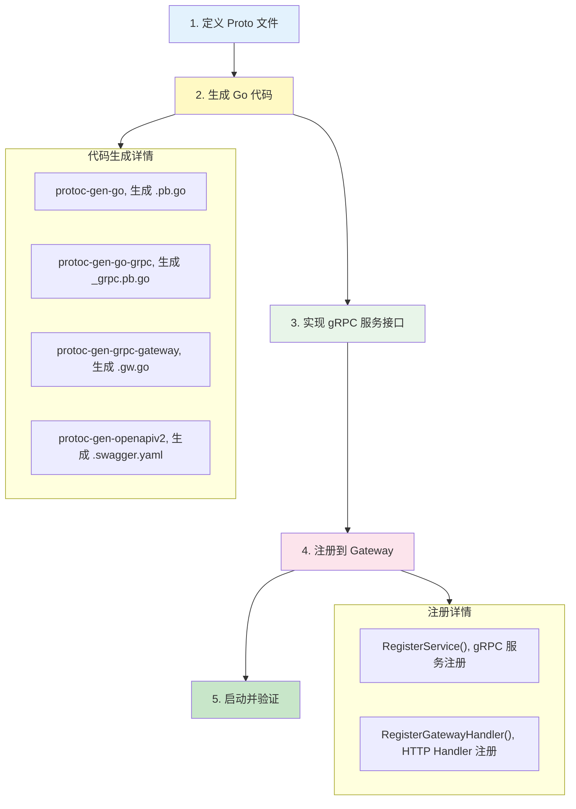
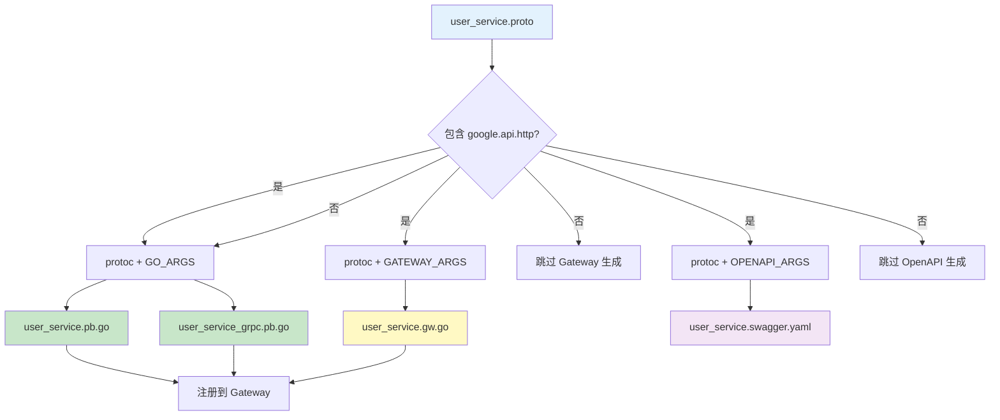
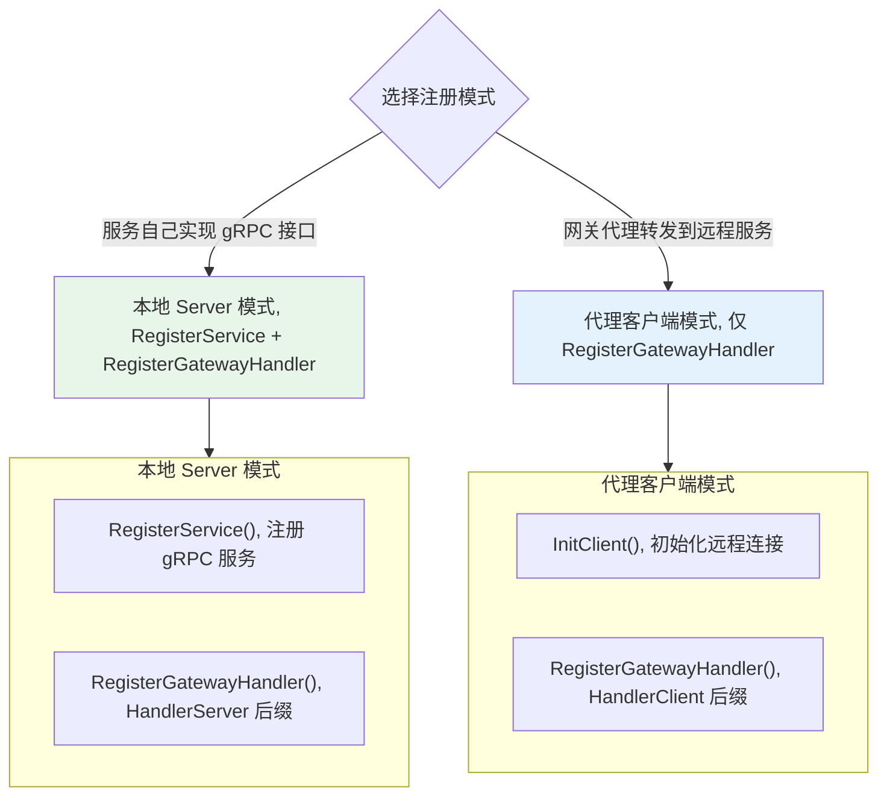
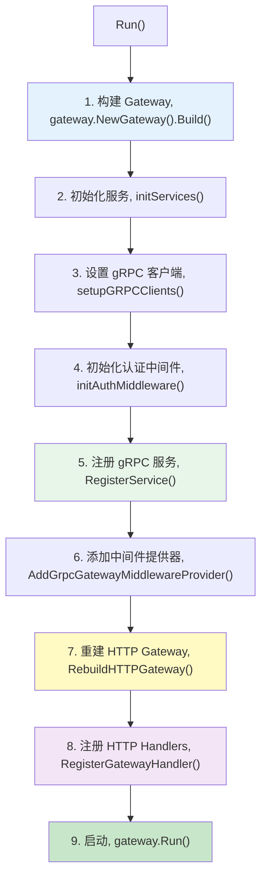
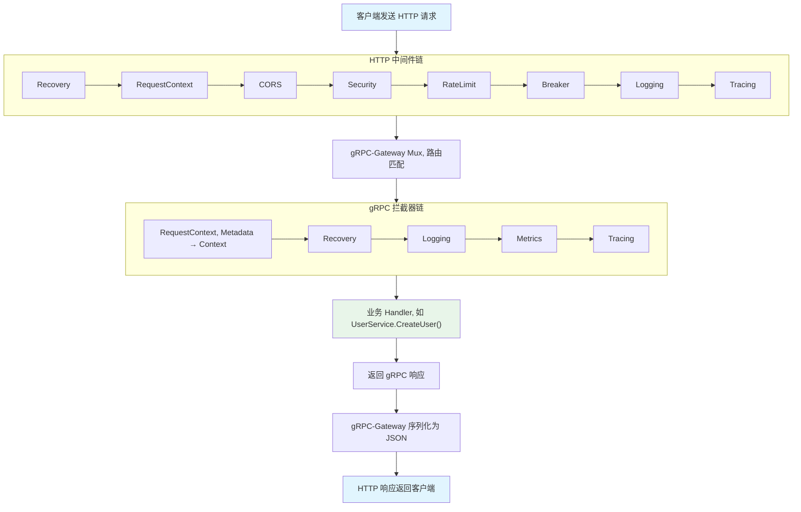

# 服务注册

## 概述

go-rpc-gateway 支持双协议注册：gRPC 服务注册 + HTTP Handler 注册，让同一个服务同时支持 gRPC 和 REST API。

本文档从 Proto 定义开始，完整介绍代码生成、服务实现、注册到 Gateway 的全流程。

## 全流程概览



## 第一步：Proto 定义

### 目录结构

推荐按模块组织 Proto 文件，将公共类型和枚举独立管理：

```
proto/
├── common/                    # 公共消息
│   ├── common.proto           # 通用 Result、Empty
│   ├── pagination.proto       # 分页 Paging、Sorting
│   ├── result.proto           # Result、Error
│   └── empty.proto            # Empty 消息
├── enums/                     # 枚举定义
│   ├── enums.proto            # 枚举入口
│   ├── status.proto           # 状态枚举
│   └── domain.proto           # 域类型枚举
└── user/                      # 服务模块
    └── user_service.proto     # 用户服务定义
```

### Proto 文件示例

```protobuf
syntax = "proto3";

import "google/api/annotations.proto";
import "google/protobuf/timestamp.proto";
import "protoc-gen-openapiv2/options/annotations.proto";
import "proto/common/common.proto";
import "proto/enums/enums.proto";

option go_package = "github.com/example/my-proto/pb/user";
package example.api.user;

// OpenAPI 文档元信息
option (grpc.gateway.protoc_gen_openapiv2.options.openapiv2_swagger) = {
  info: {
    title: "User Service"
    description: "用户管理服务"
    version: "1.0.0"
  }
  tags: [
    {
      name: "UserService"
      description: "用户管理"
    }
  ]
};

// 创建用户请求
message CreateUserRequest {
  string username = 1;
  string email = 2;
  string password = 3;
}

// 创建用户响应
message CreateUserResponse {
  string user_id = 1;
  string username = 2;
  google.protobuf.Timestamp created_at = 3;
}

// 获取用户请求
message GetUserRequest {
  string user_id = 1;
}

// 获取用户响应
message GetUserResponse {
  string user_id = 1;
  string username = 2;
  string email = 3;
  google.protobuf.Timestamp created_at = 4;
}

// 用户服务
service UserService {
  // 创建用户
  rpc CreateUser(CreateUserRequest) returns (CreateUserResponse) {
    option (google.api.http) = {
      post: "/api/v1/users"
      body: "*"
    };
    option (grpc.gateway.protoc_gen_openapiv2.options.openapiv2_operation) = {
      summary: "创建用户"
      tags: "UserService"
    };
  }

  // 获取用户
  rpc GetUser(GetUserRequest) returns (GetUserResponse) {
    option (google.api.http) = {
      get: "/api/v1/users/{user_id}"
    };
    option (grpc.gateway.protoc_gen_openapiv2.options.openapiv2_operation) = {
      summary: "获取用户"
      tags: "UserService"
    };
  }
}
```

### 关键 Proto 注解

| 注解 | 说明 | 示例 |
|------|------|------|
| `google.api.http` | HTTP 路由映射 | `post: "/api/v1/users"`, `get: "/api/v1/users/{user_id}"` |
| `openapiv2_swagger` | OpenAPI 文档元信息 | title, description, version, tags |
| `openapiv2_operation` | 单个 RPC 的 OpenAPI 信息 | summary, description, tags |
| `go_package` | Go 包路径 | `"github.com/example/my-proto/pb/user"` |

### HTTP 路由映射规则

| gRPC 方法 | `google.api.http` | REST 语义 |
|-----------|-------------------|-----------|
| `CreateUser` | `post: "/api/v1/users" body: "*"` | POST 创建 |
| `GetUser` | `get: "/api/v1/users/{user_id}"` | GET 查询 |
| `UpdateUser` | `put: "/api/v1/users/{user_id}" body: "*"` | PUT 全量更新 |
| `DeleteUser` | `delete: "/api/v1/users/{user_id}"` | DELETE 删除 |
| `ListUsers` | `get: "/api/v1/users"` | GET 列表查询 |

路径中的 `{field}` 会自动映射到请求消息的对应字段。

## 第二步：代码生成

### 依赖工具

| 工具 | 用途 | 安装 |
|------|------|------|
| `protoc` | Protocol Buffer 编译器 | 下载二进制 |
| `protoc-gen-go` | 生成 `.pb.go` (消息类型) | `go install google.golang.org/protobuf/cmd/protoc-gen-go@latest` |
| `protoc-gen-go-grpc` | 生成 `_grpc.pb.go` (gRPC 服务) | `go install google.golang.org/grpc/cmd/protoc-gen-go-grpc@latest` |
| `protoc-gen-grpc-gateway` | 生成 `.gw.go` (HTTP 反向代理) | `go install github.com/grpc-ecosystem/grpc-gateway/v2/protoc-gen-grpc-gateway@latest` |
| `protoc-gen-openapiv2` | 生成 `.swagger.yaml` (OpenAPI 文档) | `go install github.com/grpc-ecosystem/grpc-gateway/v2/protoc-gen-openapiv2@latest` |

### 生成命令

```bash
# 公共变量
GO_MODULE="github.com/example/my-proto"

# Include 路径
INCLUDE_ARGS=(-I"$GO_BIN_DIR/include" -I.)

# 如果使用 googleapis 和 grpc-gateway 的 proto 定义
INCLUDE_ARGS+=(-I"$GOPATH/src/github.com/googleapis")
INCLUDE_ARGS+=(-I"$GOPATH/src/github.com/grpc-ecosystem/grpc-gateway")

# Go 消息类型 + gRPC 服务代码
GO_ARGS=(
  --plugin="protoc-gen-go=$(which protoc-gen-go)"
  --plugin="protoc-gen-go-grpc=$(which protoc-gen-go-grpc)"
  --go_out=. --go_opt=module="$GO_MODULE"
  --go-grpc_out=. --go-grpc_opt=module="$GO_MODULE"
)

# gRPC-Gateway 反向代理代码
GATEWAY_ARGS=(
  --plugin="protoc-gen-grpc-gateway=$(which protoc-gen-grpc-gateway)"
  --grpc-gateway_out=.
  --grpc-gateway_opt=module="$GO_MODULE"
  --grpc-gateway_opt=generate_unbound_methods=true
)

# OpenAPI 文档
OPENAPI_ARGS=(
  --plugin="protoc-gen-openapiv2=$(which protoc-gen-openapiv2)"
  --openapiv2_out=.
  --openapiv2_opt=logtostderr=true
  --openapiv2_opt=json_names_for_fields=false
  --openapiv2_opt=output_format=yaml
)

# 1. 生成 Go 消息类型 + gRPC 服务代码
protoc "${INCLUDE_ARGS[@]}" "${GO_ARGS[@]}" proto/user/user_service.proto

# 2. 生成 gRPC-Gateway 代码（仅包含 google.api.http 注解的 proto）
protoc "${INCLUDE_ARGS[@]}" "${GATEWAY_ARGS[@]}" proto/user/user_service.proto

# 3. 生成 OpenAPI 文档
protoc "${INCLUDE_ARGS[@]}" "${OPENAPI_ARGS[@]}" proto/user/user_service.proto
```

### 生成文件结构

```
pb/user/
├── user_service.pb.go           # 消息类型 + 枚举（由 protoc-gen-go 生成）
├── user_service_grpc.pb.go      # gRPC 服务接口 + 客户端桩（由 protoc-gen-go-grpc 生成）
├── user_service.gw.go           # HTTP 反向代理（由 protoc-gen-grpc-gateway 生成）
└── user_service.swagger.yaml    # OpenAPI 文档（由 protoc-gen-openapiv2 生成）
```

### 生成文件说明

| 文件 | 生成器 | 关键内容 |
|------|--------|---------|
| `.pb.go` | `protoc-gen-go` | 消息结构体 `CreateUserRequest`、`GetUserResponse` 等 |
| `_grpc.pb.go` | `protoc-gen-go-grpc` | `UserServiceServer` 接口、`RegisterUserServiceServer()` 注册函数、`UnimplementedUserServiceServer` |
| `.gw.go` | `protoc-gen-grpc-gateway` | `RegisterUserServiceHandlerServer()` 本地注册、`RegisterUserServiceHandlerClient()` 代理注册 |
| `.swagger.yaml` | `protoc-gen-openapiv2` | OpenAPI 3.0 文档，供 Swagger UI 展示 |

### 代码生成流程



## 第三步：实现 gRPC 服务接口

`_grpc.pb.go` 生成的接口定义类似：

```go
// 由 protoc-gen-go-grpc 自动生成
type UserServiceServer interface {
    CreateUser(context.Context, *CreateUserRequest) (*CreateUserResponse, error)
    GetUser(context.Context, *GetUserRequest) (*GetUserResponse, error)
    // 必须嵌入以实现向前兼容
    mustEmbedUnimplementedUserServiceServer()
}
```

实现该接口：

```go
package service

import (
    "context"

    pb "github.com/example/my-proto/pb/user"
    gwerrors "github.com/kamalyes/go-rpc-gateway/errors"
    gwglobal "github.com/kamalyes/go-rpc-gateway/global"
)

type UserService struct {
    pb.UnimplementedUserServiceServer
    repo UserRepository
}

func NewUserService(repo UserRepository) *UserService {
    return &UserService{repo: repo}
}

func (s *UserService) CreateUser(ctx context.Context, req *pb.CreateUserRequest) (*pb.CreateUserResponse, error) {
    if req.GetUsername() == "" {
        return nil, gwerrors.NewError(gwerrors.ErrCodeBadRequest, "username is required").ToGRPCError()
    }

    user, err := s.repo.Create(ctx, req)
    if err != nil {
        return nil, gwerrors.Wrapf(err, gwerrors.ErrCodeDBQueryError, "create user %s", req.GetUsername()).ToGRPCError()
    }

    return &pb.CreateUserResponse{
        UserId:    user.ID,
        Username:  user.Username,
        CreatedAt: user.CreatedAt,
    }, nil
}

func (s *UserService) GetUser(ctx context.Context, req *pb.GetUserRequest) (*pb.GetUserResponse, error) {
    if req.GetUserId() == "" {
        return nil, gwerrors.NewError(gwerrors.ErrCodeBadRequest, "user_id is required").ToGRPCError()
    }

    user, err := s.repo.FindByID(ctx, req.GetUserId())
    if err != nil {
        return nil, gwerrors.Wrapf(err, gwerrors.ErrCodeDBQueryError, "find user %s", req.GetUserId()).ToGRPCError()
    }
    if user == nil {
        return nil, gwerrors.NewErrorf(gwerrors.ErrCodeNotFound, "user %s not found", req.GetUserId()).ToGRPCError()
    }

    return &pb.GetUserResponse{
        UserId:    user.ID,
        Username:  user.Username,
        Email:     user.Email,
        CreatedAt: user.CreatedAt,
    }, nil
}
```

> 源码参考：[errors/error.go:NewError()](../errors/error.go#L218)、[errors/error.go:Wrapf()](../errors/error.go#L285)

## 第四步：注册到 Gateway

### 两种注册模式



### 模式一：本地 Server 模式（最常用）

服务自己实现 gRPC 接口，同时注册 gRPC Server 和 HTTP Handler。

> 源码：[gateway.go:RegisterService()](../gateway.go#L336)、[gateway.go:RegisterGatewayHandler()](../gateway.go#L348)

```go
// 1. 注册 gRPC 服务（提供 gRPC 调用能力）
g.gateway.RegisterService(func(srv *grpc.Server) {
    pb.RegisterUserServiceServer(srv, g.userSvc)
    pb.RegisterOrderServiceServer(srv, g.orderSvc)
})

// 2. 注册 HTTP Handler（提供 REST API 能力）
// 注意：使用 HandlerServer 后缀，不需要 gRPC 连接
if err := g.gateway.RegisterGatewayHandler(func(ctx context.Context, mux *runtime.ServeMux) error {
    return pb.RegisterUserServiceHandlerServer(ctx, mux, g.userSvc)
}); err != nil {
    gwglobal.LOGGER.Fatal("Failed to register UserService HTTP handler: %v", err)
}
```

### 模式二：代理客户端模式

服务作为网关代理，将 HTTP 请求转发到远程 gRPC 服务。

```go
// 先通过 InitClient 初始化远程连接
client, ok := grpcpool.InitClient(g.healthChecker, clients, "user-service", pb.NewUserServiceClient)
if !ok {
    return fmt.Errorf("user-service client init failed")
}

// 只注册 HTTP Handler，使用远程客户端
// 注意：使用 HandlerClient 后缀，需要 gRPC 连接
if err := g.gateway.RegisterGatewayHandler(func(ctx context.Context, mux *runtime.ServeMux) error {
    return pb.RegisterUserServiceHandlerClient(ctx, mux, client)
}); err != nil {
    gwglobal.LOGGER.Fatal("Failed to register UserService HTTP handler: %v", err)
}
```

### RegisterService — gRPC 服务注册

> 源码：[gateway.go:RegisterService()](../gateway.go#L336)

```go
g.gateway.RegisterService(func(srv *grpc.Server) {
    pb.RegisterUserServiceServer(srv, g.userSvc)
    pb.RegisterOrderServiceServer(srv, g.orderSvc)
    pb.RegisterProductServiceServer(srv, g.productSvc)
})
```

### RegisterGatewayHandler — HTTP Handler 注册

> 源码：[gateway.go:RegisterGatewayHandler()](../gateway.go#L348)

```go
// 本地 Server 模式
if err := g.gateway.RegisterGatewayHandler(func(ctx context.Context, mux *runtime.ServeMux) error {
    return pb.RegisterXxxServiceHandlerServer(ctx, mux, svc)
}); err != nil {
    gwglobal.LOGGER.Fatal("Failed to register handler: %v", err)
}

// 代理客户端模式
if err := g.gateway.RegisterGatewayHandler(func(ctx context.Context, mux *runtime.ServeMux) error {
    return pb.RegisterXxxServiceHandlerClient(ctx, mux, client)
}); err != nil {
    gwglobal.LOGGER.Fatal("Failed to register handler: %v", err)
}
```

### RegisterHandler / RegisterHTTPRoute — 自定义 HTTP 路由

> 源码：[gateway.go:RegisterHandler()](../gateway.go#L365)、[gateway.go:RegisterHTTPRoute()](../gateway.go#L373)、[gateway.go:RegisterHTTPRoutes()](../gateway.go#L381)

```go
// 单个路由
g.gateway.RegisterHTTPRoute("/api/v1/health", healthHandler)

// 使用 http.Handler
g.gateway.RegisterHandler("/api/v1/custom", customHandler)

// 批量注册
g.gateway.RegisterHTTPRoutes(map[string]http.HandlerFunc{
    "/api/v1/health":  healthHandler,
    "/api/v1/version": versionHandler,
})
```

## 第五步：完整注册流程



```go
func (g *MyGateway) Run() error {
    // 1. 构建 Gateway
    gw, err := gateway.NewGateway().
        WithSearchPath("resources").
        WithEnvironment(goconfig.GetEnvironment()).
        WithPrefix("gateway-my-service").
        WithHotReload(nil).
        Build()
    if err != nil {
        return err
    }
    g.gateway = gw

    // 2. 初始化服务
    g.initServices()

    // 3. 设置 gRPC 客户端（如果需要代理模式）
    g.setupGRPCClients()

    // 4. 初始化认证中间件
    g.initAuthMiddleware()

    // 5. 注册 gRPC 服务
    g.registerGRPCServices()

    // 6. 添加中间件提供器（必须在 RebuildHTTPGateway 之前）
    g.gateway.AddGrpcGatewayMiddlewareProvider(g.getMiddleware)

    // 7. 重建 HTTP Gateway
    g.gateway.RebuildHTTPGateway()

    // 8. 注册 HTTP Handlers（必须在 RebuildHTTPGateway 之后）
    g.registerHTTPHandlers()

    // 9. 启动
    return g.gateway.Run()
}
```

### 注册顺序注意事项

1. **RegisterService** 必须在 `RebuildHTTPGateway()` 之前调用
2. **AddGrpcGatewayMiddlewareProvider** 必须在 `RebuildHTTPGateway()` 之前调用
3. **RegisterGatewayHandler** 在 `RebuildHTTPGateway()` 之后调用
4. 如果不需要自定义中间件，可以跳过步骤 6-7

## Swagger 文档集成

### 启用 Swagger

> 源码：[server/swagger.go:EnableSwagger()](../server/swagger.go#L25)

```go
// 在注册完所有 Handler 后启用 Swagger
g.gateway.EnableSwagger()
```

### 配置

```yaml
swagger:
  enabled: true
  # 单服务模式：指定单个 .swagger.yaml 文件路径
  ui-path: "/swagger/"
  paths:
    - "resources/user_service.swagger.yaml"
  # 聚合模式：指定目录，自动加载所有 .swagger.yaml
  # paths:
  #   - "resources/swagger/"
```

### OpenAPI 注解示例

在 Proto 文件中添加 OpenAPI 注解，生成更丰富的文档：

```protobuf
option (grpc.gateway.protoc_gen_openapiv2.options.openapiv2_swagger) = {
  info: {
    title: "User Service"
    description: "用户管理服务"
    version: "1.0.0"
  }
  tags: [
    { name: "UserService", description: "用户管理" }
  ]
};

// 单个 RPC 的注解
rpc CreateUser(CreateUserRequest) returns (CreateUserResponse) {
  option (google.api.http) = {
    post: "/api/v1/users"
    body: "*"
  };
  option (grpc.gateway.protoc_gen_openapiv2.options.openapiv2_operation) = {
    summary: "创建用户"
    description: "创建新用户，返回用户ID和基本信息"
    tags: "UserService"
  };
}
```

### Swagger 热重载

当配置文件变更时，Swagger 文档会自动重新加载：

```go
// EnableSwagger 在 RebuildHTTPGateway 时自动重新注册
g.gateway.RebuildHTTPGateway()
```

## 请求处理完整链路



## 下一步

- [gRPC 客户端](./GRPC-CLIENT.md) — 了解如何初始化 gRPC 客户端连接
- [中间件系统](./MIDDLEWARE.md) — 了解如何添加自定义中间件
- [请求上下文](./REQUEST-CONTEXT.md) — 了解全链路上下文传递
- [Gateway 构建器](./GATEWAY-BUILDER.md) — 了解 Gateway 构建选项
